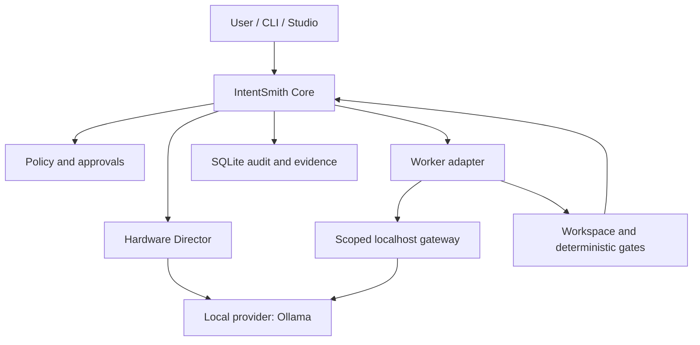

# IntentSmith

**A local-first control plane for AI-assisted software work.**

IntentSmith turns a developer's intent into a controlled, inspectable workflow: plan the work, choose a local model or worker, enforce boundaries, collect evidence, and decide whether the result actually passed.

It is designed for developers who have capable local hardware and want useful coding agents without making a cloud subscription or remote inference a requirement.

## What IntentSmith is

IntentSmith is the product and the control plane. It is not another chat wrapper and it is not a single all-powerful agent.

| Concern | Owner |
| --- | --- |
| Task state, policy, approvals, audit and verdicts | IntentSmith Core |
| Local inference | Provider adapters, beginning with Ollama |
| Coding task execution | IntentSmith Workers, beginning with OpenCode |
| Domain-aware response behaviour | IntentSmith Expertises |
| Controlled repeatable workflows | IntentSmith Skills |
| Tool-backed domain execution | IntentSmith Specialists |
| Scheduled monitoring and automation | IntentSmith Autonomous Agents |
| Visual development environment | IntentSmith Studio |
| Desktop distribution | IntentSmith Forge Local |
| Automation and scripting | `intentsmith` CLI |

`IntentSmith Forge Local` remains working naming until trademark, repository and
domain checks are complete. The CLI package is `intentsmith`; the Core package
is `intentsmith-core`.

Phase 1 delivered the deterministic vertical slice. Phase 1.1 audited it and
hardened the boundaries. Phase 2 added the first real local inference provider.
Phase 3 delegates a coding task to a real external agent — the pinned
`opencode-ai` binary, speaking ACP as a supervised child process — without
giving it any authority. Inference reaches only a loopback gateway behind a
token that dies with its run; a risky action needs a single-use approval bound
to the exact payload; shell is denied outright; what changed is read from Git
rather than believed; and an interrupted run is reconciled after a restart
without a restart ever counting as consent.

Phase 3 is a **closure candidate**: complete and verified locally, published as
PR #4, and green in CI on the integrated code tree. It is not merged or tagged.
See `docs/STATUS.md`,
`docs/testing/phase-3-results.md` and
`docs/testing/phase-3-acceptance-matrix.md`, which records what is proven, what
is only partly proven, and what the project deliberately does not claim.
Earlier phases: `docs/testing/phase-1-1-results.md` and
`docs/testing/phase-2-results.md`.

The control plane remains authoritative. Providers infer, workers propose and execute within an explicitly granted scope, and deterministic gates decide whether the evidence is sufficient.

Expertises, Skills, Specialists and Autonomous Agents are separate product
concepts. They are not aliases:

- an **Expertise** changes synthesis style, depth, vocabulary and caution without
  changing the selected intent;
- a **Skill** is a versioned workflow with explicit steps, checkpoints and a
  result contract;
- a **Specialist** is a self-contained plugin combining deterministic tools,
  knowledge, scenarios and one or more referenced expertises;
- an **Autonomous Agent** monitors sources and evaluates deterministic triggers
  over time, creating Core-governed actions or tasks;
- a **Worker** executes one task run through an adapter such as OpenCode.

See [Domain intelligence and autonomy](docs/product/domain-intelligence.md).

## Current state

Phase 2 is the current stable baseline:

- a TypeScript/pnpm monorepo with runtime-validated contracts;
- separate `Task` and `TaskRun` lifecycle records;
- SQLite persistence with migrations, WAL, transactions and append-only audit;
- evidence-based verdicts and deterministic verification;
- a localhost-only Fastify API and `intentsmith` CLI;
- a hardware director and an Ollama inference adapter;
- a capability-scoped, loopback-only worker gateway that is disabled by default;
- deterministic fake providers and workers for fast offline tests.

Phase 3 is complete through run 2F on a separate branch and is a closure
candidate published for review. It adds the first external coding worker through
ACP and OpenCode. Forced local configuration prevents the unconfigured
cloud-backed default model from being selected for an IntentSmith run. Provider
catalog network access remains disclosed and strict-offline operation remains
NOT PROVEN. Phase 3 is not part of the stable product until the reviewed
candidate is merged and tagged.

See [project status](docs/STATUS.md) for exact evidence and [the roadmap](docs/ROADMAP.md) for sequencing.

## How it works



A typical run follows seven steps:

1. The user creates a task with an intent and workspace scope.
2. Core validates policy and creates a distinct task run.
3. The hardware director selects a compatible local inference profile.
4. A worker receives only the capabilities and short-lived access required for that run.
5. Proposed changes and worker events are captured as evidence.
6. Deterministic gates inspect the resulting workspace.
7. Core issues a verdict from evidence; a worker's success claim alone can never produce `pass`.

## Local-first policy

- The stable path does not silently fall back to a cloud model.
- Core and the server bind to loopback interfaces only.
- The worker gateway is opt-in, loopback-only and uses run-scoped revocable tokens.
- Prompts and model responses are not written to the stable audit trail.
- Hardware detection records a sanitized capability profile rather than device identifiers.
- Degraded sandboxing is reported honestly; process controls are not presented as an operating-system security boundary.

Local Ollama enforcement is in code, not convention:

- only plain HTTP to a loopback address is accepted before any socket opens;
  HTTPS, public and private addresses, arbitrary hostnames, userinfo and
  `ollama.com` are rejected, and redirects are disabled;
- authorization, cookies and API-key headers are never forwarded;
- `remote_model` and `remote_host` metadata are checked during discovery,
  before generation and on every stream record;
- a `-cloud` suffix is advisory only;
- `REMOTE_INFERENCE_FORBIDDEN` is never retried and never causes provider
  fallback.

IntentSmith does not install Ollama, sign in, use an API key, download a model
or contact `ollama.com`.

Local-first does not mean that every future third-party worker is automatically offline or safe. Each adapter must declare and prove its capabilities, and any network-enabled mode must be explicit.

## Quick start

Requirements:

- Node.js 22
- pnpm 11.17.0 through Corepack
- Linux, macOS or Windows for the core packages
- Ollama only for optional real local-inference tests

```bash
corepack enable
pnpm install --frozen-lockfile
pnpm verify
```

`pnpm verify` runs frozen installation, typecheck, lint, deterministic tests
with coverage gates, and the build. The deterministic tests and build require no
Ollama, OpenCode, GPU, model or other external runtime. The measured Phase 3
installation used an already populated pnpm store; network isolation and a
cold-network installation were not proven.

Architecture rules are executable:
`tools/architecture/boundaries.test.ts` enforces
`docs/architecture/dependency-boundaries.md`, so crossing a package boundary
fails verification.

Build and start the localhost API:

```bash
pnpm build
pnpm --filter @intentsmith/server start
```

The server binds to `127.0.0.1:47831` by default. The local SQLite database is
stored at `.intentsmith/intentsmith.db`. Set `INTENTSMITH_DB_PATH` to use a
different development database.

## Local Inference

With a local Ollama daemon running, IntentSmith can inspect and use it:

```bash
pnpm --filter intentsmith start inference health
pnpm --filter intentsmith start inference models
pnpm --filter intentsmith start inference model --model qwen3:14b
pnpm --filter intentsmith start inference assess --model qwen3:14b --policy gpu_required
pnpm --filter intentsmith start hardware show
pnpm --filter intentsmith start runtime recovery
```

Generation reads the prompt from stdin so it never enters shell history:

```bash
echo "Explain this repository in one sentence." \
  | pnpm --filter intentsmith start inference generate --model qwen3:14b
```

`--prompt` exists but is documented as the less private option. Ctrl+C cancels
the generation upstream rather than orphaning it.

IntentSmith does not download models. If one is missing it says so and tells you
the `ollama pull` command to run yourself.

### Optional real-Ollama verification

```bash
INTENTSMITH_RUN_REAL_OLLAMA=1 \
INTENTSMITH_OLLAMA_TEST_MODEL=<an-already-installed-model> \
pnpm test:ollama
```

Never part of `pnpm verify` or CI. It never pulls a model, signs in or uses an
API key, and reports BLOCKED rather than PASS when Ollama or the model is
missing.

### Optional real-OpenCode verification

The opt-in suite in `tools/opencode/` drives the executable server composition
over loopback HTTP with the pinned real binary, the real gateway and real local
inference:

```bash
INTENTSMITH_RUN_REAL_OPENCODE=1 \
INTENTSMITH_OPENCODE_BIN=/absolute/path/to/opencode \
pnpm test:opencode
```

IntentSmith never installs OpenCode: install exactly `opencode-ai@1.18.8`
yourself, outside this repository, and point the variable at it. The suite
reports BLOCKED rather than PASS when the binary, its pinned version, the local
Ollama daemon, the model (`INTENTSMITH_OPENCODE_TEST_MODEL`, default
`qwen3:14b`) or the NVIDIA GPU is missing, and it is never part of `pnpm verify`
or CI. Set `INTENTSMITH_2C_EVIDENCE` to a file path to collect the sanitized
scenario log the Phase 3 evidence artifact is built from.

## Worker Inference Gateway

A loopback-only, OpenAI-shaped gateway exists so a future external worker can
run inference under the same guarantees as the user's own API: same provider,
same hardware and model-fit policy, same local-only checks, same scheduler.

It is **off by default**, because no worker exists yet:

```bash
INTENTSMITH_GATEWAY=1 pnpm --filter @intentsmith/server start
# optionally pin the port instead of using an ephemeral one
INTENTSMITH_GATEWAY_PORT=41234 pnpm --filter @intentsmith/server start
```

Every route needs an IntentSmith-issued per-run bearer token even on loopback,
because loopback is not an authorization boundary: any local process can reach
the port. Tokens are scoped to one run, never persisted or logged, and revoked
when the run ends or the server stops.

## CLI

In another terminal, the CLI talks only to the localhost API by default:

```bash
pnpm --filter intentsmith start version
pnpm --filter intentsmith start health
pnpm --filter intentsmith start project create --name demo --root /absolute/path
pnpm --filter intentsmith start task create --project-id PROJECT_ID --goal "Run deterministic checks"
pnpm --filter intentsmith start task start --task-id TASK_ID
pnpm --filter intentsmith start task result --task-id TASK_ID --json
pnpm --filter intentsmith start task audit --task-id TASK_ID --json
```

Set `INTENTSMITH_URL` to another allowed URL when the server uses a different
port.

## Development data

Stop the server first. To delete only the default development database:

```bash
rm -f .intentsmith/intentsmith.db .intentsmith/intentsmith.db-shm .intentsmith/intentsmith.db-wal
```

This command does not touch project workspaces.

## Repository map

```text
apps/
  cli/                  command-line client
  server/               localhost API and runtime composition
packages/
  contracts/            runtime schemas and public data contracts
  core/                 lifecycle, policy, use cases and verdicts
  persistence/          SQLite implementation and recovery
  inference/            provider-neutral inference port
  adapter-ollama/       local Ollama integration
  hardware/             sanitized hardware discovery and selection
  testing/              deterministic test doubles and fixtures
docs/
  product/              product vision and boundaries
  architecture/         system design and contracts
  adr/                  immutable architecture decisions
  development/          contributor onboarding
  security/             phase-specific threat models
```

Phase-specific packages that are not yet on `main` are documented in [STATUS.md](docs/STATUS.md), not advertised here as stable.

## Documentation

- [Documentation index](docs/README.md)
- [Product vision](docs/product/vision.md)
- [Architecture overview](docs/architecture/overview.md)
- [Current status](docs/STATUS.md)
- [Roadmap](docs/ROADMAP.md)
- [Development guide](docs/development/getting-started.md)
- [Security policy](SECURITY.md)
- [Contributing](CONTRIBUTING.md)

IntentSmith is pre-release software. Interfaces, package names and persistence schemas may still change before the first stable release.
