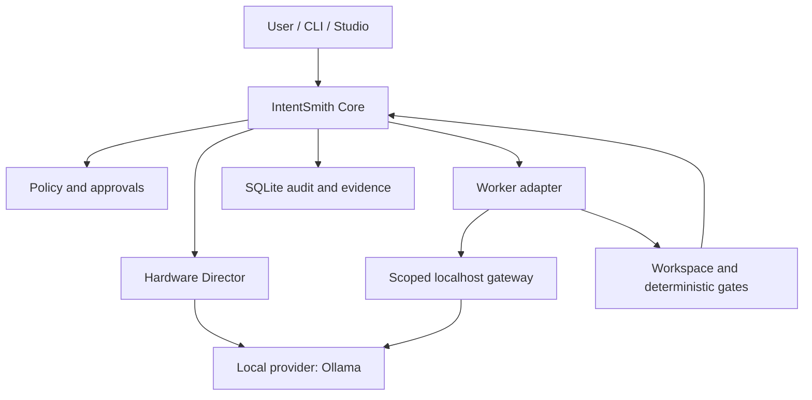

# IntentSmith

**A local-first control plane for AI-assisted software work.**

IntentSmith turns a developer's intent into a controlled, inspectable workflow: plan the work, choose a local model or worker, enforce boundaries, collect evidence, and decide whether the result actually passed.

It is designed for developers who have capable local hardware and want useful coding agents without making a cloud subscription or remote inference a requirement.

## What IntentSmith is

IntentSmith is the product and the control plane. It is not another chat wrapper and it is not a single all-powerful agent.

| Concern | Owner |
| --- | --- |
| Task state, policy, approvals, audit and verdicts | IntentSmith Core |
| Local inference | Provider adapters, beginning with Ollama |
| Coding task execution | IntentSmith Workers, beginning with OpenCode |
| Domain-aware response behaviour | IntentSmith Expertises |
| Controlled repeatable workflows | IntentSmith Skills |
| Tool-backed domain execution | IntentSmith Specialists |
| Scheduled monitoring and automation | IntentSmith Autonomous Agents |
| Visual development environment | IntentSmith Studio |
| Desktop distribution | IntentSmith Forge Local |
| Automation and scripting | `intentsmith` CLI |

The control plane remains authoritative. Providers infer, workers propose and execute within an explicitly granted scope, and deterministic gates decide whether the evidence is sufficient.

Expertises, Skills, Specialists and Autonomous Agents are separate product
concepts. They are not aliases:

- an **Expertise** changes synthesis style, depth, vocabulary and caution without
  changing the selected intent;
- a **Skill** is a versioned workflow with explicit steps, checkpoints and a
  result contract;
- a **Specialist** is a self-contained plugin combining deterministic tools,
  knowledge, scenarios and one or more referenced expertises;
- an **Autonomous Agent** monitors sources and evaluates deterministic triggers
  over time, creating Core-governed actions or tasks;
- a **Worker** executes one task run through an adapter such as OpenCode.

See [Domain intelligence and autonomy](docs/product/domain-intelligence.md).

## Current state

Phase 2 is the current stable baseline:

- a TypeScript/pnpm monorepo with runtime-validated contracts;
- separate `Task` and `TaskRun` lifecycle records;
- SQLite persistence with migrations, WAL, transactions and append-only audit;
- evidence-based verdicts and deterministic verification;
- a localhost-only Fastify API and `intentsmith` CLI;
- a hardware director and an Ollama inference adapter;
- a capability-scoped, loopback-only worker gateway that is disabled by default;
- deterministic fake providers and workers for fast offline tests.

Phase 3 is under development on a separate branch. It adds the first external coding worker through ACP and OpenCode. A real probe found that an unconfigured OpenCode instance selects a cloud-backed default model and fetches provider metadata even in `--pure` mode, so forced local configuration and network behaviour remain explicit phase blockers. Work in that phase is not part of the stable product until its contract, security, recovery and real-adapter gates pass and the phase is merged.

See [project status](docs/STATUS.md) for exact evidence and [the roadmap](docs/ROADMAP.md) for sequencing.

## How it works



A typical run follows seven steps:

1. The user creates a task with an intent and workspace scope.
2. Core validates policy and creates a distinct task run.
3. The hardware director selects a compatible local inference profile.
4. A worker receives only the capabilities and short-lived access required for that run.
5. Proposed changes and worker events are captured as evidence.
6. Deterministic gates inspect the resulting workspace.
7. Core issues a verdict from evidence; a worker's success claim alone can never produce `pass`.

## Local-first policy

- The stable path does not silently fall back to a cloud model.
- Core and the server bind to loopback interfaces only.
- The worker gateway is opt-in, loopback-only and uses run-scoped revocable tokens.
- Prompts and model responses are not written to the stable audit trail.
- Hardware detection records a sanitized capability profile rather than device identifiers.
- Degraded sandboxing is reported honestly; process controls are not presented as an operating-system security boundary.

Local-first does not mean that every future third-party worker is automatically offline or safe. Each adapter must declare and prove its capabilities, and any network-enabled mode must be explicit.

## Quick start

Requirements:

- Node.js 22
- pnpm 11.17.0 through Corepack
- Linux, macOS or Windows for the core packages
- Ollama only for optional real local-inference tests

```bash
corepack enable
pnpm install --frozen-lockfile
pnpm verify
```

Build and start the localhost API:

```bash
pnpm build
pnpm --filter @intentsmith/server start
```

In another terminal:

```bash
pnpm --filter intentsmith start version
```

The standard verification suite is deterministic and does not require a model, GPU, external agent or cloud connection.

## Repository map

```text
apps/
  cli/                  command-line client
  server/               localhost API and runtime composition
packages/
  contracts/            runtime schemas and public data contracts
  core/                 lifecycle, policy, use cases and verdicts
  persistence/          SQLite implementation and recovery
  inference/            provider-neutral inference port
  adapter-ollama/       local Ollama integration
  hardware/             sanitized hardware discovery and selection
  testing/              deterministic test doubles and fixtures
docs/
  product/              product vision and boundaries
  architecture/         system design and contracts
  adr/                  immutable architecture decisions
  development/          contributor onboarding
  security/             phase-specific threat models
```

Phase-specific packages that are not yet on `main` are documented in [STATUS.md](docs/STATUS.md), not advertised here as stable.

## Documentation

- [Documentation index](docs/README.md)
- [Product vision](docs/product/vision.md)
- [Architecture overview](docs/architecture/overview.md)
- [Current status](docs/STATUS.md)
- [Roadmap](docs/ROADMAP.md)
- [Development guide](docs/development/getting-started.md)
- [Security policy](SECURITY.md)
- [Contributing](CONTRIBUTING.md)

IntentSmith is pre-release software. Interfaces, package names and persistence schemas may still change before the first stable release.
