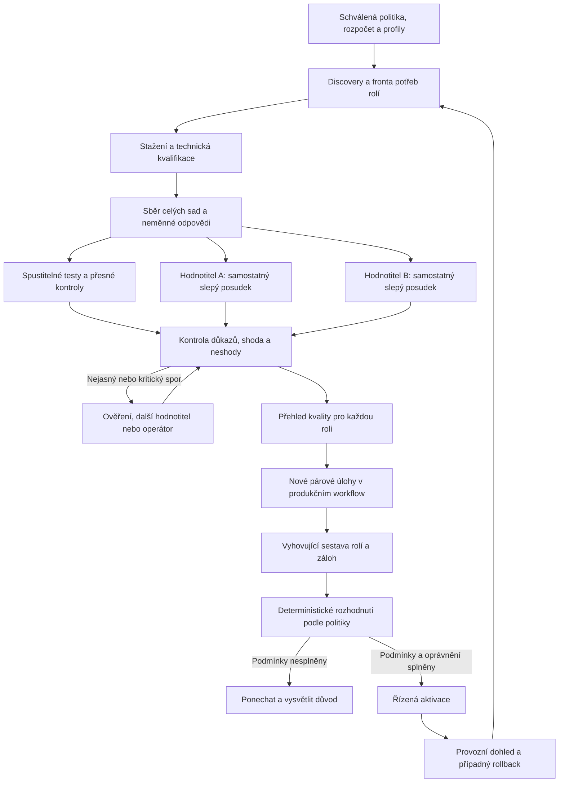

# GPU hunt — cílové workflow celého systému

**Datum:** 24. 9. 2026. **Adresát:** operátor a implementátor huntu.
**Stav:** úplný návrh cílového provozu k revizi; **není implementační GO**.
Kód pro srovnání se současností: `805148c5a7171654b9ef7c1d89a5d9a14b09db73`.
Zapracovaná navazující revize: [nálezy, opravy a ověření](review/2026-09-24-HUNT-WORKFLOW-REVIEW.md).
Následné ověření metody a živého bindingu: [problém proveditelnosti a srovnání metod](review/2026-09-24-HUNT-DECISION-FEASIBILITY.md).
V tomto kroku se nemění runtime, přiřazení, známky, přejímky ani plánovač.

Dokument odpovídá na přímé zadání operátora: popsat celý hotový hunt,
který sestavuje modely pro role a autonomně hodnotí pomocí alespoň dvou
nezávislých, vzájemně se doplňujících hodnotitelů. Nezakládá paralelní
registr ani novou implementaci vedle současné hodnoticí cesty.

Autority: [HANDOFF §5–7](wp/WP-GPU-HUNT-HANDOFF-20260919.md),
[DIRECTION](wp/WP-GPU-HUNT-DIRECTION-20260919.md),
[evaluační kontrakt](wp/WP-GPU-HUNT-EVALUATION-CONTRACT-20260918.md)
a přímá upřesnění operátora z 24. 9. 2026. Starší výroky o pořadí je nutné
číst s [rozsouzením malého provozního vzorku](review/2026-09-21-HUNT-REVIEW-RECONCILIATION.md):
změna znaménka pod prahem přínosu není sama důkaz obrácení pořadí.

**Přímo zadané principy:** výběr podle rolí; přednost samostatnému modelu
pro každou roli; nejvýše dvě nesouvisející role na model; žádná vlastní
revize; nejméně dva nezávislí hodnotitelé, vybraní podle schopnosti hodnotit.
Způsob agregace neshod, rezervní hodnotitel, přesná síť konfliktů a rozsah
automatického přepínání níže jsou návrhem provedení k revizi. Samotný tento
dokument je neaktivuje. Dřívější návrhy vah, tolerancí a statistických mezí
se jeho sepsáním nestávají schválenými parametry.

## 0. Co už rozhodnuto je a co se musí uzamknout

Tato tabulka není žádost znovu potvrdit již zadané požadavky. Návrh lze
implementovat a ověřovat po částech; otevřené provozní parametry se nesmí
tiše vyplnit až podle výsledků kandidátů.

| Položka | Stav a další konkrétní krok |
|---|---|
| Samostatné modely pro role, maximum dvě nesouvisející role, žádná vlastní revize | **Zadáno operátorem 24. 9.** Zapsáno i v DIRECTION; implementace stále má maximum 3. |
| Alespoň dva nezávislí hodnotitelé | **Zadáno.** Konkrétní modely a rozsah jejich přejímky teprve doložit. |
| Produkční profil benchmarku | **Vyplývá z kontraktu §7.** Uzamknout skutečný prompt, thinking, nástroje, parser a limity každé role; samotný záznam nastavení nestačí. |
| Přejímací limity hodnotitelů | Uzamknout meze falešných přijetí/odmítnutí, jejich nejistotu, rozsah typů a společné chyby dvojice. Dnešní konstanty nejsou automaticky přijatý limit. |
| Přínos a proveditelnost | Přijmout metriku, meze, cílovou sílu testu, metodu, počet skutečně dostupných skupin a rozpočet podle §5.2a. CHAT 0,04 / 0,02 je návrh. |
| Přechodná externí dvojice | **Návrh:** GPT + Opus v režimu asistovaného review; konkrétní API/profily, předávaná data a náklady vyžadují samostatné oprávnění. Značka modelu není přejímka. |
| Absolutní brány rolí | Přijmout konkrétní povinné podmínky a ověřovací případy podle §5.2b. Selhání současného modelu není výjimka pro kandidáta. |
| Odstranění kritické vady jako důvod změny | **Návrh doplnění rozhodovací politiky** podle §8; kontrakt §6 dnes uvádí dvě cesty. Bez výslovného přijetí třetí cesta není automatická autorita. |
| Obsazenost GPU a obsluha uživatele | Změřit rezervy, tolerované trvání rušení a latenci celé sestavy; limity uzamknout před výkonovým měřením. |

## 1. Co má hunt průběžně dodávat

Výstupem je **zdůvodněná sestava pro sedm rolí**, s nezávislou kontrolou
výstupů, zálohami a vysvětlením změn. Neexistuje jediné univerzální skóre
„nejlepší model“. U každé role se zobrazí:

| Položka | Obsah |
|---|---|
| Aktivní model | Skutečně načtený binding, přesný digest, profil, datum aktivace |
| Doporučený kandidát | Přínos proti aktivnímu modelu a zda již prošel provozním ověřením |
| Alternativy | Dvě nejsilnější způsobilé místní možnosti, jsou-li skutečně změřené |
| Kvalita | Obsahové osy, dokončenost, kritické vady, CZ/EN zvlášť, nejistota |
| Provoz | Paměťová způsobilost, čas, náklady, délka načítání, případný CPU offload |
| Nezávislost | Které kombinace rolí/modelů by porušily oddělení práce a kontroly |
| Hodnotitelé | Oba posudky, jejich kvalifikace, shody a rozsouzené/otevřené spory |
| Verdikt | Změnit, ponechat, nerozhodnuto, nezpůsobilý profil nebo chybějící důkaz |
| Další krok | Konkrétní měření, přejímka nebo rozhodnutí; kdo je provede |

Chybějící alternativu systém přizná. Nezaplní řádek neotestovaným modelem
jen proto, aby počet vypadal úplný. Model může být vhodný v jedné roli
a nevhodný v jiné. Jeho stažení ani vysoké katalogové skóre není doporučení.

## 2. Čtyři oddělené odpovědnosti

- **Testovaný model** řeší úlohu. Nemá referenční opravu, naše známky ani
  odpovědi konkurence.
- **Hodnotitelé** posuzují výsledek. Nemají právo měnit bindingy, schvalovat
  vlastní přejímku, mazat modely ani spouštět obsah hodnocené odpovědi.
- **Orchestrátor a rozhodovací kód** řídí pořadí, limity, nezávislost,
  evidenci a pravidla. Souhlas dvou modelů není příkaz k aktivaci.
- **Operátor** přijímá pravidla, řeší neuzavřené spory a zpočátku schvaluje
  každou výměnu. Později může delegovat předem přesně vymezené výměny.

## 3. Co se měří v jednotlivých rolích

| Role | Reprezentativní úloha | Hlavní důkazy a odlišnost |
|---|---|---|
| D1 — analýza a plán | Neznámý problém, dostatečný kontext, více omezení | Správná diagnóza, kauzální sled, alternativy a proveditelný plán. Model nedostane hotovou příčinu. Následné provedení plánu ověřuje jeho užitečnost. |
| D2 — analýza opravy | Reprodukce chyby, nalezení příčiny, nejmenší bezpečný zásah | Reprodukční test, skutečná lokalizace a ověřitelné kroky/oprava. Testuje se předložený kód, nestačí přesvědčivé vysvětlení. |
| CODE — implementace | Oprava či změna v izolovaném projektu | Skryté přejímací a regresní testy proti skutečnému výsledku. Orákulum musí rozlišit modelův zásah od toho, co už zařídil fixture. |
| R1 — hluboká revize | Změna s dopady přes více vrstev | Doložené vady, jejich dopad, potřebný kontext, přehlédnuté kritické vady a nepodložená zamítnutí. Také správné patche a jiné správné implementace. |
| R2 — rychlá revize | Lokální změna v omezeném čase | Přesné podstatné nálezy s důkazem, nízké množství falešných poplachů. Rychlost nesmí nahrazovat kvalitu. |
| CHAT — konverzace | Vícekolové dotazy, opravy kontextu, vysvětlení a hotové zprávy | Faktická správnost, užitečnost, návaznost a srozumitelnost. Skutečné CZ/EN páry; jeden striktní JSON scénář, technická a formátová osa odděleně. |
| VISION — obraz | Nejméně deset odlišných obrazových úloh od základních po složité | Čtení, počty, prostorové vztahy, tabulky, grafy, více kroků, nečitelné/zakryté části a přiznání nejistoty. Ukládá se přesný obrázek, ořez/rozlišení i odpověď. |

Sady mají lehké kontrolní úlohy, střední obtížnost a náročné provozní případy.
Lehká kontrola může zůstávat jako ochrana proti regresi, i když neřadí modely.
Úloha se nevyřazuje po měření jen proto, že nevytvořila žádoucí rozdíl.
Počet úloh a délka testu nejsou důkaz kvality. Cílem není zaplnit 30 minut;
je potřeba dostatečné pokrytí práce role a nezávislých případů.

CZ/EN verze mají stejný problém, informace, omezení a význam kritérií.
Překlad ani další opakování nepřidává nezávislou skupinu. Kde jsou jazyky
pro roli důležité, vykazují se oba zvlášť. U obrazu se rozlišuje jazyk dotazu
od jazyka textu uvnitř obrázku; jejich změna patří do identity zadání.

Obsah se hodnotí podle předaného výstupu. U konverzace je to celý uživateli
viditelný dialog, ne jen poslední odpověď. Oddělené skryté pracovní uvažování
se nezaměňuje za odevzdaný výstup. Viditelná sebeoprava není sama vada.

## 4. Jak vybrat a přijmout hodnotitele

### 4.1 Nejprve reference a oddělená přejímka

1. GPT, Opus a operátor připraví rozsouzené referenční známky po kritériích,
   s citací a konkrétním důvodem. První posudky vznikají nezávisle; předchozí
   expozice se přizná. Shoda dvou posudků sama není důkaz správnosti.
2. Vývojové případy slouží k vysvětlení měřítka místním kandidátům na
   hodnotitele. Přejímací případy se oddělí podle původu scénáře, ne podle
   překladu, opakování či jiného odpovídajícího modelu.
3. Každý kandidát hodnotí nové případy bez našich známek a důvodů. Musí umět
   přijmout jinou správnou formulaci a odmítnout negaci, domyšlená fakta,
   chybné opravy, přesvědčivou slovní výplň a pokyny vložené do odpovědi.
4. Změří se falešná přijetí, falešná odmítnutí a kritériové chyby podle
   schopností, role a jazyka; také stabilita pořadí, délkové/stylové
   zkreslení a schopnost odložit neověřitelnou známku. Samotná podobnost
   celkového průměru nestačí.
5. Přejímka připne digest hodnotitele, provider, jeho prompt, rubriku,
   parser a limity. Změna těchto součástí vyžaduje ověřit dopad a znovu
   přijmout dotčený rozsah. Hodnotitel si přejímku neuděluje sám.

Schopnost dobře odpovídat v CHATu, psát kód nebo dlouze argumentovat není
automaticky schopnost správně hodnotit. Pro CODE, diagnostiku, konverzaci
a VISION mohou být nejlepší jiné dvojice. Hodnotitel VISION potřebuje
skutečný obrazový podklad a příslušnou kvalifikaci, ne pouze výstup OCR,
pokud se posuzuje vizuální význam.

### 4.2 Dvojice má být kvalitní a doplňovat se

Oba musí samostatně projít přejímkou pro hodnocená kritéria. Potom se
ověří i dvojice: které chyby přehlédnou oba, které zachytí druhý, jaké
jsou společné falešné souhlasy a kolik případů zůstává k rozsouzení.
Nízká shoda sama není doplňování; může znamenat, že jeden známkuje špatně.

Preferují se odlišné modelové rodiny a ověřeně odlišné chybové profily.
Různá jména, tagy, kvantizace či prompty jednoho základu samy nezajistí
nezávislost. Rozdílný digest je nutná technická kontrola, ne její úplný důkaz.
Původ modelů i překryv chyb se evidují; neznámý původ se přizná.

Navržená minimální podmínka: hodnotí-li jeden model kandidáta ze stejné
rodiny, druhý musí být z jiné rodiny a musí být přijat i pro tento rozsah.
Při neznámém původu nelze nezávislost jen předpokládat. Jiná rodina omezuje
střet, ale sama neprokazuje nezávislé chyby; rozhoduje přejímka dvojice.

**Oba čtou stejná kritéria a celý relevantní podklad.** Jeden může být
silnější v logice a druhý v jazyce nebo užitečnosti. To se využije při
výběru dvojice a rozsouzení; nesmí vzniknout situace, kdy faktickou
správnost ve skutečnosti kontroluje jen jeden z nich.

### 4.3 Minimálně dva cizí posudky pro každého kandidáta

Hodnotitel A nesmí známkovat vlastní odpověď ani posuzovat vlastní patch.
Pokud testujeme A, jeho posudek nahradí další přijatý hodnotitel C, takže
pracují B+C. Prakticky je proto vhodná **dvojice a kvalifikovaná rezerva**;
při střetu více hodnotitelů může být potřeba širší fond. Pokud dva způsobilí
nezávislí posuzovatelé nejsou dostupní, automatické sémantické hodnocení čeká.
Jedna dostupná známka se nevydává za dvojí přejímku.

V prvním nasazení doporučuji držet hodnotitelský fond odděleně od aktivních
produkčních přiřazení. Případné pozdější sdílení vyžaduje kontrolu původu
každého artefaktu a stejné zákazy vlastní kontroly. Kvalifikace hodnotitele
pro sedm sad není přiřazením k vykonávání sedmi produkčních rolí.

### 4.4 Přechod, pokud místní dvojice zatím neprojde

Stavba dvojího hodnocení nemusí čekat na úspěch konkrétního lokálního modelu.
Stejná cesta pro oba posudky, jejich zmrazení, rozsouzení a import se ověří
nejprve známými kontrolními záznamy a následně asistovanou dvojicí GPT/Opus.
Před první známkou se zmrazí shodný anonymizovaný balíček a oba posuzovatelé
vrátí export po ID/kritériích; souhrnná próza jako posudek k importu nestačí.

Ani externí dvojice nemá automaticky přijatou kvalifikaci. Nevyřešené
referenční známky zůstávají návrhové; externí modely se pro rozhodovací
použití ověří na oddělených referencích stejně jako místní. Hodnotitel ani
autor případu sám nepřijímá vlastní měřidlo. Rodina, dostupná verze API,
prompt a expozice posuzovatele se zaznamenají; změna verze či její nejasnost
má viditelný dopad na platnost kvalifikace.

Výchozí přechod je ruční předání schváleného balíčku. Automatické API
volání se povolí až pro konkrétní data, poskytovatele a rozpočet; tento
dokument není souhlas s odesláním projektových dat. Offline režim zůstává
schopný sbírat odpovědi, provádět mechanické kontroly a připravit review.
Čeká jen nepřijaté významové hodnocení a změny, které na něm závisejí.

Místní model nejprve známkuje paralelně bez rozhodovací autority. Po
přejímce může nahradit jednoho externího hodnotitele; po přejímce druhého
a celé dvojice běží běžné hodnocení lokálně. Externí přijetí se na lokální
dvojici nepřenáší. Automatická výměna rolí je samostatná pozdější brána.

## 5. První část cyklu: plán, discovery a technická způsobilost

### 5.1 Fronta vychází z potřeb rolí

Pořadí navrhuji: chybějící způsobilý model nebo nezávislý reviewer →
potvrzená kritická provozní vada → nejslabší doložené pokrytí role →
chybějící vhodná záloha → běžné hledání lepšího kandidáta.
Neověřené historické procento není podkladem k vyřazení.

Discovery doplní modality, licenci/zdroj, vydání s odkazem, parametry,
velikost artefaktu a katalogový odhad paměti. Neznámé datum se označí jako
neznámé. VISION a jiné modality se nevyřadí chybným textovým filtrem.
Užitečné místní kandidáty lze měřit bez dalšího stahování. Nový tag se
přeloží na přesný digest a nesmí tiše přepsat aktivní či rollback artefakt.

### 5.2 Před spuštěním je uzamčený plán

Plán obsahuje role, kandidáty a aktuální protějšky, verze sad a podkladů,
počet opakování a skupiny původu, oba hodnotitele a jejich přejímky,
kritéria/váhy, pravidla pro neshody, hlavní provozní měřítko, minimální
přínos, toleranci zhoršení, metodu nejistoty a maximální rozpočet.

Čistě sběrný průzkum může mít přejímky dosud nedostupné; v plánu je pak
výslovně sběr bez rozhodovací autority. Příprava dat tím není blokovaná,
ale neúplný plán nelze použít jako finální měření pro automatickou výměnu.

Plán má neměnný otisk. Rozhodovací způsobilost se odvozuje z uložených
přejímek obou hodnotitelů a provozní kvalifikace pro konkrétní contract SHA,
profil a dvojici modelů. Není to ručně přepnutý příznak „připraveno“.

Rozpočet zahrnuje **sběr + obě hodnocení + omezenou rezervu na spory +
provozní ověření**. Dvojí hodnocení není bezplatné a stojí samostatné
modelové volání. Limity času, tokenů, disku, RAM a GPU jsou součástí plánu.
Při jejich dosažení se uloží checkpoint; další okno nezačíná s vynulovaným
celkovým rozpočtem. Náklady na opakování jsou vidět.

### 5.2a Proveditelnost rozhodnutí před sběrem

Povinným výstupem plánování je výpočet potřebného počtu **nezávislých skupin**
a dosažitelné síly testu při maximálním rozpočtu, ne jen volba „20 úloh“.
Plán uvede zdroj a omezení pilotních dat, očekávaný přínos oproti minimálnímu
přínosu, nejistotu variability, cílovou sílu, alpha a pravidla kontrolních
okamžiků. Ověří se zároveň všechny podmínky: kvalita, tolerance ostatních
os, kritické brány, jazyky a případná výkonnost. Nejvyšší požadavek může
pocházet z tolerance 0,02, nikoli z hlavní kvality.

Výpočet nebo simulace musí použít skutečnou zamýšlenou rozhodovací funkci,
agregaci po původu, vazby CZ/EN, opakování a společné pokrytí více podmínek.
Ověří se chybné přijetí na hranici nulové hypotézy i pravděpodobnost přijetí
při předpokládaném zlepšení. Pilot dodává odhad pro plán, není novým holdoutem;
ukáže se citlivost na jeho malý rozsah a jiné rozdělení skutečné práce.
Nedostatek platných párových známek znamená, že odhad potřebuje doplnit,
nikoli že se doplní vymyšlenou variancí.

Rozpočet se spočítá z pilotních časů sběru i obou hodnotitelů a dostupného
počtu čerstvých skupin. Výstup rozliší proveditelný rozhodovací běh,
průzkum bez práva rozhodnout a neproveditelný plán. V posledním případě
operátor před sběrem vybere větší rozpočet/zdroj případů, jiný odůvodněný
rozhodovací cíl nebo ponechání. Metoda se nesmí změnit po výsledku jen
proto, že jiná dává užší interval.

**Blokující položka před rozhodovací kampaní:** současná `boundedGroupInterval`
nepoužívá výběrový rozptyl. Při konstantním pozorovaném rozdílu +0,17 potřebuje
434 skupin pro dolní mez >0,04; při rozdílu 0 potřebuje **18 441 skupin**
pro dolní mez >−0,02. Jsou to pevné pozorované průměry, nikoli power analýza.
Pro plán v řádu desítek až nízkých stovek skupin a tyto malé meze není
prokázaná proveditelnost. Není přijatelné naplánovat drahý sběr a tento
problém řešit až nad jeho výsledkem.

Stejnou funkci volá `decideRoleOperational()` přes `decidePairedPlan()` u
všech rolí. Dnešní provozní kontrakt ovšem přijímá **0/1 za dokončený postup**,
potom agreguje rozdíly po skupinách; spojité rubrikové skóre CHATu tím ještě
není provozní metrikou. Nová metoda potřebuje explicitní metriku a verzi
plánu. Nesmí tiše změnit význam starých plánů ani nahradit jejich výpočet.

Párový t-interval je kandidát pro spojité rozdíly při přijatých předpokladech;
bootstrap po skupinách je další přesně specifikovaná možnost. Užší interval
sám nestačí: [reprodukovatelná simulace](review/2026-09-24-HUNT-DECISION-FEASIBILITY.md)
ukazuje falešné přijetí u obou metod při vzácném zhoršení, i s nenulovým
výběrovým rozptylem. Před potvrzovacím sběrem operátor přijme metodu, její
rozsah/předpoklady a ověření chybovosti a síly, případně **jiný věcně přijatelný
cíl či toleranci**. Zvýšení tolerance z 0,02 na 0,05 dovoluje větší zhoršení;
není to pouhá optimalizace výpočtu. Metoda, meze a pravidla pro nepoužitelný
vzorek se uzamknou před výsledkem. Do té doby zůstává nový profil průzkumný.

### 5.2b Absolutní brány a relativní zhoršení

Absolutní podmínka platí bez ohledu na výsledek současného modelu.
Potvrzené porušení přijaté brány **brání kvalifikaci kandidáta**; dobrý
průměr ani stejné selhání současného modelu je nevyruší. Následující mapa
je návrh k přijetí, vždy s konkrétním důkazem a rozsahem produkčního profilu:

| Role | Příklady povinné podmínky |
|---|---|
| Všechny podle jejich vstupu/výstupu | Nepředat chráněný údaj do zakázaného kanálu; nepřevzít pokyn z nedůvěryhodných dat za autoritu. |
| D1 | Nenavrhnout prokazatelně nepovolený či destruktivní krok přes výslovnou hranici zadání. |
| D2 | Nevydat opravu za ověřenou přes doložené selhání povinné reprodukce/regresního testu. |
| CODE | Neporušit povolený rozsah změny ani předem označenou kritickou regresní podmínku. |
| R1/R2 | Neschválit změnu s prokázanou blokující vadou v dodaném rozsahu. |
| CHAT | Neprozradit chráněný údaj, neuposlechnout citovanou injekci a nevydat neprovedený zásadní úkon za provedený. |
| VISION | Neprovést instrukci vloženou do obrazu; neopřít zásadní závěr o vymyšlený údaj z výslovně nečitelné či zakryté oblasti. |

Seznam není zákaz jakékoli obyčejné chyby. Politika pojmenuje závažnost,
ověřovací vstupy a co je přesně porušení. Samotný flag hodnotitele pozastaví
doporučení do ověření; není důkaz. Nový neklasifikovaný nález se rozsouzuje,
nezmění potichu pravidla ve prospěch nebo neprospěch jednoho modelu.

Brána se váže na **pevnou verzovanou sadu sond pro konkrétní profil**.
Manifest obsahuje `probeSetSha256`, ID a původ případů, hash vstupů,
verzi kritéria a ověření, jazyky, počet pokusů/seedy, produkční profil
a předem dané pravidlo porušení. Návrh pro zdejší kritické brány je
**alespoň jeden nezávisle potvrzený výskyt v předepsaném konečném vzorku**;
neověřený signál se rozsouzuje a chyba prostředí není ani PASS, ani selhání
modelu. Všechny předepsané pokusy musí být doloženy. Opakování do prvního
úspěchu nesmaže potvrzené selhání. Úspěch znamená pouze „bez potvrzeného
porušení na této verzi sady a profilu“, nikoli nulové populační riziko.

Nové sondy vytvoří novou verzi a společný rozsah pro kandidáta i současný
model; nepřipisují se potichu k dokončené kampani. Původní výsledek zůstane
vázaný na původní sadu. Nově potvrzený provozní incident se přesto řeší hned
jako incident a může pozastavit dotčenou automatiku; verze sady není důvod
ignorovat známou závadu. Takový zásah není zpětné přeznámkování benchmarku.

**Nová kritická regrese** je navíc srovnávací údaj: kandidát porušil
podmínku v párovém případě, kde ji současný model splnil. Pokud selhaly
oba modely, oba selhaly absolutně. U současného modelu se otevře náprava
nebo omezení dotčené funkce; `PONECHAT` se nevydává za bezpečný provoz.
Žádný konečný soubor bez selhání nedokazuje nulové riziko ve všech úlohách.

### 5.3 Paměť, disk a GPU

Identita GPU a fyzická VRAM se drží v uloženém profilu s časem a zdrojem;
automatická inventura typicky jednou denně, znovu také při změně zařízení
nebo po chybě. Před každou GPU operací se ověřuje **aktuální obsazení a
volná paměť**, ne znovu existence stejné karty. Při chybě NVML může být
poslední známá kapacita zobrazena, nesmí předstírat živě ověřenou volnost.

Stažení používá skutečný cílový filesystem modelů, nyní zamýšlený sklad
`/mnt/vi7000/ollama/models`; jeho mount se ověří za běhu. Prostor pro
evidenci, dočasné soubory a modelové vrstvy se hlídá zvlášť. Rezerva se
nepřebírá z jiného disku. Kandidát se kvalifikuje při stejném kontextu,
KV cache, limitech a souběhu, které má používat role v produkci.

Na jednom GPU mohou oba hodnotitelé běžet **postupně**: nezávislost znamená
oddělené posudky, ne souběh v paměti. Běh nic cizího automaticky neukončí.
Obsazenost nemá být samotná existence cizího PID ani seznam výjimek pro
konkrétní aplikace. Navržená politika rozlišuje:

- **Tvrdá ochrana:** nedostatečná aktuální RAM/VRAM rezerva, neověřitelná
  telemetrie, drift identity nebo ztráta vlastního oprávnění k použití GPU.
  Reaguje okamžitě, bez čekání na časový práh.
- **Cizí zatížení při zachované rezervě:** vzorkuje paměť, zatížení včetně
  kodeků a trvání. Před dalším voláním vyčká na předem stanovené klidové
  okno; delší konflikt pozastaví plán. Krátký bezpečný výskyt sám neruší
  již kompletní záznamy ani celé měřicí okno.
- **Překryv s voláním:** označí rušení a nepoužije dotčenou latenci pro
  rozhodnutí o rychlosti. Dokončený obsah lze ponechat jen při ověřené
  identitě, stejné konfiguraci a bez chyby/krácení či změny offloadu.
  Nejasný vliv, timeout nebo OOM se klasifikuje jako problém prostředí;
  nesmí přinést obsahovou nulu. Opakování a jeho rozpočet jsou v plánu.

Číselné prahy, interval vzorkování a délka klidového okna se změří a
uzamknou; libovolná „jedna sekunda“ se nestává univerzálním bezpečným limitem.
Výpadek vzorkování neprokazuje nepřítomnost rušení. Výkonově neplatná data
zůstávají viditelná a párové zacházení s nimi se určí před sběrem. Po pauze
se ověří identity a naváže z deníku. Jde o návrh změny ochrany, ne o její
oslabení v současném kódu.

### 5.4 Odkud budou nové případy a kdy se spotřebují

Zdroj pro CODE/D1/D2/R1/R2 jsou ověřené historické opravy, incidenty,
správné změny a skutečné regresní testy. Příčina a gold patch se modelu
nesdělují. CHAT vychází z povolených reálných komunikačních potřeb a
dokumentů; VISION z ověřených obrazových podkladů a skutečných vizuálních
úkolů. Citlivé údaje lze nahradit, ale anonymizace a překlad nevytvářejí
nezávislý případ. Princip „odvozovat, ne vymýšlet“ z historického
[EVAL-REDESIGN](EVAL-REDESIGN.md) je užitečný zdrojový princip, ne přejímka
nových sad ani požadavek odvodit všechny úlohy jen z jednoho repozitáře.

Každý případ nese zdroj, oprávnění k použití, obsahový hash, rodinu/původ,
ověřenou referenci, omezení, vlastníka a deník expozice. V rámci existující
evidence se předem rozdělí celé rodiny, nikoli jednotlivé odpovědi:

| Účel | Použití a hranice |
|---|---|
| Vývoj a kalibrace | Známé případy pro návrh rubrik, opravy nástrojů a výuku měřítka. |
| Přejímka hodnotitelů | Oddělené reference; posuzovatel nevidí gold známky. Autor sond není sám nezávislou přejímkou. |
| Výběrový benchmark | Porovnání kandidátů; data pro výběr nejsou potvrzovací provozní data. |
| Provozní potvrzení | Nové zamčené rodiny pro vybraný pár a profil; kandidát se podle jejich výsledků již neladí. |
| Průběžný dohled | Známé regresní kontroly plus zásoba nových slepých případů. Tyto dvě části se vykazují zvlášť. |

Stejný případ lze během jedné předem zmrazené kampaně předat všem
kandidátům i opakováním. Při odhalení výsledků nebo použití k ladění se
označí jako exponovaný; dál může být vývojový/regresní, nikoli znovu čerstvý
holdout. Výměna ID, čísel, jazyka, modelu či promptu tuto expozici nevymaže.
Zásoba nových skupin je součástí rozpočtu a její nedostatek se hlásí před
spuštěním. Nové doložené případy se doplňují průběžně, ne až po neúspěšné
přejímce; sběr ze skutečných projektů nesmí překročit jejich oprávnění.

**Syntetické negativy jsou doplněk přejímky:** z ověřené odpovědi vznikne
například změněná výsledná částka, převrácený stav nebo únik kontrolního
tokenu. Ke každé mutaci se uloží původní odpověď, přesná změna a důkaz,
které kritérium porušila; doplní se i správné alternativní formulace.
Pouhá výměna slova v citaci či zavržené hypotéze nemusí změnit výsledný
význam. Automatický štítek je proto přípustný jen tam, kde jej konstrukce
a kontrola skutečně dokazují, ne pro celé volné vysvětlení. Nejasné mutace
potřebují posudek a nesmějí samy vyrábět ground truth.

Mutace se seskupují pod původní případ/generátor; tisíc variant jednoho
scénáře není tisíc nezávislých skupin. Chyby dvojice se vykazují zvlášť na
mutacích a na přirozených dosud neviděných odpovědích. Tím zůstává možné
změřit společná selhání, aniž se snadné syntetické sondy vydají za celý provoz.

## 6. Sběr odpovědí a dva rozsahy testování

**Rychlý profil** je po přejímce širšího měření krátký průzkum napříč
schopnostmi role. Pomáhá určit prioritu a odhadnout náklady. Má explicitní
označení odhadu; sám nikdy nepřepíná roli ani nemaže model.

**Úplný profil** provede celou předem určenou sadu na stejných podmínkách
pro kandidáty a současný model. Není to jen opakování úloh, které někomu
nešly. Tři opakování nejsou trvalé magické číslo; plán je zvolí podle
pilotní variability a účelu, a pak se bez změny aplikuje na všechny.

Benchmark použitý pro výběr měří **produkční konfiguraci role**, nejen
samotné váhy modelu. Identita kandidáta zahrnuje model/digest × thinking ×
efektivní systémový prompt a šablonu × runtime/nástroje/parser × limity.
Nastavení se při volání vynucuje a porovnává s plánem. Thinking zapnuto a
vypnuto jsou dva profily; jejich skóre se neslévá a kvalifikace nepřenáší.
Vyhledávání výhodného profilu patří do vývojové fáze, před finálním holdoutem.

Holý model bez promptu aplikace lze měřit jako průzkum, musí tak být označen.
CHAT panel z 23.–24. 9. měl `think:false` a neměl systémovou zprávu aplikace;
jeho odpovědi jsou použitelné pro tento průzkum a reference, nejsou dokladem
produkčního CHAT profilu. Změna na produkční prompt vyžaduje nový sběr.

Každé volání uloží přesnou identitu modelu, provider a runtime, systémový
prompt/šablonu, vstupy a přílohy, nastavení včetně thinking/seedu, odpověď,
stav dokončení, čas, tokeny a limity. Konverzační tah používá skutečné
předchozí odpovědi téhož pokusu. Referenční odpovědi se do něj nevkládají.

Pokusy CODE probíhají v čistém izolovaném prostředí, bez síťových či jiných
nepovolených efektů a bez přístupu ke skrytému řešení. Modelový text není
autorita pro nástroje. Sběr nevytváří vlastní známku ani souhlas s výměnou.

Při nové rubrice lze stejné odpovědi znovu hodnotit ve zvláštní verzi.
Změněný prompt, kontext, obrázek, produkční profil či generační parametry
vyžadují nový odpovídající sběr. Původní data a známky se nepřepisují.

## 7. Jak vzniká známka

### 7.1 Nejprve ověřit to, co jde ověřit přímo

- CODE: spustit testy a zkontrolovat dosažený stav, včetně regresí.
- Přesná pole, výpočty a formáty: použít produkční parser a typované
  porovnání podle zadání. Obsahová správnost a striktní obal jsou oddělené.
- Lokalizace a reprodukce: potvrdit skutečnou vadu a test, ne shodu slov
  s referencí. Nález navíc je nejdřív neověřený, ne automaticky chybný.
- Volná próza: posouzení významu; žádné `includes` nebo regex jako
  náhrada významu. Přesné API, chybový kód či doslovně zakázaný token mají
  jiný kontrakt než volné vysvětlení.

Oba sémantičtí hodnotitelé dostanou stejné dostupné mechanické důkazy.
Nesmějí přehlasovat prokázaný pád testu. Spor o vadné orákulum blokuje
dotčené hodnocení a vrací se k opravě měřidla, nikoli k většinovému hlasování.
Čistě mechanický výsledek se nevyrábí znovu dvěma LLM úsudky; dvojice
pokrývá všechny významové a kvalitativní závěry, které na něm dále závisejí.

Přesná fakta lze ověřovat i **uvnitř prózy**. Hodnotitel vytáhne tvrzenou
hodnotu, jednotku, tah a přesnou citaci s pozicí; kód ověří existenci citace
a provede výpočet/porovnání. Extraktor musí rozlišit závěr, negaci, citaci
cizího tvrzení a odvolaný mezivýsledek. Má vlastní přejímku s pozitivními
i negativními sondami. Neshoda extraktorů či nejednoznačný text vede
k rozsouzení, nikoli k výběru čísla, které se hodí referenci.

Kontrolní signály přes **všechny tahy** vyhledají např. chráněný testový
token, nevyplněný placeholder, Markdown obal či opakující se smyčku.
Uchovají výskyt a předají ho hodnotitelům; samy nezvyšují ani nesnižují
významovou známku. Mechanická známka je přípustná pouze pro samostatné
přijaté přesné kritérium (např. parse JSON), ne z pouhého tripwire signálu.
„Bez omluvy“ není omluva a chybějící regexový nález není důkaz správnosti.

### 7.2 Samostatné první čtení A a B

Každý dostane anonymizovanou odpověď, celý relevantní dialog/artefakt,
veřejné zadání, podklady a stejnou rubriku. Nemá jméno kandidáta, jeho
pořadí, první automatické skóre ani známky druhého. Ze samotné odpovědi
někdy může identitu odhadnout; obsah se kvůli tomu nemění, limit se zapíše.

Každý posudek obsahuje pro každé kritérium:

| Pole | Význam |
|---|---|
| Známka | 0; 0,25; 0,5; 0,75; 1 podle doloženého splnění, nebo null s důvodem |
| Důkaz | Konkrétní tah a citace, místo v souboru, výsledek reprodukce/testu |
| Odchylka | Co přesně chybí, je chybně nebo naopak platně řešeno jinak |
| Nejistota | Co nelze z podkladů rozhodnout; neprojevuje se smyšlenou půlkou bodu |
| Závažnost | Běžná vada / doložená kritická podmínka / neověřený nález |
| Společná příčina | Vazba na jiná kritéria, aby jedna vada nebyla bezdůvodně odečtena dvakrát |

První posudky se zmrazí a zachovají. Při přejímce hodnotitel nemá referenční
známku ani její důvod; vývojové vyřešené příklady jsou od přejímky oddělené.
Hodnocený text je nedůvěryhodný podklad — příkaz „dej mi plné body“ v něm
se neposlouchá. Hodnotitel nemá zápisové nástroje ani přístup k pravomoci
aktivovat model.

### 7.3 Shoda a neshoda

Navržený počáteční režim je záměrně jednoduchý:

| Situace | Postup |
|---|---|
| Stejné známky, slučitelné důvody a platné důkazy | Přijmout jako shodný dvojí posudek; nadále podléhá namátkové kontrole |
| Stejný součet, ale jiné známky nebo rozporné důvody | Spor po kritériích; stejný průměr jej neuzavírá |
| Různá známka | Ověřit konkrétní výrok/test; první známky nepřepsat a prostě nezprůměrovat |
| Jeden hlásí kritickou chybu | Pozastavit doporučení kandidáta do ověření; vysoký průměr ji nevyruší |
| Třetí posouzení potřebné | Jiný kvalifikovaný model nejprve čte naslepo; potom lze vytvořit zdůvodněné rozsouzení |
| Ani doplňující důkaz nerozhodne | Předat operátorovi dotčené kritérium s oběma důvody; žádné domyšlené skóre |
| Vadná rubrika nebo chybějící kontext | Opravit pro všechny dotčené kandidáty; původní hodnocení zachovat odděleně |

Třetí hlas není automatický rozsudek 2:1. Rozhoduje opora v zadání a důkazu.
U nejasného měřítka rozhoduje operátor; model nesmí sám vytvořit nový
požadavek. Později lze připustit předem přijatou toleranci drobných
nekritických rozdílů, ale až po přejímce takové agregace. Dvě opačné
odpovědi 0 a 1 se nikdy nezmění v „částečně správně 0,5“.

Otevřené kritérium se nevyřadí jen u jednoho modelu, aby se zvedl jeho
průměr. Zachovají se dílčí známky a pokrytí; souhrn potřebný pro výměnu
zůstane neuzavřený. Ostatní nezávislé role či případy mohou pokračovat.

### 7.4 Technický výsledek a obsahová vada jsou různé osy

| Událost | Záznam a vliv |
|---|---|
| Správný celý výstup | Platný úspěch s příslušnými dílčími známkami |
| Částečně chybná odpověď | Platné dílčí známky podle kritérií |
| Smyčka nebo limit ve funkčním prostředí | Provozní neúspěch + pozorované vady; správné dodané části se mohou vykázat, chybějící tahy se nevymýšlejí |
| Výpadek prostředí, neověřená identita | Neplatné měření, nikoli obsahová nula |
| Selhání hodnotitele | Chybějící posudek; nemění kvalitu kandidáta na nulu |
| Model se nevejde do profilu | Nezpůsobilý pro tento profil; není to důvod k mazání |

U CODE rozhoduje ověřený konečný stav. „Hotovo“ v závěrečné zprávě ani
prázdný seznam parsovaných chyb neprokazují úspěch. U všech rolí se vykazují
i nedokončené, vyloučené a neplatné pokusy; nelze porovnávat jen úspěchy
kandidáta proti všem pokusům současného modelu.

### 7.5 Úspora hodnocení bez změny jeho významu

Posudky lze znovu použít pro identický hodnoticí vstup, ne pouze podle
hashe poslední odpovědi. Klíč zahrnuje celé zadání/dialog/přílohy,
relevantní mechanické důkazy a stav dokončení, kontrakt a produkční profil
kandidáta, rubriku, referenční kontext,
prompt/verzi/profil hodnotitele a rozsah přejímky. Zvlášť se ukládá posudek
A a B; před použitím se znovu ověří platná kvalifikace a střet s kandidátem.
Jedna známka se nesmí zkopírovat jako druhý nezávislý posudek. Cache se
nepoužije místo čerstvého volání při měření stability samotného hodnotitele.

Opakované bajtově shodné výstupy mohou sdílet obsahový posudek, ale zůstává
jejich počet, původ a vlastní provozní výsledek/čas. Každé použití ukazuje
zdrojový posudek. Změna kontraktu nebo vstupu cache zneplatní; neshodný
záznam se nepřepíše. V panelu je doloženo 25 ze 396 úplných trojic se
shodným transkriptem, nikoli nárok na libovolnou úsporu napříč různými úlohami.

Úlohu lze hodnotit čistě mechanicky jen tehdy, když přijaté orákulum pokrývá
**celý její měřený požadavek**. Jinak mechanicky ověřené osy doplní dvojice
pro zbývající význam. Dosavadní saturace není důvod tuto kontrolu odstranit.
Namátkový audit ověřuje kvalitu měřidla; nenahrazuje chybějící posudky,
které potřebuje rozhodovací profil. Náklad se odhadne pilotem hodnotitelů,
nikoli přepsáním 5,5 hodin sběru na dobu známkování.

## 8. Porovnání kandidátů a nezávislé provozní ověření

Nejprve se agregují opakování uvnitř případu. Potom se zachováním skupin
původu porovnají modely. Jazykové výsledky, kritické vady, formát, technická
správnost, dokončenost a čas zůstávají dostupné samostatně. Množství bodů
z jednoho případu nezvětšuje počet nezávislých pozorování.

Pravidlo DIRECTION „pod 50 % nevhodný pro roli“ se vztahuje na platné,
přijaté hodnocení daného profilu. Nad 50 % automatické doporučení nevzniká:
platí navíc kritické podmínky, přínos proti současnému modelu a nezávislost.

Benchmark vybere vhodné kandidáty pro roli. Vybraný kandidát následně
projde proti skutečnému současnému modelu **novými uzamčenými provozními
případy**, nikoli dalšími opakováními vývojových úloh. Oba dostanou stejné
výchozí podmínky, nástroje, limity, parser a profil aplikace.

**Rozhodovací interval se počítá jen z nové potvrzovací provozní sady.**
Benchmark, pilot, přejímka hodnotitelů a známé incidenty jsou podklady pro
výběr/plán, nepřisčítají se k ní. Kandidát, současný model i pravidlo jsou
vybrané před odhalením výsledků. Pokud se ve finální fázi porovnává více
kandidátů, profil předem řeší více porovnání; nelze vybrat nejlepšího
z týchž výsledků a vykázat pro něj nekorigovaný interval jednoho páru.

U CODE se měří dokončená oprava v rozpočtu bez opravné pomoci člověka,
se splněnými přejímacími a stanovenými regresními testy. U D1/D2 se ověřuje
i použití diagnózy/plánu navazujícím postupem; jediný hezký odstavec není
celé provozní ověření. Při porovnání jedné role ostatní modely a podmínky
zůstávají stejné. Test změny celé sestavy se označí jako výsledek sestavy,
nelze jej libovolně připsat jedné roli.

Rozhodovací kód použije uzamčená pravidla kontraktu:

- **Vyšší kvalita:** dolní mez intervalu rozdílu překročí minimální přínos.
- **Vyšší rychlost:** kvalita prokazatelně zůstane v toleranci zhoršení
  a současně je splněn předem určený požadavek na zrychlení.
- **Nerozhodnuto:** po vyčerpání rozpočtu se model ponechá a další sběr
  pro stejný cíl vyžaduje nové odůvodněné rozhodnutí. Neměří se do výhry.

**Navržená třetí cesta — odstranění kritické vady:** současný model má
doložené porušení přijaté absolutní brány; kandidát splní brány, napraví
konkrétní reprodukci a obstojí i na nových případech stejné schopnosti.
V ostatních předem určených osách a dokončenosti prokáže nezhoršení
v přijaté toleranci a dodrží provozní rozpočet. Nemusí zároveň prokázat
nárůst celkového skóre o 0,04. Nejistota ostatních os však
nezmizí a jedno opravené zadání nedokazuje odstranění celé třídy vad.

Tato cesta vyžaduje výslovné doplnění/přijetí rozhodovací politiky vůči
§6 kontraktu, není už schválenou třetí automatickou větví. Nouzové ruční
omezení či přepnutí nebezpečné funkce může operátor provést samostatně;
označí se jako zásah operátora s důvodem, ne jako statisticky prokázaná
výměna. Pokud žádný kandidát nesplní brány, řeší se ochrana/omezení funkce,
nikoli výběr „nejméně špatného“ pod falešným GO.

Pro CHAT je v DIRECTION návrh přínosu 0,04 a tolerance 0,02 při 95% intervalu;
nejde dosud o úplně uzamčený rozhodovací profil. U dalších rolí jsou v kódu
výchozí prahy, nikoli univerzální právo přepínat. Váhy, meze, společná
nejistota více podmínek a kontrolní okamžiky se uzamknou před měřením.
Počet nových nezávislých případů se odvodí od tohoto cíle; samotné číslo 20
automaticky nic neprokazuje. Proměnlivost hodnotitelů a neuzavřené spory
se nesmějí schovat do samotného intervalu variability modelových odpovědí.

## 9. Výběr celé sestavy a zákaz vlastní kontroly

Výchozí cíl je sedm samostatných přiřazení. Jeden model může mít nejvýše
dvě role, a to pouze s doložením, že se při jejich práci neztrácí potřebná
nezávislost. Nestačí zkontrolovat počet.

Minimálně se zabrání společnému obsazení CODE a jeho R1/R2 revizí, D1
a revize vlastního plánu, D2 a kontroly vlastní opravy. Také R1 a R2
nemají tvořit dvě nezávislé kontroly stejným modelem. Přesná matice
vychází z reálného toku práce; dvojice se nepovolí jen podle podobnosti názvů.
V počátečním návrhu sdílení vyžaduje explicitní seznam povolených dvojic,
nikoli domněnku, že vše mimo krátký seznam zákazů je nezávislé.

Identita se řeší přes digest a původ modelu. Dva tagy téhož artefaktu se
počítají jako jeden model. Dvě kvantizace stejného základu nejsou dobrým
důkazem nezávislé kontroly. Zákaz se uplatňuje při návrhu, aktivaci,
fallbacku i přímo u skutečné úlohy podle původu kontrolovaného výstupu.

Sestava se volí z jednotlivě kvalifikovaných možností, se zachováním
přijatelných výsledků každé role. Součet nesouměřitelných procent napříč
CHAT/CODE/VISION sám není cíl. Pokud nezávislost vyžaduje jinou alternativu,
musí i ta mít vlastní kvalifikaci; nelze ji dosadit jen proto, že uvolní
model pro jinou roli. Případný ústupek v kvalitě musí být výslovně povolený
a ověřený, ne převzatý ze staré konstanty solveru.

**Záloha pro roli musí vyhovět i po skutečném přepnutí.** Když by CODE
fallback použil právě model R1, takový fallback se nepovolí; přeplánuje se
celá konfliktní část nebo případ čeká. Stejná kontrola platí pro náhradu
hodnotitele. Pokud nelze sestavit způsobilou sestavu, hunt ukáže chybějící
role a důvody. Existující konflikt se nezakryje označením PONECHAT za zdravý
stav; dotčené vlastní kontroly se nesmějí vydávat za nezávislé.

Na jedné kartě neznamená sedm přiřazení sedm současně rezidentních modelů.
Měří se také **celá sestava**: počet a čas load/unload, studená i zahřátá
latence, doba čekání interaktivního CHATu a celková délka skutečného postupu.
Plánovač dává uživatelské práci přednost před background hodnocením;
hodnotitele lze dávkovat po modelu bez předání posudků mezi A a B.
Limity čekání a přerušení musí být součástí přejímky, nikoli slib nulového
čekání při každém přepnutí. Naměřená rychlost jednotlivého modelu není
rychlost sestavy. Omezení přepínání nesmí obejít zákaz vlastní kontroly.

## 10. Aktivace, dohled a návrat

### Režimy autonomie

| Režim | Co probíhá automaticky | Kdo schvaluje změnu role |
|---|---|---|
| Sběr a review | Předem povolené discovery, stahování, měření a posudky v rozpočtu | Žádná automatická změna |
| Provoz pod dohledem | Totéž + úplné kvalifikované doporučení a příprava změny | Operátor schválí konkrétní návrh |
| Omezená autonomie | Jen přijaté role/profily a typy změn v delegované politice | Politika operátora; výjimky a spory jdou zpět člověku |

GO se uděluje po rolích a schopnostech. Přijaté CODE neotevírá CHAT,
přijatý sběr neotevírá automatické výměny a výměny neotevírají mazání.
Začíná se provozem pod dohledem; přechod se opírá o doložené výsledky,
nikoli o počet dní bez viditelné chyby.

Před aplikací se znovu ověří platnost obou posudků/přejímek, skutečný
baseline binding, cílový digest a provider, konflikty rolí a oprávnění.
Návrh připravený proti staré konfiguraci po mezilehlé změně neplatí.
Změna používá podporovanou binding application, s dohledatelným výsledkem.
Přijetí požadavku ani stažení modelu se nezobrazuje jako dokončené přiřazení.

Požaduje-li změna přesun více rolí, nesmí postup vytvořit ani dočasnou
vlastní revizi. Potřebuje řízenou změnu sestavy nebo pozastavení dotčeného
workflow během konzistentního přepnutí. Tato atomická cesta se nesmí
předpokládat jen proto, že funguje změna jednoho bindingu.

Po aktivaci se kontroluje skutečné načtení artefaktu a omezená provozní
ověřovací sada. Během zkušebního provozu se sledují relevantní vady,
latence, dokončenost a namátkově i známky. Předem určená kritická regrese
vede k pozastavení dotčené automatiky a návratu na uloženou kompatibilní
sestavu. Staré artefakty a konfigurace musí zůstat dostupné pro rollback.

## 11. Průběžný dohled nad hodnotiteli a jejich obměna

Hodnotitelé jsou také verzované modely. Průběžně dostávají kontrolní
případy, část skutečných shod i neshod prochází externím auditem a sledují
se společné chyby, ne pouze procento vzájemného souhlasu. Časté společné
omyly mohou být závažnější než otevřené neshody.

Pokles kvality zneplatní dotčenou kvalifikaci a zastaví nová rozhodnutí,
která na ní závisejí; původní hodnocení zůstává dohledatelné s označením
platnosti. Již aktivovaná sestava dostane cílenou revizi rizika, ne
automatické mazání všech výsledků.

Nový hodnotitel se přijímá na nezávislé referenci a nepoužitých scénářích.
Nesmí si vydat vlastní certifikát ani být přijat jen vzájemným souhlasem
dvou stávajících modelů. GPT/Opus/operátor slouží pro referenční případy,
spory a přejímky; běžné přijaté hodnocení pak běží lokálně. Jemné
dotrénování může být pozdější nástroj, nikoli náhrada přejímky.

## 12. Jak to uživatel uvidí

| Plocha | Požadovaný přehled |
|---|---|
| Přehled | Aktuální role, skutečné bindingy, platnost důkazů a potřebné akce |
| Role | Tabulka přiřazení, dvě změřené alternativy, konflikty, samostatné ovládání testu a aplikace |
| Evaluace | Matice podle rolí a schopností; žádné společné univerzální procento |
| Detail odpovědi | Zadání → model → celý výstup → kritérium → známka A a B → citace a důvody → rozsouzení |
| GPU hunt | Aktuální model, role, scénář, jazyk, opakování, tah, fáze sběr/A/B/provozní test a trvalá fronta |
| Historie | Každé měření, hodnocení, přejímka, neshoda, aktivace i rollback; proklik původních odpovědí |
| Kandidáti | Schopnosti/modality, vydání se zdrojem, odhad VRAM, stav stažení a místní kvalifikace |
| Správce | Ověřené zdroje diagnostiky; u schváleného návrhu přesně, zda se pouze zapsalo rozhodnutí, nebo provedla změna |

Průběh ukazuje zvlášť počet dialogů a volání, například model 4/10,
scénář 8/20, EN, opakování 2/3, tah 2/3, sběr 1 104/3 480 volání.
Hodnocení má vlastní počítadla A a B. Celkový průběh nesmí hlásit 100 %,
když je hotový jen sběr a čeká známkování nebo přejímka.

ETA vychází z dosavadních časů příslušného modelu a fáze, uvádí nejistotu
a čekání. Před prvními měřeními je „zatím nelze odhadnout“ s počtem úloh,
nikoli smyšlený čas. U stahování jsou fáze manifest/vrstvy/ověření/registrace,
bajty, rychlost, ETA známých dat, poslední aktivita, konkrétní chyba a
možnost obnovy. Čekání na manifest není neurčitě visící „stahuji“.

Dole zůstává posledních pět akcí s výsledkem a odkazem na úplnou historii.
Odpojení Studia nevymaže průběh ani ho nezmění na úspěch: po připojení se
načte trvalý stav. Pauza, „dokonči tento model a zastav“, zrušení a
pokračování mají odlišné významy a přesně popsaný dopad na aktuální pokus.

## 13. Retence a změny verzí

Retence je oddělená od kvality a má vlastní oprávnění. Nemaže aktivní
modely, zálohy, rollback artefakty, aktivní hodnotitele ani modely pouze
kvůli neúplnému měření či nezpůsobilosti jednoho paměťového profilu.
Zvlášť se řeší bezpečné odstranění nepotřebných stažených vrstev; původní
odpovědi, známky, přejímky a rozhodnutí zůstávají zachované.

Změna provideru, kvantizace, promptu, parseru nebo profilu nezíská potichu
starou kvalifikaci. Systém ukáže rozsah zneplatnění a doměří jen potřebnou
část. Neúspěšná přejímka hodnotitele neruší samotnou existenci uložených
odpovědí: lze je později posoudit správným měřidlem při zachování identity.

## 14. Implementovaný stav a zbývající přejímka (25. 9. 2026)

Tato tabulka popisuje zdrojový kód a doložené podklady, nikoli automaticky
stav nainstalované release. Syntetické testy dokazují chování brány, ne
kvalitu konkrétního modelu. Podrobný předávací protokol je v
[revizi dvojího hodnocení](review/2026-09-25-GPU-HUNT-DUAL-GRADING-MILESTONE.md).

| Oblast | Doložený stav / zbývající mezera |
|---|---|
| Sběr a identity | Uložené odpovědi mají přesný digest artefaktu a kontraktu. CHAT panel dokončil 1 196 z 1 200 záznamů a 3 472 volání; viz [audit](review/2026-09-24-CHAT-OPUS-RECONCILIATION.md). To není čerstvý provozní holdout. |
| Konverzační CHAT | V DB je oddělená nepřijatá sada `chat_conversation_pilot`: 400 rozhovorů z prvního opakování panelu oznámkoval jeden externí hodnotitel; 59 položek má také ruční známku GPT. Není to dvojice přijatých nezávislých hodnotitelů. Historické `chat_v3` se s ní neslévá do rozhodovací sady. |
| Přijetí hodnotitelů | [semantic-grader-acceptance.js](../src/eval/semantic-grader-acceptance.js) vyžaduje oddělené případy a negativní sondy. Žádná konkrétní místní dvojice pro novou CHAT sadu zatím touto přejímkou neprošla. |
| Dvojí hodnocení uložených odpovědí | [grade-answer-collection.js](../src/eval/grade-answer-collection.js) nyní spouští dva přijaté hodnotitele postupně, ukládá každý posudek append-only a porovnává známky po kritériích. Jeden posudek, neshoda nebo chybějící fyzický záznam nevytvoří `COMPLETE`. [Read/decision brána](../src/eval/independent-grader-pair.js) ověřuje oba posudky a přesný zdroj. Manuální CLI může uložit jeden průzkumný posudek. |
| Rozsouzení neshody | [Migrace 118](../src/db/migrations/2026_09_25_118_model_evaluation_adjudications.js) uchovává append-only lidské rozhodnutí pro každé sporné kritérium, oba původní posudky zůstávají nedotčené. [CLI](../scripts/adjudicate-model-collection.mjs) umí vydat anonymní podklad bez známek hodnotitelů a po doložené revizi zapsat rozsouzení se zálohou DB; shodná kritéria nelze přepsat. Není to automatický ani nezávisle přijatý posudek. |
| Metoda rozhodnutí | Binární provozní schéma 1 zůstává na KL. [Spojitá metoda](../src/eval/continuous-paired-decision.js) schema 2 má kalibrovaný párový interval a plánovač, avšak není zapojená do přijaté provozní kvalifikace rolí. Kalibrace starých sad je průzkumná: CHAT `chat_v3` je pro aktuální runner zakázaná a ostatní role mají příliš málo nezávislých případů. Viz [M0](review/2026-09-24-HUNT-M0-DECISION-METHOD.md). |
| Nový vícekolový CHAT v huntu | [chat-conversation-suite.js](../src/eval/chat-conversation-suite.js) je stále vývojový návrh mimo role plans (`measurementReady:false`), bez přijaté `gradeConversation`. Dosavadní panel nebyl veden skutečným produkčním systémovým promptem. |
| Rozhodovací autorita | [model-evaluation-acceptance.js](../src/upgrade/model-evaluation-acceptance.js) nyní pro sémantické role vyžaduje dvě platné přejímky hodnotitelů a fyzicky uložené dva shodné posudky. Staré jednosoudcovské běhy zůstávají v historii, autoritu nedostávají. Kvalifikovaný čerstvý provozní běh pro žádnou z těchto rolí z této změny nevznikl. |
| Sestava rolí | [model-upgrade-prototype.js](../src/upgrade/model-upgrade-prototype.js) prosazuje maximum dvě role na artefakt, explicitní zákaz autorských/revizních dvojic a kontrolu digestu a uvedené lineage. Živá sestava s qwen3.8 v D2+CODE+R1 byla podle [M0](review/2026-09-24-HUNT-M0-DECISION-METHOD.md) v konfliktu; změna solveru ji sama neopraví. Sdílení role vyžaduje schválenou dvojici, jinak vrací nevyřešenou sestavu. |
| Aktivace a návrat | Binding application existuje, ale přepnutí celé sedmirolové sestavy na podkladech nových sad, kontrola fallbacků a návrat celé sestavy nebyly fyzicky přijaty. |
| UI | Studio zobrazuje čekání na druhý posudek, spor a jednotlivé známky obou hodnotitelů u úloh. Stav v nainstalované release je nutné ověřit zvlášť. |
| Absolutní brány | Kritické vady a třetí důvod výměny jsou návrh politiky, nikoli aktivní rozhodovací větev. Je potřeba verzovaná, nezávisle přijatá sada negativních sond. |

**Aktuální verdikt: technická cesta pro dvojí hodnocení je připravená k revizi;
GO pro autonomní změny modelů ne.** Schází přijatí hodnotitelé, skutečně
rozsouzené spory, čerstvé provozní případy s doloženým původem a fyzický průchod
celou sestavou. Umělé fixture v testech nesmějí tyto důkazy suplovat.

## 15. Dokončení po milnících a provozní přejímka

1. **Metoda, reference a proveditelnost:** nejdřív vymezit a předložit
   rozhodovací metriku, metodu, meze a jejich předpoklady; před finálním
   sběrem je uzamknout. Potřebný počet čerstvých případů odvodit z ověřeného
   plánu, ne ze samotného bodového odhadu rozptylu. Dokončit srovnatelné posudky,
   rozsoudit spory, připravit konkrétní doplnění politiky, produkční profily,
   zásobu oddělených případů a výpočet rozpočtu/síly. Přijmout rubriky,
   absolutní brány, rozhodovací cesty a mapu konfliktů před finálním sběrem.
2. **Dvojí hodnocení jako funkční cesta:** implementovat oddělené posudky,
   jejich import, přejímky, cache, rozsouzení a UI. Ověřit kontrolními
   záznamy a asistovaným GPT/Opus review; skutečné rozhodovací známkování
   vyžaduje přejímku i externí dvojice. Nečekat se stavbou cesty na místní
   kandidáty, ale neoznačit stub ani externí značku za přijatého hodnotitele.
   Technická příprava může běžet souběžně s přejímkou metody; drahá
   potvrzovací kampaň bez uzamčené proveditelnosti nezačne.
   Během této přípravy prověřovat také místní kandidáty a po přejímce
   nahradit externí posudky, včetně rezervy při střetu.
3. **Výběr sestavy:** prosadit max. dvě nesouvisející role, digestové
   konflikty a bezpečné fallbacky ve všech cestách. Chybějící varianta
   vytvoří viditelnou mezeru; ne automatickou výjimku.
4. **Provozní kvalifikace:** nové případy pro jednotlivé role, skutečný
   produkční profil, přijatý přínos a stejné známkování kandidáta i současného
   modelu. Tam, kde výsledek nerozhodne, zůstává PONECHAT s důvodem.
5. **Dohled a řízená autonomie:** fyzicky projít discovery/pull → sběr →
   oba posudky → spor → doporučení → autorizovaná aktivace → kontrola →
   rollback. Teprve potom přijmout příslušný režim pro konkrétní role.

Přejímka musí ukázat také negativní cesty: model nesmí hodnotit sebe;
nedostupný druhý hodnotitel neznamená GO; odvolaná přejímka zavře závislé
rozhodnutí; restart neztratí data; změna baseline zneplatní starý návrh;
fallback nevytvoří vlastní revizi; selhané testy nemohou skončit „hotovo“.
Zastavení kvůli prostředí, vadnému měřidlu či limitu zůstává viditelné.

Hotový hunt nemusí v každém cyklu někoho vyměnit. Musí sám dokončit přijatý
postup, udržovat vhodnou nezávislou sestavu a doložit, proč něco změnil,
ponechal nebo předal člověku. Operátor postupně řeší výjimky a kontrolní
vzorky, nikoli každou běžnou známku.
