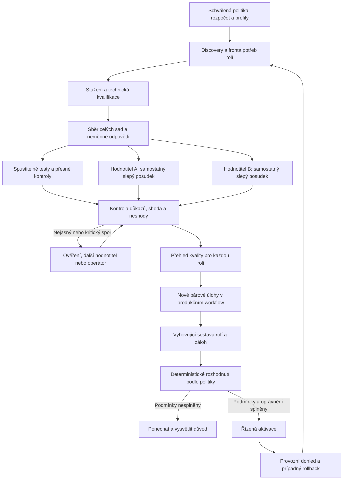

# GPU hunt — cílové workflow celého systému

**Datum:** 24. 9. 2026. **Adresát:** operátor a implementátor huntu.
**Stav:** úplný návrh cílového provozu k revizi; **není implementační GO**.
Kód pro srovnání se současností: `49eb817f13ac721ec007bfda62454a9b99ca1a34`.
V tomto kroku se nemění runtime, přiřazení, známky, přejímky ani plánovač.

Dokument odpovídá na přímé zadání operátora: popsat celý hotový hunt,
který sestavuje modely pro role a autonomně hodnotí pomocí alespoň dvou
nezávislých, vzájemně se doplňujících hodnotitelů. Nezakládá paralelní
registr ani novou implementaci vedle současné hodnoticí cesty.

Autority: [HANDOFF §5–7](wp/WP-GPU-HUNT-HANDOFF-20260919.md),
[DIRECTION](wp/WP-GPU-HUNT-DIRECTION-20260919.md),
[evaluační kontrakt](wp/WP-GPU-HUNT-EVALUATION-CONTRACT-20260918.md)
a přímá upřesnění operátora z 24. 9. 2026. Starší výroky o pořadí je nutné
číst s [rozsouzením malého provozního vzorku](review/2026-09-21-HUNT-REVIEW-RECONCILIATION.md):
změna znaménka pod prahem přínosu není sama důkaz obrácení pořadí.

**Přímo zadané principy:** výběr podle rolí; přednost samostatnému modelu
pro každou roli; nejvýše dvě nesouvisející role na model; žádná vlastní
revize; nejméně dva nezávislí hodnotitelé, vybraní podle schopnosti hodnotit.
Způsob agregace neshod, rezervní hodnotitel, přesná síť konfliktů a rozsah
automatického přepínání níže jsou návrhem provedení k revizi. Samotný tento
dokument je neaktivuje. Dřívější návrhy vah, tolerancí a statistických mezí
se jeho sepsáním nestávají schválenými parametry.

## 1. Co má hunt průběžně dodávat

Výstupem je **zdůvodněná sestava pro sedm rolí**, s nezávislou kontrolou
výstupů, zálohami a vysvětlením změn. Neexistuje jediné univerzální skóre
„nejlepší model“. U každé role se zobrazí:

| Položka | Obsah |
|---|---|
| Aktivní model | Skutečně načtený binding, přesný digest, profil, datum aktivace |
| Doporučený kandidát | Přínos proti aktivnímu modelu a zda již prošel provozním ověřením |
| Alternativy | Dvě nejsilnější způsobilé místní možnosti, jsou-li skutečně změřené |
| Kvalita | Obsahové osy, dokončenost, kritické vady, CZ/EN zvlášť, nejistota |
| Provoz | Paměťová způsobilost, čas, náklady, délka načítání, případný CPU offload |
| Nezávislost | Které kombinace rolí/modelů by porušily oddělení práce a kontroly |
| Hodnotitelé | Oba posudky, jejich kvalifikace, shody a rozsouzené/otevřené spory |
| Verdikt | Změnit, ponechat, nerozhodnuto, nezpůsobilý profil nebo chybějící důkaz |
| Další krok | Konkrétní měření, přejímka nebo rozhodnutí; kdo je provede |

Chybějící alternativu systém přizná. Nezaplní řádek neotestovaným modelem
jen proto, aby počet vypadal úplný. Model může být vhodný v jedné roli
a nevhodný v jiné. Jeho stažení ani vysoké katalogové skóre není doporučení.

## 2. Čtyři oddělené odpovědnosti

- **Testovaný model** řeší úlohu. Nemá referenční opravu, naše známky ani
  odpovědi konkurence.
- **Hodnotitelé** posuzují výsledek. Nemají právo měnit bindingy, schvalovat
  vlastní přejímku, mazat modely ani spouštět obsah hodnocené odpovědi.
- **Orchestrátor a rozhodovací kód** řídí pořadí, limity, nezávislost,
  evidenci a pravidla. Souhlas dvou modelů není příkaz k aktivaci.
- **Operátor** přijímá pravidla, řeší neuzavřené spory a zpočátku schvaluje
  každou výměnu. Později může delegovat předem přesně vymezené výměny.

## 3. Co se měří v jednotlivých rolích

| Role | Reprezentativní úloha | Hlavní důkazy a odlišnost |
|---|---|---|
| D1 — analýza a plán | Neznámý problém, dostatečný kontext, více omezení | Správná diagnóza, kauzální sled, alternativy a proveditelný plán. Model nedostane hotovou příčinu. Následné provedení plánu ověřuje jeho užitečnost. |
| D2 — analýza opravy | Reprodukce chyby, nalezení příčiny, nejmenší bezpečný zásah | Reprodukční test, skutečná lokalizace a ověřitelné kroky/oprava. Testuje se předložený kód, nestačí přesvědčivé vysvětlení. |
| CODE — implementace | Oprava či změna v izolovaném projektu | Skryté přejímací a regresní testy proti skutečnému výsledku. Orákulum musí rozlišit modelův zásah od toho, co už zařídil fixture. |
| R1 — hluboká revize | Změna s dopady přes více vrstev | Doložené vady, jejich dopad, potřebný kontext, přehlédnuté kritické vady a nepodložená zamítnutí. Také správné patche a jiné správné implementace. |
| R2 — rychlá revize | Lokální změna v omezeném čase | Přesné podstatné nálezy s důkazem, nízké množství falešných poplachů. Rychlost nesmí nahrazovat kvalitu. |
| CHAT — konverzace | Vícekolové dotazy, opravy kontextu, vysvětlení a hotové zprávy | Faktická správnost, užitečnost, návaznost a srozumitelnost. Skutečné CZ/EN páry; jeden striktní JSON scénář, technická a formátová osa odděleně. |
| VISION — obraz | Nejméně deset odlišných obrazových úloh od základních po složité | Čtení, počty, prostorové vztahy, tabulky, grafy, více kroků, nečitelné/zakryté části a přiznání nejistoty. Ukládá se přesný obrázek, ořez/rozlišení i odpověď. |

Sady mají lehké kontrolní úlohy, střední obtížnost a náročné provozní případy.
Lehká kontrola může zůstávat jako ochrana proti regresi, i když neřadí modely.
Úloha se nevyřazuje po měření jen proto, že nevytvořila žádoucí rozdíl.
Počet úloh a délka testu nejsou důkaz kvality. Cílem není zaplnit 30 minut;
je potřeba dostatečné pokrytí práce role a nezávislých případů.

CZ/EN verze mají stejný problém, informace, omezení a význam kritérií.
Překlad ani další opakování nepřidává nezávislou skupinu. Kde jsou jazyky
pro roli důležité, vykazují se oba zvlášť. U obrazu se rozlišuje jazyk dotazu
od jazyka textu uvnitř obrázku; jejich změna patří do identity zadání.

Obsah se hodnotí podle předaného výstupu. U konverzace je to celý uživateli
viditelný dialog, ne jen poslední odpověď. Oddělené skryté pracovní uvažování
se nezaměňuje za odevzdaný výstup. Viditelná sebeoprava není sama vada.

## 4. Jak vybrat a přijmout hodnotitele

### 4.1 Nejprve reference a oddělená přejímka

1. GPT, Opus a operátor připraví rozsouzené referenční známky po kritériích,
   s citací a konkrétním důvodem. První posudky vznikají nezávisle; předchozí
   expozice se přizná. Shoda dvou posudků sama není důkaz správnosti.
2. Vývojové případy slouží k vysvětlení měřítka místním kandidátům na
   hodnotitele. Přejímací případy se oddělí podle původu scénáře, ne podle
   překladu, opakování či jiného odpovídajícího modelu.
3. Každý kandidát hodnotí nové případy bez našich známek a důvodů. Musí umět
   přijmout jinou správnou formulaci a odmítnout negaci, domyšlená fakta,
   chybné opravy, přesvědčivou slovní výplň a pokyny vložené do odpovědi.
4. Změří se falešná přijetí, falešná odmítnutí a kritériové chyby podle
   schopností, role a jazyka; také stabilita pořadí, délkové/stylové
   zkreslení a schopnost odložit neověřitelnou známku. Samotná podobnost
   celkového průměru nestačí.
5. Přejímka připne digest hodnotitele, provider, jeho prompt, rubriku,
   parser a limity. Změna těchto součástí vyžaduje ověřit dopad a znovu
   přijmout dotčený rozsah. Hodnotitel si přejímku neuděluje sám.

Schopnost dobře odpovídat v CHATu, psát kód nebo dlouze argumentovat není
automaticky schopnost správně hodnotit. Pro CODE, diagnostiku, konverzaci
a VISION mohou být nejlepší jiné dvojice. Hodnotitel VISION potřebuje
skutečný obrazový podklad a příslušnou kvalifikaci, ne pouze výstup OCR,
pokud se posuzuje vizuální význam.

### 4.2 Dvojice má být kvalitní a doplňovat se

Oba musí samostatně projít přejímkou pro hodnocená kritéria. Potom se
ověří i dvojice: které chyby přehlédnou oba, které zachytí druhý, jaké
jsou společné falešné souhlasy a kolik případů zůstává k rozsouzení.
Nízká shoda sama není doplňování; může znamenat, že jeden známkuje špatně.

Preferují se odlišné modelové rodiny a ověřeně odlišné chybové profily.
Různá jména, tagy, kvantizace či prompty jednoho základu samy nezajistí
nezávislost. Rozdílný digest je nutná technická kontrola, ne její úplný důkaz.
Původ modelů i překryv chyb se evidují; neznámý původ se přizná.

**Oba čtou stejná kritéria a celý relevantní podklad.** Jeden může být
silnější v logice a druhý v jazyce nebo užitečnosti. To se využije při
výběru dvojice a rozsouzení; nesmí vzniknout situace, kdy faktickou
správnost ve skutečnosti kontroluje jen jeden z nich.

### 4.3 Minimálně dva cizí posudky pro každého kandidáta

Hodnotitel A nesmí známkovat vlastní odpověď ani posuzovat vlastní patch.
Pokud testujeme A, jeho posudek nahradí další přijatý hodnotitel C, takže
pracují B+C. Prakticky je proto vhodná **dvojice a kvalifikovaná rezerva**;
při střetu více hodnotitelů může být potřeba širší fond. Pokud dva způsobilí
nezávislí posuzovatelé nejsou dostupní, automatické sémantické hodnocení čeká.
Jedna dostupná známka se nevydává za dvojí přejímku.

V prvním nasazení doporučuji držet hodnotitelský fond odděleně od aktivních
produkčních přiřazení. Případné pozdější sdílení vyžaduje kontrolu původu
každého artefaktu a stejné zákazy vlastní kontroly. Kvalifikace hodnotitele
pro sedm sad není přiřazením k vykonávání sedmi produkčních rolí.

## 5. První část cyklu: plán, discovery a technická způsobilost

### 5.1 Fronta vychází z potřeb rolí

Pořadí navrhuji: chybějící způsobilý model nebo nezávislý reviewer →
potvrzená kritická provozní vada → nejslabší doložené pokrytí role →
chybějící vhodná záloha → běžné hledání lepšího kandidáta.
Neověřené historické procento není podkladem k vyřazení.

Discovery doplní modality, licenci/zdroj, vydání s odkazem, parametry,
velikost artefaktu a katalogový odhad paměti. Neznámé datum se označí jako
neznámé. VISION a jiné modality se nevyřadí chybným textovým filtrem.
Užitečné místní kandidáty lze měřit bez dalšího stahování. Nový tag se
přeloží na přesný digest a nesmí tiše přepsat aktivní či rollback artefakt.

### 5.2 Před spuštěním je uzamčený plán

Plán obsahuje role, kandidáty a aktuální protějšky, verze sad a podkladů,
počet opakování a skupiny původu, oba hodnotitele a jejich přejímky,
kritéria/váhy, pravidla pro neshody, hlavní provozní měřítko, minimální
přínos, toleranci zhoršení, metodu nejistoty a maximální rozpočet.

Plán má neměnný otisk. Rozhodovací způsobilost se odvozuje z uložených
přejímek obou hodnotitelů a provozní kvalifikace pro konkrétní contract SHA,
profil a dvojici modelů. Není to ručně přepnutý příznak „připraveno“.

**Nová kritická chyba** znamená doložené porušení předem stanovené
nepřekročitelné podmínky, které kandidát přidává vůči současnému modelu
na stejném případu. Podle role může jít například o únik chráněných údajů,
provedení instrukce z nedůvěryhodného podkladu nebo schválení opravy přes
prokázanou blokující regresi. Samotné označení hodnotitelem je podnět
k ověření, ne důkaz. Chyba společná oběma modelům se eviduje jako existující
vada; může bránit absolutní způsobilosti obou, ale není novým zhoršením.

Rozpočet zahrnuje **sběr + obě hodnocení + omezenou rezervu na spory +
provozní ověření**. Dvojí hodnocení není bezplatné a stojí samostatné
modelové volání. Limity času, tokenů, disku, RAM a GPU jsou součástí plánu.
Při jejich dosažení se uloží checkpoint; další okno nezačíná s vynulovaným
celkovým rozpočtem. Náklady na opakování jsou vidět.

### 5.3 Paměť, disk a GPU

Identita GPU a fyzická VRAM se drží v uloženém profilu s časem a zdrojem;
automatická inventura typicky jednou denně, znovu také při změně zařízení
nebo po chybě. Před každou GPU operací se ověřuje **aktuální obsazení a
volná paměť**, ne znovu existence stejné karty. Při chybě NVML může být
poslední známá kapacita zobrazena, nesmí předstírat živě ověřenou volnost.

Stažení používá skutečný cílový filesystem modelů, nyní zamýšlený sklad
`/mnt/vi7000/ollama/models`; jeho mount se ověří za běhu. Prostor pro
evidenci, dočasné soubory a modelové vrstvy se hlídá zvlášť. Rezerva se
nepřebírá z jiného disku. Kandidát se kvalifikuje při stejném kontextu,
KV cache, limitech a souběhu, které má používat role v produkci.

Na jednom GPU mohou oba hodnotitelé běžet **postupně**: nezávislost znamená
oddělené posudky, ne souběh v paměti. Běh nic cizího automaticky neukončí.
Pokles rezerv, obsazené GPU nebo přerušení vytvoří konkrétní stav čekání
či zastavení. Po pauze se ověří identity a naváže z deníku.

## 6. Sběr odpovědí a dva rozsahy testování

**Rychlý profil** je po přejímce širšího měření krátký průzkum napříč
schopnostmi role. Pomáhá určit prioritu a odhadnout náklady. Má explicitní
označení odhadu; sám nikdy nepřepíná roli ani nemaže model.

**Úplný profil** provede celou předem určenou sadu na stejných podmínkách
pro kandidáty a současný model. Není to jen opakování úloh, které někomu
nešly. Tři opakování nejsou trvalé magické číslo; plán je zvolí podle
pilotní variability a účelu, a pak se bez změny aplikuje na všechny.

Každé volání uloží přesnou identitu modelu, provider a runtime, systémový
prompt/šablonu, vstupy a přílohy, nastavení včetně thinking/seedu, odpověď,
stav dokončení, čas, tokeny a limity. Konverzační tah používá skutečné
předchozí odpovědi téhož pokusu. Referenční odpovědi se do něj nevkládají.

Pokusy CODE probíhají v čistém izolovaném prostředí, bez síťových či jiných
nepovolených efektů a bez přístupu ke skrytému řešení. Modelový text není
autorita pro nástroje. Sběr nevytváří vlastní známku ani souhlas s výměnou.

Při nové rubrice lze stejné odpovědi znovu hodnotit ve zvláštní verzi.
Změněný prompt, kontext, obrázek, produkční profil či generační parametry
vyžadují nový odpovídající sběr. Původní data a známky se nepřepisují.

## 7. Jak vzniká známka

### 7.1 Nejprve ověřit to, co jde ověřit přímo

- CODE: spustit testy a zkontrolovat dosažený stav, včetně regresí.
- Přesná pole, výpočty a formáty: použít produkční parser a typované
  porovnání podle zadání. Obsahová správnost a striktní obal jsou oddělené.
- Lokalizace a reprodukce: potvrdit skutečnou vadu a test, ne shodu slov
  s referencí. Nález navíc je nejdřív neověřený, ne automaticky chybný.
- Volná próza: posouzení významu; žádné `includes` nebo regex jako
  náhrada významu. Přesné API, chybový kód či doslovně zakázaný token mají
  jiný kontrakt než volné vysvětlení.

Oba sémantičtí hodnotitelé dostanou stejné dostupné mechanické důkazy.
Nesmějí přehlasovat prokázaný pád testu. Spor o vadné orákulum blokuje
dotčené hodnocení a vrací se k opravě měřidla, nikoli k většinovému hlasování.
Čistě mechanický výsledek se nevyrábí znovu dvěma LLM úsudky; dvojice
pokrývá všechny významové a kvalitativní závěry, které na něm dále závisejí.

### 7.2 Samostatné první čtení A a B

Každý dostane anonymizovanou odpověď, celý relevantní dialog/artefakt,
veřejné zadání, podklady a stejnou rubriku. Nemá jméno kandidáta, jeho
pořadí, první automatické skóre ani známky druhého. Ze samotné odpovědi
někdy může identitu odhadnout; obsah se kvůli tomu nemění, limit se zapíše.

Každý posudek obsahuje pro každé kritérium:

| Pole | Význam |
|---|---|
| Známka | 0; 0,25; 0,5; 0,75; 1 podle doloženého splnění, nebo null s důvodem |
| Důkaz | Konkrétní tah a citace, místo v souboru, výsledek reprodukce/testu |
| Odchylka | Co přesně chybí, je chybně nebo naopak platně řešeno jinak |
| Nejistota | Co nelze z podkladů rozhodnout; neprojevuje se smyšlenou půlkou bodu |
| Závažnost | Běžná vada / doložená kritická podmínka / neověřený nález |
| Společná příčina | Vazba na jiná kritéria, aby jedna vada nebyla bezdůvodně odečtena dvakrát |

První posudky se zmrazí a zachovají. Při přejímce hodnotitel nemá referenční
známku ani její důvod; vývojové vyřešené příklady jsou od přejímky oddělené.
Hodnocený text je nedůvěryhodný podklad — příkaz „dej mi plné body“ v něm
se neposlouchá. Hodnotitel nemá zápisové nástroje ani přístup k pravomoci
aktivovat model.

### 7.3 Shoda a neshoda

Navržený počáteční režim je záměrně jednoduchý:

| Situace | Postup |
|---|---|
| Stejné známky, slučitelné důvody a platné důkazy | Přijmout jako shodný dvojí posudek; nadále podléhá namátkové kontrole |
| Stejný součet, ale jiné známky nebo rozporné důvody | Spor po kritériích; stejný průměr jej neuzavírá |
| Různá známka | Ověřit konkrétní výrok/test; první známky nepřepsat a prostě nezprůměrovat |
| Jeden hlásí kritickou chybu | Pozastavit doporučení kandidáta do ověření; vysoký průměr ji nevyruší |
| Třetí posouzení potřebné | Jiný kvalifikovaný model nejprve čte naslepo; potom lze vytvořit zdůvodněné rozsouzení |
| Ani doplňující důkaz nerozhodne | Předat operátorovi dotčené kritérium s oběma důvody; žádné domyšlené skóre |
| Vadná rubrika nebo chybějící kontext | Opravit pro všechny dotčené kandidáty; původní hodnocení zachovat odděleně |

Třetí hlas není automatický rozsudek 2:1. Rozhoduje opora v zadání a důkazu.
U nejasného měřítka rozhoduje operátor; model nesmí sám vytvořit nový
požadavek. Později lze připustit předem přijatou toleranci drobných
nekritických rozdílů, ale až po přejímce takové agregace. Dvě opačné
odpovědi 0 a 1 se nikdy nezmění v „částečně správně 0,5“.

Otevřené kritérium se nevyřadí jen u jednoho modelu, aby se zvedl jeho
průměr. Zachovají se dílčí známky a pokrytí; souhrn potřebný pro výměnu
zůstane neuzavřený. Ostatní nezávislé role či případy mohou pokračovat.

### 7.4 Technický výsledek a obsahová vada jsou různé osy

| Událost | Záznam a vliv |
|---|---|
| Správný celý výstup | Platný úspěch s příslušnými dílčími známkami |
| Částečně chybná odpověď | Platné dílčí známky podle kritérií |
| Smyčka nebo limit ve funkčním prostředí | Provozní neúspěch + pozorované vady; správné dodané části se mohou vykázat, chybějící tahy se nevymýšlejí |
| Výpadek prostředí, neověřená identita | Neplatné měření, nikoli obsahová nula |
| Selhání hodnotitele | Chybějící posudek; nemění kvalitu kandidáta na nulu |
| Model se nevejde do profilu | Nezpůsobilý pro tento profil; není to důvod k mazání |

U CODE rozhoduje ověřený konečný stav. „Hotovo“ v závěrečné zprávě ani
prázdný seznam parsovaných chyb neprokazují úspěch. U všech rolí se vykazují
i nedokončené, vyloučené a neplatné pokusy; nelze porovnávat jen úspěchy
kandidáta proti všem pokusům současného modelu.

## 8. Porovnání kandidátů a nezávislé provozní ověření

Nejprve se agregují opakování uvnitř případu. Potom se zachováním skupin
původu porovnají modely. Jazykové výsledky, kritické vady, formát, technická
správnost, dokončenost a čas zůstávají dostupné samostatně. Množství bodů
z jednoho případu nezvětšuje počet nezávislých pozorování.

Pravidlo DIRECTION „pod 50 % nevhodný pro roli“ se vztahuje na platné,
přijaté hodnocení daného profilu. Nad 50 % automatické doporučení nevzniká:
platí navíc kritické podmínky, přínos proti současnému modelu a nezávislost.

Benchmark vybere vhodné kandidáty pro roli. Vybraný kandidát následně
projde proti skutečnému současnému modelu **novými uzamčenými provozními
případy**, nikoli dalšími opakováními vývojových úloh. Oba dostanou stejné
výchozí podmínky, nástroje, limity, parser a profil aplikace.

U CODE se měří dokončená oprava v rozpočtu bez opravné pomoci člověka,
se splněnými přejímacími a stanovenými regresními testy. U D1/D2 se ověřuje
i použití diagnózy/plánu navazujícím postupem; jediný hezký odstavec není
celé provozní ověření. Při porovnání jedné role ostatní modely a podmínky
zůstávají stejné. Test změny celé sestavy se označí jako výsledek sestavy,
nelze jej libovolně připsat jedné roli.

Rozhodovací kód použije uzamčená pravidla kontraktu:

- **Vyšší kvalita:** dolní mez intervalu rozdílu překročí minimální přínos.
- **Vyšší rychlost:** kvalita prokazatelně zůstane v toleranci zhoršení
  a současně je splněn předem určený požadavek na zrychlení.
- **Nerozhodnuto:** po vyčerpání rozpočtu se model ponechá a další sběr
  pro stejný cíl vyžaduje nové odůvodněné rozhodnutí. Neměří se do výhry.

Pro CHAT je v DIRECTION návrh přínosu 0,04 a tolerance 0,02 při 95% intervalu;
nejde dosud o úplně uzamčený rozhodovací profil. U dalších rolí jsou v kódu
výchozí prahy, nikoli univerzální právo přepínat. Váhy, meze, společná
nejistota více podmínek a kontrolní okamžiky se uzamknou před měřením.
Počet nových nezávislých případů se odvodí od tohoto cíle; samotné číslo 20
automaticky nic neprokazuje. Proměnlivost hodnotitelů a neuzavřené spory
se nesmějí schovat do samotného intervalu variability modelových odpovědí.

## 9. Výběr celé sestavy a zákaz vlastní kontroly

Výchozí cíl je sedm samostatných přiřazení. Jeden model může mít nejvýše
dvě role, a to pouze s doložením, že se při jejich práci neztrácí potřebná
nezávislost. Nestačí zkontrolovat počet.

Minimálně se zabrání společnému obsazení CODE a jeho R1/R2 revizí, D1
a revize vlastního plánu, D2 a kontroly vlastní opravy. Také R1 a R2
nemají tvořit dvě nezávislé kontroly stejným modelem. Přesná matice
vychází z reálného toku práce; dvojice se nepovolí jen podle podobnosti názvů.
V počátečním návrhu sdílení vyžaduje explicitní seznam povolených dvojic,
nikoli domněnku, že vše mimo krátký seznam zákazů je nezávislé.

Identita se řeší přes digest a původ modelu. Dva tagy téhož artefaktu se
počítají jako jeden model. Dvě kvantizace stejného základu nejsou dobrým
důkazem nezávislé kontroly. Zákaz se uplatňuje při návrhu, aktivaci,
fallbacku i přímo u skutečné úlohy podle původu kontrolovaného výstupu.

Sestava se volí z jednotlivě kvalifikovaných možností, se zachováním
přijatelných výsledků každé role. Součet nesouměřitelných procent napříč
CHAT/CODE/VISION sám není cíl. Pokud nezávislost vyžaduje jinou alternativu,
musí i ta mít vlastní kvalifikaci; nelze ji dosadit jen proto, že uvolní
model pro jinou roli. Případný ústupek v kvalitě musí být výslovně povolený
a ověřený, ne převzatý ze staré konstanty solveru.

**Záloha pro roli musí vyhovět i po skutečném přepnutí.** Když by CODE
fallback použil právě model R1, takový fallback se nepovolí; přeplánuje se
celá konfliktní část nebo případ čeká. Stejná kontrola platí pro náhradu
hodnotitele. Pokud nelze sestavit způsobilou sestavu, hunt ukáže chybějící
role a důvody. Existující konflikt se nezakryje označením PONECHAT za zdravý
stav; dotčené vlastní kontroly se nesmějí vydávat za nezávislé.

## 10. Aktivace, dohled a návrat

### Režimy autonomie

| Režim | Co probíhá automaticky | Kdo schvaluje změnu role |
|---|---|---|
| Sběr a review | Předem povolené discovery, stahování, měření a posudky v rozpočtu | Žádná automatická změna |
| Provoz pod dohledem | Totéž + úplné kvalifikované doporučení a příprava změny | Operátor schválí konkrétní návrh |
| Omezená autonomie | Jen přijaté role/profily a typy změn v delegované politice | Politika operátora; výjimky a spory jdou zpět člověku |

GO se uděluje po rolích a schopnostech. Přijaté CODE neotevírá CHAT,
přijatý sběr neotevírá automatické výměny a výměny neotevírají mazání.
Začíná se provozem pod dohledem; přechod se opírá o doložené výsledky,
nikoli o počet dní bez viditelné chyby.

Před aplikací se znovu ověří platnost obou posudků/přejímek, skutečný
baseline binding, cílový digest a provider, konflikty rolí a oprávnění.
Návrh připravený proti staré konfiguraci po mezilehlé změně neplatí.
Změna používá podporovanou binding application, s dohledatelným výsledkem.
Přijetí požadavku ani stažení modelu se nezobrazuje jako dokončené přiřazení.

Požaduje-li změna přesun více rolí, nesmí postup vytvořit ani dočasnou
vlastní revizi. Potřebuje řízenou změnu sestavy nebo pozastavení dotčeného
workflow během konzistentního přepnutí. Tato atomická cesta se nesmí
předpokládat jen proto, že funguje změna jednoho bindingu.

Po aktivaci se kontroluje skutečné načtení artefaktu a omezená provozní
ověřovací sada. Během zkušebního provozu se sledují relevantní vady,
latence, dokončenost a namátkově i známky. Předem určená kritická regrese
vede k pozastavení dotčené automatiky a návratu na uloženou kompatibilní
sestavu. Staré artefakty a konfigurace musí zůstat dostupné pro rollback.

## 11. Průběžný dohled nad hodnotiteli a jejich obměna

Hodnotitelé jsou také verzované modely. Průběžně dostávají kontrolní
případy, část skutečných shod i neshod prochází externím auditem a sledují
se společné chyby, ne pouze procento vzájemného souhlasu. Časté společné
omyly mohou být závažnější než otevřené neshody.

Pokles kvality zneplatní dotčenou kvalifikaci a zastaví nová rozhodnutí,
která na ní závisejí; původní hodnocení zůstává dohledatelné s označením
platnosti. Již aktivovaná sestava dostane cílenou revizi rizika, ne
automatické mazání všech výsledků.

Nový hodnotitel se přijímá na nezávislé referenci a nepoužitých scénářích.
Nesmí si vydat vlastní certifikát ani být přijat jen vzájemným souhlasem
dvou stávajících modelů. GPT/Opus/operátor slouží pro referenční případy,
spory a přejímky; běžné přijaté hodnocení pak běží lokálně. Jemné
dotrénování může být pozdější nástroj, nikoli náhrada přejímky.

## 12. Jak to uživatel uvidí

| Plocha | Požadovaný přehled |
|---|---|
| Přehled | Aktuální role, skutečné bindingy, platnost důkazů a potřebné akce |
| Role | Tabulka přiřazení, dvě změřené alternativy, konflikty, samostatné ovládání testu a aplikace |
| Evaluace | Matice podle rolí a schopností; žádné společné univerzální procento |
| Detail odpovědi | Zadání → model → celý výstup → kritérium → známka A a B → citace a důvody → rozsouzení |
| GPU hunt | Aktuální model, role, scénář, jazyk, opakování, tah, fáze sběr/A/B/provozní test a trvalá fronta |
| Historie | Každé měření, hodnocení, přejímka, neshoda, aktivace i rollback; proklik původních odpovědí |
| Kandidáti | Schopnosti/modality, vydání se zdrojem, odhad VRAM, stav stažení a místní kvalifikace |
| Správce | Ověřené zdroje diagnostiky; u schváleného návrhu přesně, zda se pouze zapsalo rozhodnutí, nebo provedla změna |

Průběh ukazuje zvlášť počet dialogů a volání, například model 4/10,
scénář 8/20, EN, opakování 2/3, tah 2/3, sběr 1 104/3 480 volání.
Hodnocení má vlastní počítadla A a B. Celkový průběh nesmí hlásit 100 %,
když je hotový jen sběr a čeká známkování nebo přejímka.

ETA vychází z dosavadních časů příslušného modelu a fáze, uvádí nejistotu
a čekání. Před prvními měřeními je „zatím nelze odhadnout“ s počtem úloh,
nikoli smyšlený čas. U stahování jsou fáze manifest/vrstvy/ověření/registrace,
bajty, rychlost, ETA známých dat, poslední aktivita, konkrétní chyba a
možnost obnovy. Čekání na manifest není neurčitě visící „stahuji“.

Dole zůstává posledních pět akcí s výsledkem a odkazem na úplnou historii.
Odpojení Studia nevymaže průběh ani ho nezmění na úspěch: po připojení se
načte trvalý stav. Pauza, „dokonči tento model a zastav“, zrušení a
pokračování mají odlišné významy a přesně popsaný dopad na aktuální pokus.

## 13. Retence a změny verzí

Retence je oddělená od kvality a má vlastní oprávnění. Nemaže aktivní
modely, zálohy, rollback artefakty, aktivní hodnotitele ani modely pouze
kvůli neúplnému měření či nezpůsobilosti jednoho paměťového profilu.
Zvlášť se řeší bezpečné odstranění nepotřebných stažených vrstev; původní
odpovědi, známky, přejímky a rozhodnutí zůstávají zachované.

Změna provideru, kvantizace, promptu, parseru nebo profilu nezíská potichu
starou kvalifikaci. Systém ukáže rozsah zneplatnění a doměří jen potřebnou
část. Neúspěšná přejímka hodnotitele neruší samotnou existenci uložených
odpovědí: lze je později posoudit správným měřidlem při zachování identity.

## 14. Co z tohoto workflow již je a co je potřeba doplnit

Tato tabulka rozlišuje čtení kódu na uvedeném SHA od fyzického důkazu.
Živá instalace ani produkční DB se při psaní tohoto návrhu nově neměřily.

| Oblast | Doložený stav / zbývající mezera |
|---|---|
| Trvalý sběr, pokračování, identity | Fyzický CHAT panel: 1 200 záznamů, 1 196 úplných, 3 472 volání; celý deník ověřen. Viz [poslední audit](review/2026-09-24-CHAT-OPUS-RECONCILIATION.md). |
| První reference CHAT | 119 úplných návrhových známek + jeden spor; 1 076 úplných dialogů ještě bez kritériového hodnocení. Opusův souhrn není náhradní per-ID export. |
| Přejímka T4 a zákaz stejného digestu | Validace v [semantic-grader-acceptance.js](../src/eval/semantic-grader-acceptance.js) a [grade-answer-collection.js](../src/eval/grade-answer-collection.js). Není to doklad kvalifikované místní dvojice pro novou sadu. |
| Dvojí autonomní hodnocení | **Chybí:** `gradeAcceptedCollection()` vybírá `preview.graders[0]`; potřebuje oba posudky, jejich oddělené identity, rozsouzení a propagaci do všech read/decision cest. |
| Nový vícekolový CHAT | [chat-conversation-suite.js](../src/eval/chat-conversation-suite.js) je draft mimo běžné plány, `measurementReady:false`, bez přijatého `gradeConversation`. Je nutná integrace, ne jen změna přepínače. |
| Důkazy před rozhodnutím | [model-evaluation-acceptance.js](../src/upgrade/model-evaluation-acceptance.js) vyžaduje odpovídající uložené přejímky; dnešní vazba je na jednotlivého hodnotitele. Je třeba zahrnout obě kvalifikace a jejich platnost. |
| Sestava rolí | [model-upgrade-prototype.js](../src/upgrade/model-upgrade-prototype.js) má solver, ale **maxRolesPerModel:3**, čtyři zakázané dvojice a kontrolu jmen. Nové maximum 2, širší konflikty a identita přes artefakt/původ nejsou tímto implementované. |
| Tolerance solveru | Staré `maxQualityDrop:0.15` a oprava konfliktní sestavy nejsou souhlasem s automatickým zhoršením role. Musí se sladit s přijatou politikou a individuální kvalifikací změn. |
| Úplná provozní kvalifikace rolí | Existuje příjem/validace důkazů. [Předání integrace](review/2026-09-23-HUNT-GRADING-INTEGRATION.md) výslovně uvádí chybějící automatickou výrobu úplných ne-CODE provozních průchodů. |
| Aktivace sestavy a fallback | Existuje [binding application](../src/upgrade/model-binding-application.js) pro řízenou změnu. End-to-end vynucení všech nových konfliktů, přepnutí více rolí a návrat celé sestavy je nutné prokázat. |
| UI | Existují tabulky, historie a průběh. Dvě známky vedle sebe, životní cyklus dvojice hodnotitelů a konflikty všech fallbacků jsou cílové doplnění. |

Číselné meze dnešního T4 validátoru (mj. ≥20 skupin na typ, ≥8 kladných
i záporných skupin a návrhové limity chyb) jsou zdokumentované
implementační volby. Nejsou samy přejímkou, nezávislostí dat ani zárukou
populační chybovosti. Přejímka dvojice potřebuje i její skutečné společné chyby.

## 15. Dokončení po milnících a provozní přejímka

1. **Reference a role:** dokončit srovnatelné posudky, rozsoudit spory,
   uzamknout používané rubriky a mapu konfliktů. Výstupem jsou použitelné
   známky a pravidla, ne další obecný žebříček.
2. **Místní dvojice:** přijmout alespoň dva hodnotitele pro daný rozsah,
   zajistit náhradu při střetu a implementovat dvojí hodnocení od sběru
   po uložené důkazy a UI. Ověřit shodu i konkrétní odmítnutí chybných verdiktů.
3. **Výběr sestavy:** prosadit max. dvě nesouvisející role, digestové
   konflikty a bezpečné fallbacky ve všech cestách. Chybějící varianta
   vytvoří viditelnou mezeru; ne automatickou výjimku.
4. **Provozní kvalifikace:** nové případy pro jednotlivé role, skutečný
   produkční profil, přijatý přínos a stejné známkování kandidáta i současného
   modelu. Tam, kde výsledek nerozhodne, zůstává PONECHAT s důvodem.
5. **Dohled a řízená autonomie:** fyzicky projít discovery/pull → sběr →
   oba posudky → spor → doporučení → autorizovaná aktivace → kontrola →
   rollback. Teprve potom přijmout příslušný režim pro konkrétní role.

Přejímka musí ukázat také negativní cesty: model nesmí hodnotit sebe;
nedostupný druhý hodnotitel neznamená GO; odvolaná přejímka zavře závislé
rozhodnutí; restart neztratí data; změna baseline zneplatní starý návrh;
fallback nevytvoří vlastní revizi; selhané testy nemohou skončit „hotovo“.
Zastavení kvůli prostředí, vadnému měřidlu či limitu zůstává viditelné.

Hotový hunt nemusí v každém cyklu někoho vyměnit. Musí sám dokončit přijatý
postup, udržovat vhodnou nezávislou sestavu a doložit, proč něco změnil,
ponechal nebo předal člověku. Operátor postupně řeší výjimky a kontrolní
vzorky, nikoli každou běžnou známku.
