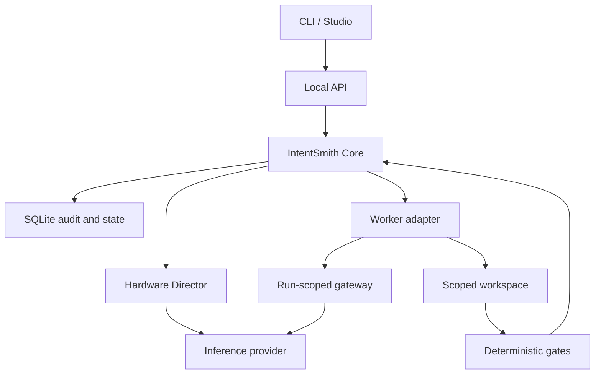

# Architecture overview

IntentSmith separates authority from capability. Core is authoritative for task state and verdicts; adapters provide inference or work; policy and deterministic gates constrain what can become an accepted result.

## Authority model

| Component | May do | Must not decide |
| --- | --- | --- |
| Core | Validate commands, transition lifecycle, enforce policy, persist evidence, calculate verdict | Provider transport or worker internals |
| Persistence | Store state, run atomic transactions, append audit, recover interrupted runs conservatively | Business policy |
| Hardware Director | Describe sanitized local capacity and choose compatible profiles | Task lifecycle |
| Inference provider | Execute a bounded inference request | Task state or final verdict |
| Worker adapter | Translate a contracted run to an external worker and emit validated events | Persistence, approvals or pass/fail authority |
| Gateway | Expose the minimum run-scoped local capability with revocable credentials | General Core or filesystem access |
| Gate runner | Execute deterministic checks and return evidence | Lifecycle transitions |
| CLI / Studio | Present commands and state | Bypass Core |

## Stable package boundaries

The Phase 2 baseline contains:

- `packages/contracts` — TypeBox runtime schemas and shared public types;
- `packages/core` — use cases, lifecycle, policy ports and evidence verdicts;
- `packages/persistence` — SQLite migrations, repositories, transactions and recovery;
- `packages/hardware` — sanitized hardware discovery and model-fit policy;
- `packages/adapter-ollama` — the local Ollama adapter;
- `packages/testing` — deterministic fakes and fixtures;
- `apps/server` — localhost composition and HTTP transport;
- `apps/cli` — the `intentsmith` command-line client.

Phase 3 develops `worker-sdk`, `process-runtime` and `adapter-opencode` behind the existing worker boundary. They are not stable packages until the phase merges.

Dependency direction is enforced by tests. See [dependency boundaries](dependency-boundaries.md).

## Domain model

- A **Project** identifies a local workspace and its policy.
- A **Task** represents durable user intent.
- A **TaskRun** represents one execution attempt for a task.
- A **WorkerEvent** is validated evidence emitted during a run.
- A **CoreVerdict** is derived from lifecycle state and required evidence.
- An **AuditEntry** records accepted and rejected operations without update/delete paths.

Separating `Task` from `TaskRun` preserves attempt history and permits future retry policy without rewriting the original intent.

## Inference flow

1. Core validates an inference request against its provider-neutral contract.
2. The Hardware Director reads a sanitized local profile.
3. Policy selects a model/profile or returns an explicit incompatibility.
4. The provider adapter translates to the local runtime protocol.
5. Timeouts and cancellation are mapped to stable IntentSmith errors.
6. Raw prompts, responses and GPU identifiers are excluded from persistent evidence.

Ollama is the first adapter. The provider port deliberately does not expose Ollama request or response shapes.

## Worker flow

1. Core creates a run and obtains a truthful worker descriptor.
2. Policy grants only capabilities supported by that descriptor.
3. A process supervisor starts the worker without a shell and with an allowlisted environment.
4. The ACP client negotiates protocol compatibility and starts a session.
5. The worker can reach local inference only through a loopback gateway token scoped to that run.
6. Worker messages are runtime-validated and untrusted text is redacted at ingress.
7. Proposed workspace changes are captured, checked and persisted as evidence.
8. Cancellation, timeout, failure and shutdown revoke the token and terminate owned processes.

This flow is Phase 3 work in progress. The exact completed and pending guarantees are tracked in [STATUS.md](../STATUS.md).

## Verdicts

A terminal worker event is necessary but insufficient for a pass. Core evaluates:

- whether lifecycle transitions were valid;
- whether the run ended successfully;
- whether required deterministic gates executed and passed;
- whether the evidence belongs to the correct task and run;
- whether the requested capability and policy constraints were respected.

Missing or contradictory evidence produces a blocked or failed result, never an optimistic pass.

## Persistence and recovery

SQLite is configured with foreign keys and WAL. Store operations serialize transactions per connection, while independent store instances maintain isolated async transaction contexts.

On restart, interrupted runs are not automatically retried. Recovery marks the attempt failed/blocked, preserves audit history and is idempotent. Automatic retry remains a later product policy.

## Trust boundaries

- HTTP listeners bind to loopback only.
- The optional worker gateway is disabled unless explicitly enabled.
- Gateway tokens are short-lived, run-scoped and revoked on every terminal path.
- External worker output and workspace content are untrusted inputs.
- Process-group termination and environment filtering reduce exposure but are not an OS sandbox.
- A degraded sandbox may be used only where policy explicitly permits it; real-project execution requires stronger proof in Phase 3.

See [SECURITY.md](../../SECURITY.md) and the [Phase 2 threat model](../security/phase-2-threat-model.md).

## Extension points

New providers and workers are added as adapters:

- first define or reuse a provider-neutral port;
- run the unchanged contract suite against the adapter;
- keep vendor and protocol shapes inside the adapter package;
- make optional real-integration tests explicit;
- document new capabilities, permissions and failure modes;
- add an ADR when the change alters a lasting boundary.

This allows IntentSmith to reuse open-source components without delegating product authority to them.
