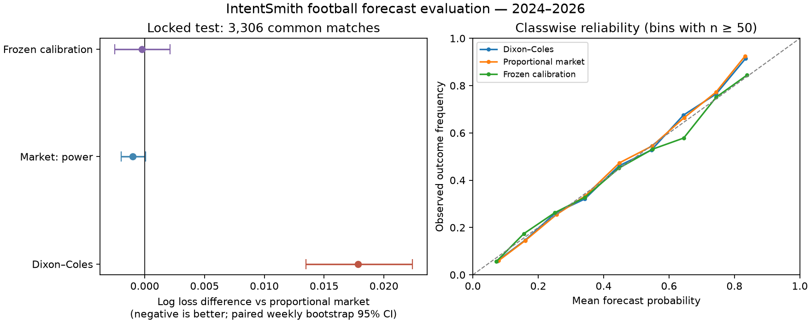

# Autonomní sázkař pro IntentSmith: výzkum, měření a implementační rozhodnutí

**Stav k 12. září 2026.** Podklad pro operátora a review implementace
`WP-SAZENI-AUTONOMOUS-20260912`. Rozsah je předzápasový fotbal 1X2,
časově omezené singly a akumulátory. Dokument rozlišuje publikované poznatky,
tvrzení poskytovatelů, vlastní měření a návrhy. Neprohlašuje vyčerpání veškeré
literatury ani univerzálně nejlepší predikci. Výzkum vedl k běžícímu kódu,
ikoli pouze k návrhu; nezávislé přijetí změn zatím neproběhlo.

## 1. Rozhodnutí, které lze nyní obhájit

Engine má samostatně získávat zdroje a vypočítat pravděpodobnosti. Uživatel
zadává čas, rozsah kurzu, minimální teoretickou úspěšnost a další preference.
Nesmí dodávat predikční vektor a nesmí svým textem označit zdroj jako ověřený.
Tuto změnu implementuje kontrakt v3.

Vlastní model ale není automaticky kvalitnější než informace obsažená v trhu.
Proto výchozí výpočetní politikou zůstává tržní odhad
normalizovaný přes celý 1X2 trh. Strukturální model z výsledků se autonomně
trénuje a jeho výstup se uchovává pro srovnání. Při měření neprokázal zlepšení
proti trhu. Toto rozhodnutí není tvrzením, že trh má pravdu, ale že dostupné
důkazy neopravňují povýšit složitější model na lepší predikci.

Bezplatný veřejný režim byl skutečně spuštěn bez vložených zápasů a procent.
Vytvořil návrhy pro následujících 24 h i 72 h a uložil zdroje i výpočet.
Aktuální nabídka českých kanceláří má připravený samostatný konektor;
bez API klíče nelze potvrdit jeho živé pokrytí a kvalitu. Přítomnost názvu
kanceláře v katalogu je slabší důkaz než čerstvý úplný trh konkrétního zápasu.

## 2. Proč nezačínat předpovídáním procent pomocí LLM

Pro tuto úlohu je nutné kontrolovat součet pravděpodobností, časovou dostupnost
každého vstupu, totožnost zápasu, kalibraci a reprodukovatelnost. Volný text
„domácí mají asi 70 %“ žádnou z těchto vlastností nezaručuje. Implementace proto
nevyužívá LLM k tvorbě numerických predikcí ani k přepisu výsledného tiketu.
Jazykový vstup převádí omezený parser na preference; výsledek počítá a vykreslí
program. Nepodporované zadání vyjasní nebo odmítne.

Budoucí role LLM může být užitečná při práci se zprávami o zraněních a sestavách.
Výstup by však musel být strukturovaný fakt s identitou hráče, původním zdrojem,
časem publikace, časem pozorování a stavem potvrzení. Zpráva „hráč pravděpodobně
nenastoupí“ nesmí sama změnit pravděpodobnost o libovolný počet procentních bodů.
Takový vliv je parametr modelu, který je třeba odhadnout na historii stejných
časově dostupných vstupů. Tato část dosud není implementovaná.

## 3. Dostupnost dat: co se podařilo ověřit

| Zdroj | Ověřená role | Konkrétní limit | Rozhodnutí |
|---|---|---|---|
| Football-Data.co.uk | veřejné CSV výsledků, statistik, kurzů a budoucích zápasů | nabídka není průběžně aktualizovaný český sportsbook feed | implementovaný referenční režim |
| Odds-API.io | veřejný katalog, OpenAPI, české názvy kanceláří | konkrétní data vyžadují klíč a plán; jde o nezávislého agregátora | implementovaný konektor, živé ověření čeká |
| The Odds API | dokumentace v4, časované odds snapshoty | veřejný seznam nepotvrdil požadovanou českou variantu kanceláří | zachován lokální adapter; není hlavní CZ cesta |
| Sportmonks | oficiálně dokumentované výsledky, sestavy, odds a predikce | šířka služby nedokládá konkrétní pokrytí nebo kalibraci našeho použití | kandidát pro další data a kontrolní model |
| StatsBomb Open Data | otevřená data vybraných soutěží a událostí | výběrové pokrytí, není univerzální aktuální feed | výzkum xG a událostí, ne náhrada současné nabídky |

Football-Data rozlišuje předzávěrečné a closing sloupce. Výslovně upozorňuje
na systematicky zastarávající veřejné Pinnacle kurzy od 23. 7. 2025 a jejich
vyřazení z agregovaných cen. Nabídky víkendů sbírá v pátek a pro týdenní zápasy
v úterý. Proto implementace nepoužívá Pinnacle ani směs maximálních cen a
nepovažuje čas stažení CSV za čas aktualizace každého kurzu. [1][2]

Staženo bylo 56 souborů: 55 liga/sezona CSV pro ročníky 2016/17–2026/27 a
aktuální nabídka. Obsahují 18 083 dokončených zápasů; poslední ročník je
neúplný. Celkem 7 360 634 bajtů. Manifest ukládá URL, přesný SHA-256, počet
bajtů, retrieval timestamp a Last-Modified. Jde o vlastní sčítání stažených
souborů, nikoli marketingový údaj. Raw CSV zůstávají v lokálním výzkumném
adresáři; do Git patří manifest a agregované výsledky. [E1]

Přímé čtení veřejného endpointu Odds-API.io `/v3/bookmakers` vrátilo 283
položek a `active:true` pro `Tipsport.cz`, `Chance.cz`, `iFortuna CZ`,
`Betano CZ`. Je to silnější důkaz než samotná propagační stránka, ale stále
neříká, které zápasy daný tarif vrátí. OpenAPI popisuje stránkování událostí,
samostatný status a dávky kurzů nejvýše deseti událostí. Konektor tyto hranice
vynucuje a uchovává jednotlivé odpovědi. [3][4][E2]

Poskytovatel zároveň výslovně uvádí, že není přidružený k Tipsportu a agreguje
veřejně zobrazené ceny. Jeho příklad odpovědi proto není důkaz právě platného
kurzu ani potvrzení přijetí sázky. U produkčního rozhodnutí je nutné rozlišit
licenci agregátora, přesnost dat a pravidla konkrétní kanceláře. [5]

## 4. Cena a rozpory v dokumentaci poskytovatelů

Aktuální cenová stránka Odds-API.io uvádí **Solo £49/měsíc pro dvě kanceláře**
a **Starter £99/měsíc pro pět kanceláří**. Současně píše, že vydávání nových
bezplatných klíčů je pozastavené na neurčito. Některé jiné stránky stále
slibují okamžitý bezplatný klíč. Pro odhad nákladů proto vycházím z aktuálního
ceníku, nikoli z obecného onboarding textu. Žádná registrace ani objednávka
neproběhla. Pro samostatného uživatele s 24–72h oknem není doložen důvod kupovat
WebSocket příplatek před otestováním REST nabídky. [6]

Sportmonks uvádí základní fotbalový Starter od €29 měsíčně při měsíční platbě
pro pět lig; predikce jsou doplněk. Na stránce doplňku se levnější čísla
vztahují k roční fakturaci a jsou bez DPH. Nestačí sečíst nejnižší čísla z
různých stránek: požadovaná historie, odds, ligy a rozšíření musí patřit do
jedné konkrétní konfigurace. Publikované log loss metriky dodavatelské
predikce jsou vhodný začátek kontroly, nikoli náhrada vlastního časově
odděleného měření. [7][8]

Doporučení pro další nákup je podmíněné: nejprve krátká sonda jednoho nebo
dvou vybraných českých booků a konkrétních soutěží. Měřit podíl úplných 1X2,
stáří aktualizace, změny statusu, zpoždění odkladu zápasu, shodu týmů a cenu
za úspěšně použitelnou událost. Teprve z tohoto měření lze obhájit rozpočet.
Samotný počet podporovaných sportů není metrika kvality pro tento engine.

## 5. Pravděpodobnost, marže a strukturální model

První reference počítá pro úplnou trojici kurzů `o_i` hodnoty `q_i=1/o_i`
a `p_i=q_i/sum(q)`. Tyto hodnoty jsou automaticky získaným odhadem trhu.
Nejsou skutečnou známou pravděpodobností. Výzkum porovnal i power transformaci:
řeší exponent `k`, aby `sum(q_i^k)=1`. Konkrétní metodu odstranění marže je
vhodné měřit na daném zdroji; rozdílné metody nemají automaticky stejné chyby
u favoritů a outsiderů. Literatura o kombinaci trhu a historických výsledků
podporuje jejich společné empirické porovnání, nikoli předem zvolenou váhu
vlastního modelu. [9]

Dixon–Coles pracuje s týmovou útočnou a obrannou silou, domácí výhodou a
Poissonovými intenzitami branek. Korekce nízkých skóre upravuje buňky 0:0,
0:1, 1:0 a 1:1. Novější výsledky dostávají vyšší váhu. Původní práce je
historickým základem metody, nikoli důkazem současného profitu. [10]

Implementace přidává ridge regularizaci týmových parametrů. Exponenciální
útlum se vybírá na validačním období, ne podle výsledku testovací sezony.
Výpočet se zastaví bez predikce při nekonvergenci, neplatné korekci, příliš
malé historii nebo neznámém týmu. Skórová matice má kontrolovanou zbytkovou
hmotu; normalizace nesmí zamaskovat zápornou pravděpodobnost.

Nový preprint z roku 2026 rovněž uvádí převahu závěrečné tržní ceny nad
strukturálním modelem ve zkoumané Serii A. Je to podpůrná a dosud preprintová
evidence. Navíc používá closing ceny a preferuje Pinnacle, což vzhledem k
upozornění datového zdroje vyžaduje opatrnost. Náš experiment stojí na vlastních
měřeních a jiném výběru kurzů; nepřebírá jeho výsledky jako hotové potvrzení. [11]

## 6. Jak bylo provedeno vlastní měření

Výzkumný program používá stejný čistý JS model jako autonomní engine.
Pro každou ligu jej znovu trénuje před příslušným kalendářním měsícem;
trénink končí před forecast origin a používá posledních 1 461 dnů. Výsledky
mladší než 48 hodin jsou vyloučené. To představuje konzervativní publikační
zpoždění, ne pozorovanou historickou latenci zdroje.

| Účel | Období | Co se v něm smí rozhodovat |
|---|---|---|
| historický trénink | od 2016/17, rolling okno | odhad parametrů z minulosti |
| výběr strukturálního modelu | 1. 7. 2021 – 1. 7. 2023 | Poisson/DC, half-life, ridge |
| kalibrace a kombinace | 1. 7. 2023 – 1. 7. 2024 | váha modelu/trhu a teplota |
| uzamčené testovací období | 1. 7. 2024 – 1. 7. 2026 | závěrečné vyhodnocení této série |

Porovnána byla jedna regularizovaná Poissonova varianta a šest Dixon–Coles
variant: half-life 180/365/730 dnů a ridge .001/.005. Výběr proběhl podle
log loss na shodném pokrytí 3 429 validačních zápasů. Vyhrál DC s 365 dny a
ridge .005. Kalibrace pak samostatně zkoušela tržní proporcionalitu/power,
21 vah vlastního modelu a 13 teplot. Vybrala váhu modelu **0** a teplotu **.85**.
Soubor s touto konfigurací vznikl před zpracováním testovacích výsledků. [E3]

Hlavní metriky jsou log loss a více-třídní Brierův součet, kde nižší je lepší.
Accuracy ukazujeme jen pomocně. Tyto proper scoring rules hodnotí celý vektor
pravděpodobností, nikoli jen nejpravděpodobnější výsledek. Kalibraci a schopnost
odlišit silné a slabé favority je potřeba posuzovat odděleně. [12][13]

Teplotní kalibrace je nízkoparametrická možnost úpravy pravděpodobností, ale
musí se učit na datech oddělených od hodnocení. Samotné snížení chyby na
kalibračním vzorku není úspěchem na budoucích datech. Z tohoto důvodu nebyla
použita flexibilní izotonická úprava každé ligy na malých vzorcích. [14][15]

## 7. Výsledky uzamčeného testu

Celkem 3 504 zápasů, 3 306 splnilo modelové pokrytí; tržní reference existovala
pro všech 3 504. Následující tabulka používá **stejných 3 306 zápasů** u všech
metod. Vynechaných 198 zápasů nesmí zmizet z reportu kvality. [E3]

| Metoda | Log loss | Brier |
|---|---:|---:|
| tržní proporcionalita | 0.970090 | 0.576688 |
| tržní power transformace | 0.969089 | 0.576182 |
| Dixon–Coles | 0.987920 | 0.588854 |
| předem zmrazená kombinace/kalibrace | 0.969874 | 0.576836 |

Párový bootstrap resampluje celé kalendářní týdny, 2 000 replikací s pevným
seedem. Rozdíl log loss proti tržní proporcionalitě:

- DC: 95% interval **[+0.013496, +0.022363]**; zřetelně horší v tomto vzorku.
- Power: **[−0.001980, +0.000078]**; interval zahrnuje nulu.
- Zmrazená kalibrace: **[−0.002492, +0.002116]**; interval zahrnuje nulu.

Proto v běžné politice zůstala jednoduchá reference. Jde o rozhodnutí po
vyhodnocení této série; nová promovaná metoda by potřebovala další nezávislé
ověření. Bootstrap zde neřeší všechny formy nestacionarity a není intervalem
pravděpodobnosti konkrétního zápasu. [E3]

Křivka spolehlivosti sdružuje třídy do deseti pevných pásem a v grafu vynechává
pásma pod 50 pozorování. Není dokladem kalibrace v každé lize a u každého
uživatelského filtru. Vybrané tipy s vysokým kurzem mohou mít jinou chybu než
celkový soubor. Report proto obsahuje i metriky po ligách a počty v pásmech.

## 8. Kontrola matematiky a širší průzkumný experiment

Správný backtest nespraví chybný solver. Gradient DC objective byl porovnán
s nezávislými centrálními diferencemi; test kontroluje i asymetrické intenzity
a zachování pravděpodobnostní hmoty. Vedle toho SciPy L-BFGS-B s numerickým
gradientem z jiného počátečního bodu přepočítal šest tréninků: E0/D1/I1,
k lednu 2024 a červenci 2026. Všech šest konvergovalo. Maximální rozdíl
objective je přibližně **2.48 × 10⁻⁸**. To podporuje numerickou implementaci,
ne predikční výhodu modelu. [16][E4]

Další experiment využil Elo, předchozí průměry vstřelených/inkasovaných gólů,
střel a střel na branku, ligu a rozsah předchozí historie. Aktuální zápasové
statistiky nebyly vstupem jeho vlastní predikce. Simulovaná feature origin
byla 24 hodin před zápasem a výsledky se uvolňovaly s 48h zpožděním. Chybějící
statistika ponechala předchozí klouzavý průměr. Kandidáti: tři logistické
regrese s různou regularizací a dvě velikosti histogramových boosted trees. [17][E5]

Protože závěrečné sezony už byly zkoumány v prvním experimentu, je toto
**průzkumné opětovné použití testu, nikoli nová nezávislá validace**.
Nejlépe validačně vyšla logistická regrese C=.1. Na 3 504 testovacích zápasech
měla log loss 0.984327, tržní reference 0.971880 a zmrazená kalibrace 0.971972.
Ani zde kalibrace nepřidělila vlastnímu modelu kladnou váhu. Experiment nebyl
povýšen do runtime a nepřidal Python závislost běžnému enginu. [E5]

## 9. Co by skutečně mohlo přidat novou informaci

Další krok nemá být náhodné přidávání dalších modelů nad stejnými vstupy.
Je třeba dodat informaci, která ve stávajících cenách ještě není nebo kterou
stávající model nedostatečně využívá, a její přínos časově otestovat.

| Kandidát | Očekávaný přínos, který se musí teprve změřit | Nutná data |
|---|---|---|
| xG a kvalita vytvořených šancí | méně šumu než samotné skóre | konzistentní definice xG a čas dostupnosti |
| sestavy a hráčská síla | změna očekávané sestavy proti obvyklé | confirmed/predicted status, hráčské ID, historie |
| zranění a suspendace | dostupnost konkrétních hráčů | původní zdroj, čas, opravy a potvrzení |
| tržní konsensus a pohyb cen | více pohledů na pravděpodobnost a aktuální informaci | současné kompletní trhy, žádné křížení časů |
| dynamický hierarchický model | částečné sdílení informace pro nové týmy | postupy/sestupy a spolehlivé identity |
| společný model tiketu | závislosti mezi vybranými událostmi | dostatečná historie skutečně vydaných návrhů |

StatsBomb Open Data má hodnotu pro výzkum událostí a kvality šancí, ale
publikuje vybrané soutěže. Nelze z jeho existence dovodit aktuální pokrytí
všech pěti lig. Před přidáním dat do produktu je nutné použít skutečné
licenční podmínky daného datasetu a požadované atribuce. [18]

U sportovních zpráv je navíc potřeba zabránit zpětnému úniku oprav. Článek
publikovaný ráno a večer doplněný o potvrzenou sestavu musí mít dva oddělené
pozorované stavy. Archiv dnešní stránky s ranním datem sám nedokládá, že
večerní informace byla známá již ráno. Nový zdroj proto musí procházet stejným
ukládáním snímků a časů jako kurzový feed.

## 10. Tikety, čas, korelace a ekonomika

Součin p je správný pouze za předpokladu nezávislosti. Odlišné zápasy tento
předpoklad nezaručují. Implementace proto zakazuje společnou událost, tým a
známou dependency group, ale nepředstírá, že tím odstranila veškerou závislost.
Zobrazuje bodový odhad a Fréchetovy meze pro stejná marginální p. Tyto meze
nejsou statistickou dolní mezí skutečné úspěšnosti a navíc závisejí na kvalitě
samotných marginálních odhadů.

Například p=.6 a p=.6 dávají při nezávislosti .36; bez znalosti závislosti
jsou přípustné meze společného úspěchu .2 až .6. Požadavek „alespoň 35 %“ tak
může splnit bodový výpočet .36, ale není důkazem skutečného minima 35 %.
Číselný příklad je přímo odvozený z pravděpodobnostních mezí, ne z dat bookmakerů.

Očekávaná návratnost `p × kurz − 1` používá nejistý odhad p. Pokud se p odvozuje
ze stejného celého trhu, odkud pochází kurz, nemáme nezávislý důkaz value betu.
Engine může porovnávat toto číslo a respektovat uživatelský filtr; nesmí jej
vydávat za dosažený nebo garantovaný zisk. Zatím neimplementuje Kelly staking
ani automatickou alokaci bankrollu. Výchozí preference nevyžadují vklad.

Časové okno platí pro začátky a rozestup uvnitř každého tiketu. Není to příslib
vypořádání. Zápas za týden nesmí doplnit tiket „do 24 h“, ani když jinak chybí
položka. Při změně času, odkladu nebo expiraci feedu musí dojít k novému
výpočtu. Veřejný soubor nemusí zachytit čerstvý odklad; to je konkrétní riziko
referenčního režimu, které placený feed musí v pilotu řešit měřitelně.

## 11. Architektura, kterou implementace již nese

1. **Vstup:** uzavřené preference a jednoznačná kotva času. Nový JSON resetuje
   dřívější textové override; další zpráva může změnit jen pojmenované limity.
2. **Datový host:** konkrétní invocation pro specialistu, konverzaci a zprávu.
   Umí omezené čtení pevných zdrojů a uložení vlastního výsledku.
3. **Získání a evidence:** omezený přenos, audit před odesláním, raw obsah,
   digest, retrieval timestamp a původní metadata. API key zůstává v hostu.
4. **Normalizace:** validace CSV/JSON, úplnost trhu, přesná identita, status,
   časová zóna, duplicity a chybějící údaje. Žádné tiché fuzzy spojení zápasů.
5. **Model:** oddělená historie, kontrolovaná konvergence a jednoznačný model ID.
   Výpočetní politika určuje, který odhad se smí použít pro výběr.
6. **Solver:** tvrdé meze, omezený počet stavů, explicitní neúplnost hledání,
   přesná aritmetika kurzů a peněz, oddělené alternativy.
7. **Uložení a výstup:** modely, nabídka, preference a výsledek v DB; přímý
   deterministický report a export. Chyba persistence nevede k READY.

Specialista nemá vlastní síťovou, filesystem nebo SQL autoritu. API URL,
metody a parametry jsou omezené v core outbound policy; neexistuje zde
obecný „vyhledej libovolnou stránku“ backdoor. Přístupová capability zaniká
po úloze a ukládání výsledku je jednorázové. Samostatná DB nezasahuje do živé
provozní databáze IntentSmithu. Tuto hranici ověřují negativní testy i skutečná
serializace handleru; nezávislé architektonické review zůstává otevřené.

## 12. Co zbývá ověřit a praktický postup

**Ihned použitelné:** spustit veřejnou autonomní cestu z README, prohlédnout
časové hranice, zdroj, jednotlivé tipy a uložený výpočet. Není potřeba ručně
vytvářet data, procenta, model ani tabulku zápasů. Výsledek může být prázdný,
pokud limity nebo pokrytí nedovolují kvalitní návrh.

**Před živým českým provozem:** přidat API klíč do prostředí hostu, ověřit
skutečně vybrané knihy v účtu poskytovatele, spustit sondu a porovnat nabídku
s konkrétní kanceláří. Zachytit kompletní 1X2, shodný čas/status a průběh
expirace. Klíč se neposílá specialistovi ani do chatové zprávy. Automatizovaný
nákup dat nebo komunikace s dodavatelem nebyly autorizovány ani provedeny.

**Před tvrzením o kvalitnější vlastní predikci:** sbírat nové předpovědi s
původním časem dostupnosti. Předem určit metriky a ligy, horizonty 24/72 h,
volbu modelu, minimální pokrytí a vyhodnocení právě vybraných tiketů. Vzorek
stanovit podle požadované přesnosti metrik; arbitrární „sto sázek“ nemusí
poskytnout dostatečně přesný závěr. Nové období se během ladění nesmí opakovaně
používat jako údajně nezávislý test. Běžný průměrný log loss není jediná
přijímací podmínka: nutná je také kalibrace a provozní spolehlivost.

**Otevřené části produktu:** automatické settlement a void/refund případy,
plánované úlohy a doručování, samostatný formulář ve Studiu, další sporty,
lineupy/zranění/xG a společný pravděpodobnostní model tiketu. Existující
implementace žádnou z těchto částí nepovažuje za hotovou. Výsledek této práce
je autonomní a měřitelný základ, jehož současnou hranici lze ověřit v kódu.

## Důkazy a reprodukce

- [E1] [Manifest 56 stažených zdrojů](betting-20260912/sources.json).
- [E2] [Veřejná sonda českého katalogu a otisk OpenAPI](betting-20260912/provider-probes.json).
- [E3] [Benchmark včetně metrik po ligách](betting-20260912/benchmark.json),
  [výběr modelu](betting-20260912/selection.json),
  [konfigurace zmrazená před testem](betting-20260912/frozen-policy.json).
- [E4] [Nezávislý numerický přepočet šesti modelů](betting-20260912/model-verification.json).
- [E5] [Průzkumné ML porovnání](betting-20260912/exploratory-ml.json).
- [Verze Python balíčků použité pouze pro výzkum](betting-20260912/research-requirements.txt).

Reprodukce měření: `scripts/betting/research-download.py`, `benchmark.mjs`,
`verify-scipy.py`, `research-ml.py`, `plot-research.py`. Raw snímky, původní
predikce každého měsíce a vstup nezávislého solveru jsou v
`.intentsmith-artifacts/betting-research-20260912/`. Opětovné stažení budoucí
verze CSV nemusí mít stejný hash; přesná reprodukce musí použít původní obsah.
Běžný engine používá pouze Node.js a existující SQLite závislost projektu.

## Zdroje

Všechny webové položky byly ověřovány 12. 9. 2026. Číslované odkazy v textu
se vztahují k následujícím původním zdrojům; závěry o implementaci a vlastní
měření jsou samostatně označené E1–E5.

1. [Football-Data: data, historie a upozornění na Pinnacle](https://football-data.co.uk/data.php).
2. [Football-Data: definice sloupců a harmonogram sběru](https://www.football-data.co.uk/notes.txt).
3. [Odds-API.io: veřejný katalog kanceláří](https://api.odds-api.io/v3/bookmakers).
4. [Odds-API.io: OpenAPI v3](https://docs.odds-api.io/api-reference/openapi.json).
5. [Odds-API.io: popis nezávislého Tipsport.cz feedu](https://odds-api.io/sportsbooks/tipsportcz).
6. [Odds-API.io: ceník a pozastavení nových bezplatných klíčů](https://odds-api.io/#pricing).
7. [Sportmonks: fotbalová data a měsíční tarify](https://www.sportmonks.com/football-api/solutions/sports-betting-api/).
8. [Sportmonks: predikční doplněk, metriky a fakturace](https://www.sportmonks.com/football-api/football-predictions-api/).
9. [Egidi, Pauli, Torelli: Combining historical data and bookmakers’ odds](https://arxiv.org/abs/1802.08848), 2018.
10. [Dixon a Coles: Modelling Association Football Scores](https://rss.onlinelibrary.wiley.com/doi/abs/10.1111/1467-9876.00065), 1997; [otevřená kopie původní práce](https://www.ajbuckeconbikesail.net/wkpapers/Airports/MVPoisson/soccer_betting.pdf).
11. [Pitcan: Does a Structural Model Add Anything to the Closing Price?](https://arxiv.org/html/2608.11505v1), preprint v1, 11. 8. 2026.
12. [Gneiting a Raftery: Strictly Proper Scoring Rules, Prediction, and Estimation](https://sites.stat.washington.edu/people/raftery/Research/PDF/Gneiting2007jasa.pdf), JASA 2007.
13. [Verification of football probability forecasts: reliability and discrimination](https://arxiv.org/abs/2106.14345), 2021.
14. [Guo et al.: On Calibration of Modern Neural Networks](https://proceedings.mlr.press/v70/guo17a.html), ICML 2017.
15. [scikit-learn: Probability calibration](https://scikit-learn.org/stable/modules/calibration.html).
16. [SciPy: L-BFGS-B optimizer](https://docs.scipy.org/doc/scipy/reference/optimize.minimize-lbfgsb.html).
17. [scikit-learn: Histogram-based gradient boosting](https://scikit-learn.org/stable/modules/ensemble.html#histogram-based-gradient-boosting).
18. [StatsBomb/Hudl Open Data: rozsah, atribuce a licence](https://github.com/hudl/open-data).
19. [The Odds API: skutečný veřejný seznam bookmakerů podle regionu](https://the-odds-api.com/sports-odds-data/bookmaker-apis.html).
20. [Odds-API.io: historické kurzy a jejich dostupnost](https://docs.odds-api.io/guides/historical).
