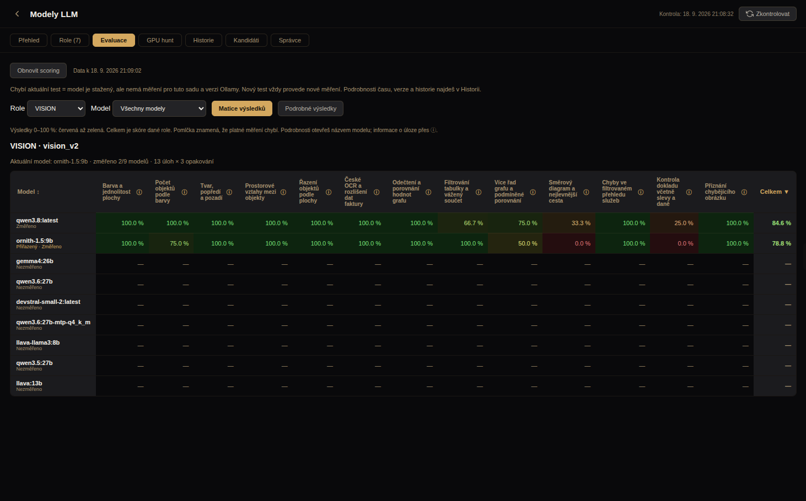

# Opravy hodnotitelů a dvanáct obrazových úloh — 18. 9. 2026

**Stav: INSTALLED_VISION_EXPLORATORY_MEASUREMENT_PASS / REVIEW_PENDING.
CODE_PILOT_PENDING; celý testovací profil není zelený.**

Nasazený zdroj: `230778adfe8b64c27c8d84e157bffa42d43fdd62`.
Vlastní implementace: `3ded30b1..230778ad` (dva commity). Vstupní merge
`3ded30b1` zachoval již instalované změny Studia z `576719bf`; jejich UI
nepřipisujeme této opravě. Nový [kontrakt pilotu](../wp/WP-GPU-HUNT-EVALUATION-CONTRACT-20260918.md)
je samostatný commit `9a35a4e8`, se stavem SCOPE_APPROVED / NOT_IMPLEMENTED /
PILOT_PENDING. Tento packet uzavírá předchozí explicitní zadání rozšířit VISION
a opravit doložené vady; není přejímkou nového CODE pilotu.

## Co se změnilo

- Strukturované reasoning úlohy vyžadují celý parsovatelný objekt se správnými
  klíči. Prázdný JSON ani správný objekt připojený k odporující próze nezískává
  body jen za formát. D1/D2/R1 však stále sdílejí stejná zadání.
- R2 používá přiřazení nálezů jedna ku jedné a skutečné precision/recall/F1.
  Duplicity už nemohou navyšovat počet správných nálezů. **To zatím není
  splnění §5 kontraktu:** nálezy mimo referenci stále automaticky penalizuje;
  obecné posouzení jejich pravdivosti chybí. Takové skóre není dokladem úplné
  kvality revize v otevřeném zadání.
- Identita ne-CODE sady nyní zahrnuje sdílený soubor hodnotitelů, runner,
  obrazový manifest a verzi Node. Změna společného hodnotitele zneplatní
  dřívější cache. CODE runtime kontrakt se nezměnil.
- Retenční politika odmítá samotné CPU přetečení v jednom kontextu jako důvod
  smazání: `RETENTION_CONTEXT_SPECIFIC_GPU_UNFIT`. Noční unit ani instalační
  šablona už neobsahují `--prune-rejected`. Časovač a backend zůstaly aktivní.
  V této práci nebyl smazán ani stažen žádný model, změněn žádný binding.

Přejímací sondy zachycené původním auditem nyní hlásí **dvě otevřené vady,
obě CHAT**: rozporné shrnutí dostává 1 a správná parafráze 0,4.
Negovaný tvar ve VISION dostává 0; nesprávný seznam barev ztrácí body za dané
pole; duplicity R2 snižují F1; odporující próza před JSONem neprojde; změna
helperu mění kontrakt. To jsou konkrétní ověřené hranice, nikoli univerzální
přejímka všech hodnotitelů podle nového §3.

## VISION: rozsah a skutečné výsledky

Sada `vision_v2 / vision-synthetic.3` obsahuje **12 různých PNG** a jednu
kontrolu přiznání chybějícího obrázku. Kontrola bez obrázku se do dvanácti
obrazových scénářů nepočítá. Tři úlohy jsou základní, čtyři střední a pět
složitějších; tento stupeň popisuje konstrukci úloh, nikoli kalibrovanou
obtížnost na reprezentativní populaci modelů.

PNG jsou verzované, mají SHA-256 v manifestu a lze je znovu vytvořit pomocí
`scripts/manual/build-vision-fixtures.py`; manifest zaznamenává Pillow/font.
Produkční evaluace čte PNG přímo a nepotřebuje Python. Sada ověřuje typované
hodnoty, nikoli přítomnost slov. Každé pole má stejnou váhu uvnitř úlohy,
úlohy stejnou váhu uvnitř sady; souhrn zahrnuje i kontrolu bez obrázku.

| Úloha | Obtížnost | Qwen3.8 | Ornith 1.5 9B |
|---|---|---:|---:|
| Barva a jednolitost | základní | 100 % | 100 % |
| Počet objektů podle barvy | základní | 100 % | 75 % |
| Tvar, popředí a pozadí | základní | 100 % | 100 % |
| Prostorové vztahy | střední | 100 % | 100 % |
| Řazení podle plochy | střední | 100 % | 100 % |
| České OCR a data faktury | střední | 100 % | 100 % |
| Odečtení sloupcového grafu | střední | 100 % | 100 % |
| Filtrování tabulky a vážený součet | složitější | 66,7 % | 100 % |
| Porovnání několika řad grafu | složitější | 75 % | 50 % |
| Směrový diagram a nejlevnější cesta | složitější | 33,3 % | 0 % |
| Chyby ve filtrovaném přehledu služeb | složitější | 100 % | 100 % |
| Kontrola dokladu, slevy a daně | složitější | 25 % | 0 % |
| Přiznání chybějícího obrázku | kontrola | 100 % | 100 % |
| **Průměr 13 úloh** | | **84,6 %** | **78,8 %** |

Finální běhy jsou nové inference, každý 13 úloh × 3 opakování. Všechna tři
opakování mají u těchto modelů stejné známky; nejsou to 39 nezávislých úloh.

| Model | Run ID | Doba samotné sady |
|---|---|---:|
| `qwen3.8:latest` | `eval_b24a454c-29bc-4131-ab82-8526aabae304` | 154 326 ms |
| `ornith-1.5:9b` | `eval_1cfc47dc-be30-4666-8766-4ffbf6628aab` | 75 606 ms |

Oba jsou COMPLETE, provider `0.34.0-intentsmith.1`, důkaz RESPONSE_BOUND.
Přesné identity a výsledky všech úloh jsou v
[strojovém záznamu](../execution/runs/evaluation-hardening-vision-20260918.json).
Kontrakt obou běhů:
`7a355a0ad41f057b5699ecbdd3198052fd2d087e4e5aa87c22d897cb736bcc84`.
GPU RTX 3090, 24 576 MiB. Kvalita používá kontext 4 096, kvalifikace 32 768;
**nesoulad §7 zůstává otevřený**. Časy vznikly za souběhu offline CPU kontrol,
nelze je používat jako srovnávací výkonnostní benchmark. Celý wrapper včetně
přípravy trval přibližně 5:09 u Qwenu a 1:57 u Ornithu.

Tohle stále není požadovaný široký 20–30minutový benchmark ani quick/full
režim. Jde o krátkou syntetickou sadu se širším pokrytím; umělé prodlužování
opakování by nepřidalo nové schopnosti. Přirozené fotografie, složité reálné
dokumenty a oddělená přejímací sada zatím chybějí. Sedm obrazových úloh oba
modely vyřešily plně, takže ani tento panel nedokládá plošnou rozlišitelnost.
Výsledky neopravňují k výměně aktuálního VISION modelu Ornith.

## Zachovaná chyba při prvním fyzickém běhu

Původní oprava `.vision-synthetic.2` byla příliš přísná na obal JSONu:
Qwen obalil 30 z 39 odpovědí samostatným Markdown blokem a dostal 23,1 %
(`eval_83b99351-0a65-43be-88ec-575218f799f6`, 137 202 ms).
Tento řádek zůstal v DB a v důkazech. Diagnostický replay odhalil směšování
obsahu s formátem; nebyl vydáván za nové měření a nepřepsal DB.

Ve `.3` VISION přijímá celý holý JSON nebo jediný celý JSON blok, bez prózy
před/za ním a bez několika bloků. Dodržení striktního JSONu vykazuje odděleně
přes `strictJson` / `responseFormat` a vysvětluje v detailu. Potom proběhlo
**nové měření obou modelů**, ne pouze přeznámkování starého výstupu.
Celkem během této práce 117 odpovědí sady, dva různé modely, nula nových
stažených artefaktů. Původních 2 758 odpovědí / 57 běhů z auditu se zde
znovu nepřehrávalo; to není doložení počtů pro budoucí CODE pilot.

## Ověření a neúspěšné pokusy

Cílené testy: evaluation suites **32/32**, model upgrade **102/102**, read
model **20/20**, desktop hunt **33/33**, artifact validation **160/160**.
Adversariální audit úmyslně končí neúspěšně kvůli dvěma dosud otevřeným CHAT
vadám; nelze jej zahrnout do zelených kontrol.

| Kontrola | Výsledek |
|---|---|
| První spuštění plného profilu z dirty checkoutu | odmítnutí před testy, zachované `deterministic.log` |
| `4b5eb209`, bez povolených externích nástrojů | 348 PASS / 2 FAIL / 10 BLOCKED |
| `230778ad`, plný profil, concurrency 2 | 339 PASS / 17 FAIL / 3 TIMEOUT / 1 BLOCKED |
| Stejný zdroj, 21 neúspěšných programů sériově | 19 PASS / 1 FAIL / 1 TIMEOUT |
| Další samostatné M2 lifecycle ověření | znovu TIMEOUT |

První vlastní FAIL byl zastaralý počet řádků v SYSTEM-MAP; následná oprava
prošla artifact validací. U paralelního běhu 16 programů skončilo s exit 0,
ale kontrola čistoty zdroje zachytila dočasnou fixture `tests/.nightly-nested-source-*`
z paralelního self-testu. Zůstávají vedené jako FAIL původního běhu.
Tři timeouty a chybějící OCR prostředí vedly k cílenému sériovému opakování
se správnou konfigurací runtime, bez změn testů a timeoutů.

**Poslední výsledek každého programu na `230778ad`: 358 PASS / 1 FAIL /
1 TIMEOUT. Není to jeden zelený úplný běh.** Otevřené:

- `tests/nightly-orchestrator-self-test.js`: `registry hash differs from the
  reviewed Gate 0 policy`, zděděná release pečeť; nebyla obcházena.
- `tests/m2-lifecycle-application-service.test.js`: 60s timeout ve dvou
  následných pokusech. Poslední pokus běžel bez GPU evaluace a bez našeho
  plného profilu, ale souběžně se spouštěním GUI. Naměřená I/O zátěž není
  prokázanou příčinou; selhání zůstává otevřené.

## Instalovaný produkt a GUI

Installer vytvořil zálohu `installation-backups/2026-09-18T18-58-13-645Z`,
provedl své kontroly a restartoval backend. Zdroj instalace je `230778ad`.
Frontend z již instalovaného `576719bf` zůstal bajtově stejný; ověření buildu
prošlo, bundle SHA-256
`04b3b5ae7a4d27939ad8345770cb549c059eab05b6c680f1a896ad63eaf65b8e`.
API potvrdilo dva současné COMPLETE řádky a 13 úloh. Sedm bindingů zůstalo
stejných, kontrolní SHA-256
`ddbdfce82570a121c0ab869b1377f00af147af7b7a3724e9a56435c77ed0cfca`.

Fyzické instalované Electron okno: Nastavení → Modely LLM → Evaluace → VISION,
matice 15 sloupců (model + 13 úloh + celkem), otevření Qwenu a detailu všech
úloh včetně diagramu, dokladu a informace o JSON obalu. Viditelné částečné
výsledky ověřené i ze screenshotů:

[Detail složitějších úloh](assets/evaluation-hardening-vision-20260918/vision-detail-bottom.png).

Meze GUI důkazu: privátní profil Electronu, diagnostické `--no-sandbox`,
`NODE_ENV=production`, živý instalovaný backend; navigace byla pouze čtecí,
inference se spouštěly samostatně přes autoritativní CLI. Nejde o důkaz
kliknutí „Nový test“ v tomto konkrétním běhu. Zachované negativní pokusy:
první harness čekal na staré `C3WS`, druhý nedostal CDP během 60 s, třetí
používal zastaralý selector. Po předání již otevřeného privátního okna
opravenému driveru bylo potřeba jedno ruční kliknutí na Nastavení; následné
DOM kontroly prošly. Není to jediný nepřerušený automatický cold-start PASS.
Uživatelovo původní okno a cizí procesy nebyly ukončeny.

## Hranice nového kontraktu a další postup

1. CODE pilot má teď výslovné zadání; nejprve přejímka hodnotitele včetně
   jiné správné opravy, výsledkové třídy a reprezentativní profil.
2. Současný model a dva kandidáti musí dostat stejné benchmarkové podmínky.
   Před finálním během uzamknout sedm rozhodovacích hodnot, skupiny závislých
   scénářů a oddělenou provozní sadu. Tyto kroky zde neproběhly.
3. Teprve párový provozní výsledek opravňuje k doloženému rozhodnutí.
   Rychlý profil se odvodí později; další role se v CODE pilotu neotvírají.

§12 je částečně pokryt zamezením mazání z jednoho paměťového profilu a
vypnutím automatického úklidu. Nezavedli jsme novou výsledkovou třídu
`NEZPŮSOBILÝ_PROFIL`, stejné kontexty ani měření špičky na dlouhém vstupu.
Gemma4:31b nebyla znovu stažena ani kvalifikována na kratším kontextu;
žádné tvrzení, že se do něj vejde, zde nevzniká.

## Důkazy

Evidence root:
`/home/belphareon/Projects/coworker/intentsmith-evaluation-hardening-20260918`.
Obsahuje přesné CLI invokace, nové i původní DB výstupy, auditní sondy,
všechny čtyři široké testovací reporty a jejich logy, build/install kontroly,
GUI receipty včetně neúspěšných pokusů a screenshoty. Vybraný archiv obsahuje
hashovaný manifest; neobsahuje DB, privátní Electron profily ani přístupové
capability. Fyzické běhy jsou záznamem tohoto stroje, nikoli nezávislým replay.

`source.bundle` zahrnuje delta do `9a35a4e8`; `git bundle verify` PASS.
Je inkrementální a vyžaduje již publikované předky `b2512408`, `39cad5f1`
a `0534a111` (plné SHA jsou v `bundle-verify.log`). Archiv a jeho SHA-256
jsou uvedeny ve strojovém záznamu; následující dokumentační commit měření
ani instalované zdroje nemění.

Archiv `evidence.tar.gz`: 1 941 617 bajtů, SHA-256
`286b5ce37d9dc9a029a4e8e9bcae2baf792b54310889a1833401aae193031ce4`.
Všech 790 položek uvedených v manifestu bylo ověřeno proti bajtům archivu;
manifest sám tvoří 791. soubor. Následná kontrola dokumentace: artifact
validation znovu 160/160 PASS, `git diff --check` bez chyb.

**Checkpoint po prvním pushi, 19:43:24 UTC:** souběžný běh mezitím nainstaloval
`9ab808f197ffaf1032989743253153c745d48a3d` (nastavení/vzhled Studia), jehož
historie obsahuje merge `cc8f4ace` nad `230778ad`. Sedm souborů hodnotitelů,
plánu, runneru, manifestu, read modelu, retence a desktop runtime bylo
porovnáno SHA-256 a zůstalo bajtově shodných s testovanou verzí. Backend
i timer aktivní, automatické mazání nadále vypnuté. Výše uvedený GUI důkaz
patří testované instalaci `230778ad`, nikoli novému vzhledu `9ab808f1`.
Dodatečný záznam `installed-closeout-check.json` je obsažen také ve strojovém
záznamu tohoto packetu; vznikl až po zapečetění archivu, takže do něj nepatří.
