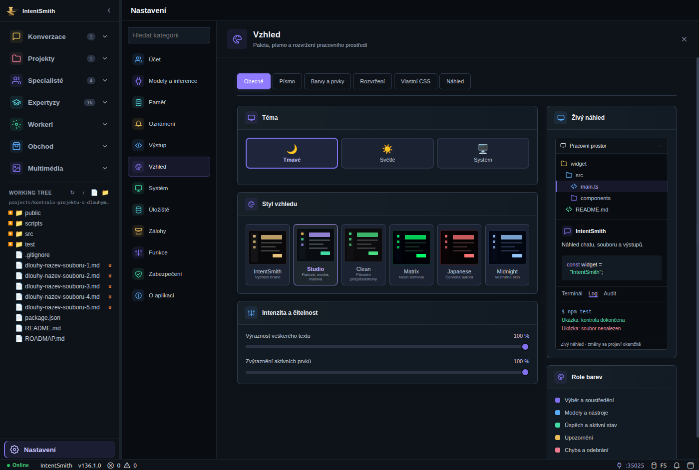
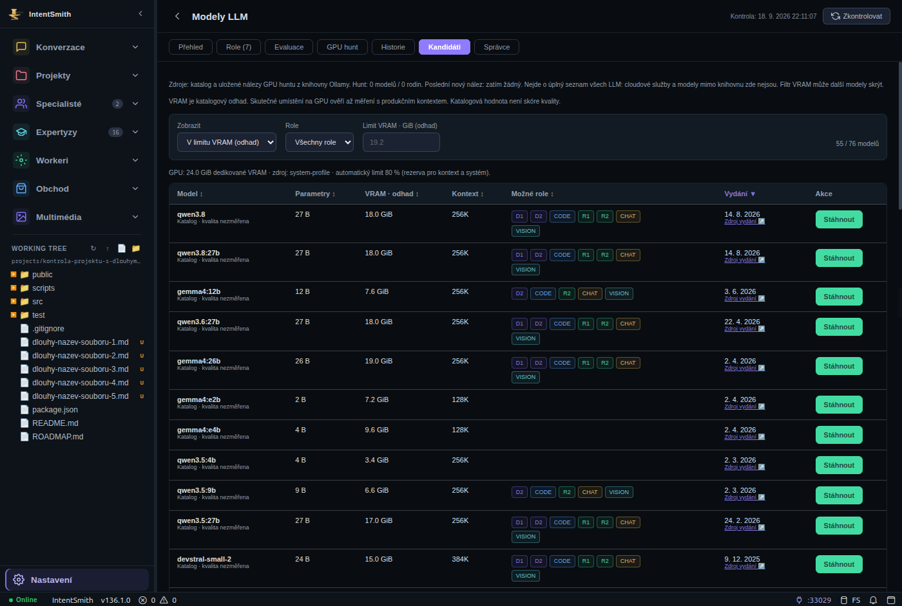

# Studio: barevná paleta a nastavení podle dodaných předloh

Stav **INSTALLED_RUNTIME_VERIFIED / REVIEW_PENDING**. Zdroj i nasazení
`0ef67a564ecafd813ceac2a1690faf91cae48daa`. Review rozsah **`be6d2cca..0ef67a56`**; navazuje na
předchozí vzhled v `9ab808f1`. Operátor požadoval podstatně věrnější využití
LM Studio palety a 12sekční předlohy nastavení. „80 %“ je směr zadání,
nikoli změřený vizuální výsledek; finální vizuální přijetí zůstává operátorovi.

## Co se změnilo

- Studio má soustavné významy barev: fialový výběr, modré nástroje, mátový
  úspěch/zapnuté stavy, jantarová upozornění, růžové chyby. Navigace má vlastní
  barevné ikony; role modelů barevné štítky, stažení mátové tlačítko.
- Nastavení zachovává 12 kategorií a 33 záložek. Přibyly ikony záhlaví a karet,
  výraznější aktivní záložky, tmavší pole a kompaktní hlavní/vedlejší sloupec.
  Při nedostatku místa se přehled přesune pod ovladače. Levé menu zůstává.
- Každá kategorie má konkrétní přehled: lokální profil, přiřazené modely,
  rozpočet kontextu, doručování, ukázku kódu, provozní data, databázi, rozsah
  exportu, přepínače, přístupové relace nebo verzi. Nastavené podíly jsou tak
  označené; nejde o vymyšlené využití paměti. Chybějící údaje nejsou nuly.
- Vzhled má malé vizuální náhledy stylů, živý strom souborů/chat/kód/log a
  legendu barev. Oba posuvníky jsou i na úvodní záložce. Výraznost nadále
  působí na **veškerý text**, včetně Monaco, chatu a terminálu; 0 % text neschová.
- 58 původních konfiguračních volání/callbacků ostatních kategorií zůstalo
  shodných dle AST inventury. Žádné fiktivní předplatné, SSO ani cloudové
  funkce z obrázku. Zlatý IntentSmith i alternativní styly zůstávají dostupné.

Snímky skutečné instalační kopie, privátní testovací profil/DB:

Katalog na snímku má lokální fixture DB bez uložených hunt nálezů; není to
inventář uživatelovy DB. Živá instalace je ověřena zvlášť v live-verification.json.

## Ověření

- Produkční build a M1 consumer verifier PASS, také v připravené instalaci.
- Cílené workspace/desktop/Studio testy **101/101**, M1 **133/133**, artifact
  validation **160/160**. Žádný nový testový program ani změna Gate 0.
- Celý offline/database profil přesně na `0ef67a56`: **359 PASS / 1 FAIL**,
  360 programů. Jediný FAIL `nightly-orchestrator-self-test`: `registry hash
  differs from the reviewed Gate 0 policy`. Celkový verdict zůstává FAIL.
  Hash reportu i všech 360 logů ověřen.
- Electron v šířkách 1400 a 960: všech 33 záložek, 12 kategorií, klávesnice,
  light/dark a návrat ze skleněného stylu; 36 kontrol při každé šířce.
  Navíc 14 kontrol ikon, palety a pozic přehledu při každé šířce; žádné
  přetékající karty, na Náhledu právě jeden živý náhled.
- Z instalační kopie 4 kontroly rozložení/Monaco, matice 0/100 % na 10
  textových plochách (výplň se mění, pozadí a sémantická barva se nemění),
  skutečný deterministický chatový tah s časem, paleta kandidátů a řádný
  restart backendu i Electronu s novými PID a obnovením Studio + 0 %.

Uchované neúspěšné pokusy: čtyři testovací Electron procesy skončily SIGTRAP
po ztrátě síťového/GPU/zygote procesu; časy 22:01:17, 22:03:45, 22:08:17 a
22:10:14 odpovídají souběžným restartům SystemSmith. Při prvním skončilo i
uživatelské Studio a ShellSmith. Příčina nebyla prokázána; nejde o tvrzení,
že ji způsobil SystemSmith nebo tato úprava. Zkrácené chybové logy a časová
korelace jsou v důkazech. Následné cílené běhy a řádný restart prošly.
Jeden pokus o proklik kategorií se překryl se snímkovacím skriptem a selhal
na chybějícím ovladači; opakovaný sériový běh prošel. Selhání se nemažou.

## Nasazení a data

Čistá detached instalace `0ef67a564ecafd813ceac2a1690faf91cae48daa`, backend PID
1963529; backend i hunt mají stejný sourceRoot. Autorizované
HTTP 200, bez capability 401; launcher check PASS.
Před nasazením ověřeny neaktivní hunt/evaluace. Nebyla spuštěna GPU inference.
Záloha `/home/belphareon/.local/state/intentsmith/installation-backups/2026-09-18T20-11-08-896Z`.

SQLite quick_check ok, 0 FK chyb, 105 migrací. Devět chráněných tabulek
(konverzace/zprávy, evaluace/bindingy, paměť) má shodné hashe proti záloze.
Projekty mají všechna pole shodná kromě stávajícího startup last_active u
2/4/5/6/7/11. Zachován administrátorský credential i uživatelský profil.
Uživatelské okno tento worker neukončoval; nový frontend se načte při otevření.

[Uživatelský návod](../IDE-WORKSPACE.md),
[strojový souhrn](../execution/runs/ide-design-refinement-20260918.json),
[WP](../wp/WP-IDE-DESIGN-REFINEMENT-20260918.md).
Důkazy: `.intentsmith-artifacts/ide-design-refinement-20260918/`.
Archiv `ide-design-refinement-evidence.tar.gz`: 5260110 B, SHA-256
`1ccb7d135f0b7c4581a2614d9dde15ace66114c7fb2c64e14de31a078d46bf73`; 453 položek v manifestu. Privátní runtime,
DB, profil ani capability/env soubory nejsou zahrnuté. Vizuální úprava
neuzavírá nezávislé review ani jiné otevřené produkční kvalifikace.
