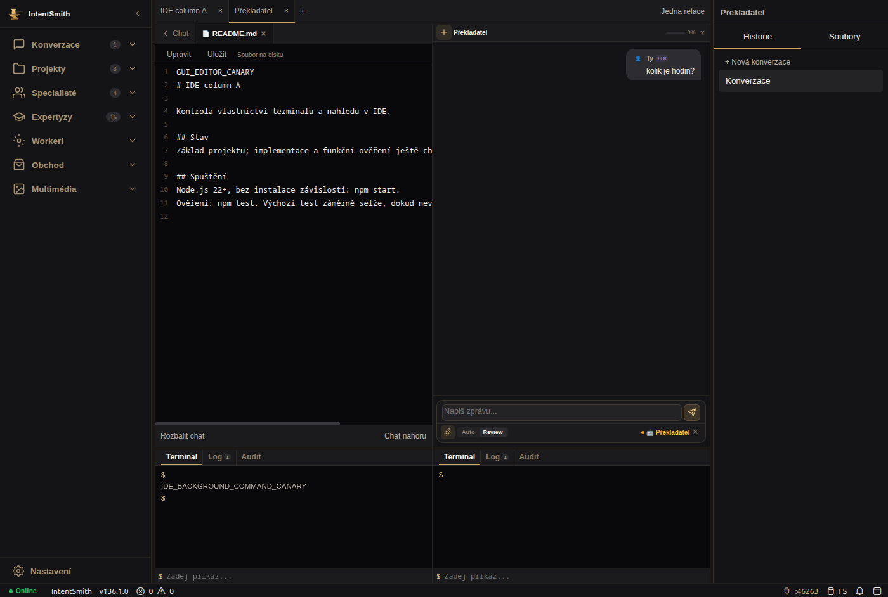
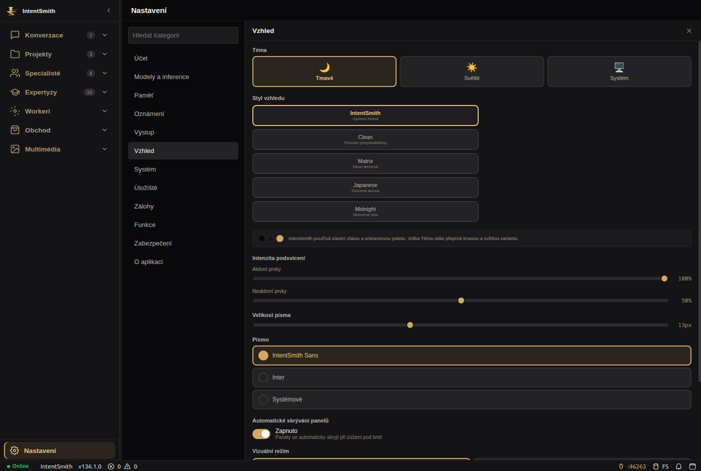

# IntentSmith IDE: pracovní relace, soubory a navigace — 18. září 2026

**IMPLEMENTED / REVIEW_PENDING.** Není to přijetí celého produktu ani změna Gate 0 nebo M5 disposition. Výchozí vlastní větev vychází z `4ebdfd39`; runtime kolegy `2ca3cca1` je integrovaný skutečným mergem. Při review porovnejte `2ca3cca1..0534a11140ee03c9c170796c511348960f9775a2` (IDE delta) a samostatně zachovejte review modelových změn kolegy. Publikační větev: `work/ide-workspace-20260918`.

## Body zadání a výsledné chování

1. Specialista má samostatnou lokální knihovnu souborů a historii konverzací. Pravý panel začíná historií, soubory jsou přepínač. Sdílení vytváří explicitní kopii mezi knihovnami; žádný soubor se tím sám neodesílá modelu. Historie používá specialistu zaznamenaného v metadatech uživatelského tahu, nikoli dodatečný odhad starých konverzací.
2. Pojmenované záložky, `+`, zavření relace, jedna relace nebo sloupce vedle sebe. Chat, soubor/diff a výstupy stejné relace mají stejný sloupec. Terminal, Log a Audit zůstávají samostatné pohledy. Konverzační křížek zachová sloupec a soubory; tabový křížek zavře celý prostor a hlídá neuložené změny i aktivní úlohu. Maximálně 24 současných relací; zavřené sloty lze znovu použít, aktivní transporty se nepřečíslují.
3. Katalogy a nastavení používají střed bez trvale připojeného chatu a terminálu. Otevření konkrétního projektu, konverzace či specialisty přejde do pracovního prostoru. Otevřený editor už nepřekryje navigaci do katalogu. Rozpracovaný chat zůstává při přepínání menu a relací.
4. Nastavení má kompaktní vyhledávatelnou navigaci kategorií a hlavní formulář. Přibyly přístupné názvy ovladačů, vymezení panelů a ovládání klávesnicí. Soubor má náhled, Monaco editor, ruční uložení a ochranu před přepsáním souběžné změny na disku. Chat lze sbalit a přesunout nahoru/dolů.
5. Aktivní balíčky, adresáře, globals, události, CSS, proměnné prostředí a současné návody používají IntentSmith. Kompatibilní čtení starých nastavení, lokálního WS, licencí a záloh zůstává; stará DB se nepřejmenovává. Historické C3 důkazy, externí repozitář a zamčené identifikátory kontrol nejsou přepisované identity. Sedm změn názvů importních hran je explicitně připnutých; samotné přejmenování nemění počet hran ani cykly. Oprava migrace později přidává jedinou hranu na existující M5 validátor.

## Skutečné GUI a meze důkazů

Soukromý Electron/Xvfb, skutečný backend a SQLite, vlastní uživatelský profil i projekty. V tomto probe byl modelový provider nedostupný; výsledky NEJSOU fyzický modelový journey. Diagnostický Electron používal `--no-sandbox --disable-gpu`; nejde o důkaz Chromium containmentu běžné instalace. Tento GUI probe nespouštěl GPU hunt ani inferenci. Provozní restart později obnovil existující stahování zadané uživatelem; viz samostatný popis nasazení níže.

- Nový projekt přes skutečný průvodce, jiný projekt nepřevezme prázdně vypadající relaci specialisty; Code Reviewer zůstal vlastníkem své relace.
- Příkaz `pwd` přes oba skutečné terminály vrátil správný rozdílný kořen projektu A/B.
- Výběr souboru skutečným systémovým dialogem, náhled, příloha rozepsané zprávy, oddělená druhá knihovna a explicitní sdílení. Knihovna přežila restart.
- Ruční editace přes CDP klávesnici v Monaco, tlačítko Uložit, ověřená změna bajtů na disku. Testy navíc ověřují cizí změnu na disku a editaci za probíhajícího ukládání.
- Externí projekt obsahoval README, package.json a index.js před importem. Import zobrazil čtecí analýzu a dotaz na cíl; všechny soubory a jejich seznam zůstaly bajtově stejné.
- Zavření konverzace zachovalo sloupec i README. Zavření celé relace je jiný ovladač. Přechod do nastavení odstranil všechny sloupce z centrální plochy.
- Skutečné restarty procesů, aktivace dříve neaktivního projektu, obnova stromu i souborové záložky. Dva terminály a šest změn šířky skutečného X11 okna (900–1400 px) zůstaly responzivní. Poslední běhy skončily čistě.

První pokusy jsou zachované: editorový `execCommand` neprovedl editaci; původní neaktivní strom se neobnovil; dva terminály si přebíraly fokus a renderer bylo nutné ukončit silou. Oprava odstranila automatický focus při renderu i skryté duplicitní výstupy. Výsledek po opravě je doložen zvlášť. Starý projekt A byl vytvořen ještě před opravou přebírání prázdné specialistické relace; důkaz opravy je nový projekt B, ne přeznačení A.

## Kompatibilita a uložená data

Migrace 115 kopíruje legacy `c3.*` nastavení do nových klíčů pouze tehdy, pokud nový klíč chybí. Staré hodnoty a timestamp zůstávají. Totéž platí pro lokální nastavení Studia. Úprava admin.env zachovává přesnou credential hodnotu; mění se název proměnné. Knihovny specialistů jsou IndexedDB v profilu Studia, nikoli součást SQLite backupu; běžná hranice je 20 MiB na soubor a 512 KiB pro textový náhled. Neuložený chatový draft není slibovaná obnova po pádu procesu.

## Nálezy při nasazení nad skutečnou databází

První pokus zastavila kopie DB před změnou živých dat: při přejmenování existujících nastavení chyběla registrace funkce požadované M5 triggerem. Původní služba byla znovu spuštěna. Migrace 115 nyní registruje stávající M5 validátor; ochranný trigger ani jeho fingerprint se nemění. Nový test databázi skutečně zavře a otevře, doplní nové klíče se zachováním původních hodnot/timestampu a ověří, že zakázaný zápis hesla zůstává odmítnutý. Kopie skutečné DB po opravě prošla. Gate na `4ed8b5f9` měl navíc dvě metodické chyby: neaktualizovaný počet importních hran v ROADMAP a chybějící statický isolation bootstrap nového testu vytvářejícího dočasný soubor. Obojí opraveno bez výjimky z kontrol.

Druhý pokus aplikoval migraci, ale launcher nenašel připravené HTTP: obnova uživatelem zahájeného stahování `gemma4:31b` (USER_HTTP, 18. září 12:07:41 UTC) blokovala otevření listeneru. Stejné čekání bylo v předchozí verzi. Server teď spouští existující recovery na pozadí, se stejnou operací, autoritou a artifact claims. Dokončení i neúspěch mají obsluhu; nejde o nový download, změnu rolí nebo obejití zámků. Test drží recovery Promise nevyřešenou a ověřuje dokončení zbytku startu; zvlášť ověřuje rejection. Po nasazení je HTTP dostupné během stejného pokračujícího downloadu. Přerušení klientského spojení při restartu a nové recovery jsou přiznanou součástí tohoto ověření.

Ověřovací skript napoprvé příliš úzce požadoval 403 bez credential. Server správně vrací 401 a produkční launcher obě možnosti přijímá. Opraven byl pouze probe; původní assertion a instalační chyby zůstávají v důkazech.

## Stav přenosné opravy launcheru

Runtime je `c52b03ffedd3417d4473ed2bfd82086ee8c7a45e`, aktuální kandidát `0534a11140ee03c9c170796c511348960f9775a2`. Přenosný výběr starého profilu je v posledním commitu připravený a otestovaný; přepnutí této poslední instalační revize zabránilo právě běžící GPU měření. Na tomto počítači je zachování profilu dokončené kompatibilním odkazem `~/.config/intentsmith-ide-electron` na dosavadní adresář. Data se nekopírovala a backend kvůli tomu nebyl restartovaný. `src/`, frontendové rozšíření a produkční bundle mezi oběma revizemi nemají rozdíl; delta launcheru se nepředstírá jako nasazená.

## Ověření a nasazení

Nasazeno `c52b03ffedd3417d4473ed2bfd82086ee8c7a45e` z čisté detached instalace. Backend a timer jsou aktivní; launcher `--check` prošel. Původní otevřené Studio potřebuje zavřít a spustit znovu ikonou — frontend se do běžícího okna nevymění. Před nasazením byla vytvořena konzistentní záloha a migrace ověřena na její kopii. DB quick_check je `ok`, bez chyb cizích klíčů, 105 záznamů migrační historie (čerstvá DB má 102 migrací). Zachování 10 tabulek (projekty, konverzace, zprávy, projektová/osobní paměť, měření, rozhodnutí a role) je doložené počty i hashy vůči záloze. Credential hodnota zůstala stejná; autorizované HTTP 200, bez capability 401.

| Revize / úplný offline,database profil | PASS | FAIL | Verdict |
|---|---:|---:|---|
| `2328f649` / gate | 348 | 12 | FAIL |
| `50e21e0f` / gate-2 | 359 | 1 | FAIL |
| `893d9806` / gate-3 | 358 | 2 | FAIL |
| `0dc5110a` / gate-4 | 359 | 1 | FAIL |
| `cd1c6142` / gate-5 | 359 | 1 | FAIL |
| `51891604` / gate-6 | 359 | 1 | FAIL |
| `d0d39952` / gate-7 | 359 | 1 | FAIL |
| `4ed8b5f9` / gate-8 | 357 | 3 | FAIL |
| `c52b03ff` / gate-9 | 359 | 1 | FAIL |
| `0534a111` / gate-10 | 359 | 1 | FAIL |

Poslední profil má 360 programů a jediný non-PASS: `nightly-orchestrator-self-test`, „registry hash differs from the reviewed Gate 0 policy“. Gate 0 pečeť se neměnila. Registry má 525 programů (431 ACTIVE, 79 BLOCKED, 15 HISTORICAL). Počty předchozích neúspěchů se nepřepisují.

Cílená závěrečná sada: 106/106 Node testů v osmi souborech, bez přičítání vnořených vlastních počítadel. Produkční Studio build a kontrola M1 consumeru PASS. Module boundary 1377 hran, 3 cykly, 28 souborů; sedm explicitních přejmenování a jedna nová hrana z migrace 115 na existující M5 validátor. Připnutí nemění pečeť Gate 0. M5 tree 2538 souborů, 0 nálezů.

Při integraci kolegova katalogu M5 lexikální kontrola označila veřejný klíč `review_command_secret` s českým popiskem. Zachovaný neúspěšný scan je v důkazech. Uvozovky kolem stejného klíče zachovaly význam JS objektu i popisku; žádný credential ani výjimka skeneru nebyly přidány. Ověřeno katalogovou regresí i novým scanem.

Dva poslední regresní případy ověřují pozdní systémový log do původní relace a dokončení terminálu na pozadí bez ukradení fokusu. Totéž prošlo řízenou injekcí událostí do běžícího rendereru; toto konkrétní ověření není fyzické spuštění modelu či příkazu. Skutečné příkazy `pwd` jsou samostatný dřívější GUI důkaz.

Lokální archiv důkazů: `.intentsmith-artifacts/ide-workspace-20260918/review-evidence.tar.gz`. SHA-256: `f65fced87f0a5a6ea8d9a9ca6a4489e8cacf62e348dd07c98fc5075b892d8304`. Strojový souhrn připíná všechny soubory včetně 360 posledních testových logů. Databáze, port capability a privátní profily runtime nejsou do tohoto archivu přidány.

## Co zůstává otevřené

Nezávislé review této široké IDE/namespace změny. Operátorská Gate 0 pečeť stále odmítá nový registr. M5 current-tree scan má nula nálezů, 15 historických objektů je stále dosažitelných a disposition není podepsaná. Známý AppArmor problém M2 v systemd není vyřešen změnou rozložení; není potvrzený nový fyzický modelový průchod ani oprávněné tvrdit production-ready. Starší instalace a rollback evidence nejsou mazány. Hlavní cizí rozpracovaný checkout zůstal nedotčený.

[Návod ovládání](../IDE-WORKSPACE.md). Strojové výsledky, revize a hashy jsou v [souhrnu](../execution/runs/ide-workspace-20260918.json).
