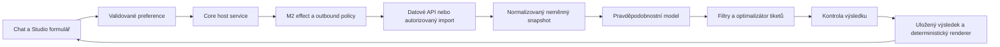

# Sázkař pro IntentSmith — kontrakt v2

Stav: **IMPLEMENTED_SLICE / REVIEW_PENDING**. Datum: 2026-09-11.
Adresát: operátor, implementátor a nezávislý reviewer specialisty `sazeni`.
Autorita: explicitní navazující zadání operátora „uprav to a udělej podle
kontraktu“, doplněné o 24h / 3denní časová kritéria. Implementace v izolovaném
worktree vychází z `7c693d32107cdd5f6d16405ab58ea94057a8f28e`.
Pracovní rozsah: [WP](../../docs/wp/WP-SPECIALISTS-20260911.md).

## Provedený řez a zbývající části

Tento dokument zachovává celý cílový návrh. Není tvrzením, že jsou všechny níže
popsané části implementované. Číselný kontrakt běžícího řezu má integer `version: 2`;
uzavřené validátory jsou `engine/contract.js`. Spustitelný vstup je
`{request: BettingRequest@2, snapshot: BettingSnapshot@2}`.

| Část | Stav v tomto checkoutu |
|---|---|
| Validace, tržní/ruční p, kurzy, peníze, omezený solver | Implementováno |
| Čas od/do, následujících 24/72 h, maximální rozestup zápasů | Implementováno |
| Chat, JSON import, textové změny preferencí, Markdown bez LLM | Implementováno |
| Lokální CLI export/replay, JSON/CSV/Markdown, Odds API import adapter | Implementováno |
| Živý ověřený datový provider a scoped persistence connector | Zbývá implementovat a nezávisle přijmout; bez credentials/coverage |
| Trénovaný kalibrovaný model, confidence lower bound | Zbývá; požadavek vrací MODEL_UNAVAILABLE |
| Studio formulář, DB historie, settlement, refresh workflow | Zbývá implementovat |
| Integrace do provozního checkoutu a nezávislé přijetí | REVIEW_PENDING, neprovedeno |

Přímé CRE tool ID zůstávají kompatibilní identitou, ale nově vyžadují v2 data a
hostový čas. Původní ad hoc vstupy ani nedokončený scénář nevytvářejí čísla.
Platformní `ExtensionManifest/Context@1` se nemění. Host předává opt-in
`needsTurnContext` pouze UTC čas, monotónní hodiny, signal a yield callback;
`acceptsInlineAttachments` poskytuje obsah příloh z aktuální zprávy, nikoli cesty.
Žádná nová DB, filesystem, síťová či modelová authority v balíčku nevznikla.

## Časový dodatek operátora

`window` vyžaduje IANA `timezone` a právě jednu formu:
- `{horizonHours: 24}` nebo `{horizonHours: 72}`: od hostového času výpočtu;
- `{from: UTC, to: UTC}`: uzavřené absolutní okno.

Nepovinné `maxSpreadHours` omezuje rozdíl posledního a prvního začátku na každém
tiketu. Bez něj platí šířka celého okna. Povoleno 1–720 celých hodin pro horizont,
0–720 pro rozestup; absolutní okno kladné, nejvýše 720 h. „3 dny“ jsou 72
uplynulých hodin i přes DST. `effectivePreferences.window` obsahuje vyřešené
UTC `from/to`, `timezone`, `maxSpreadHours`, `anchorAt` (null u absolutního okna).
Všechny zápasy musejí být v okně; zápas za týden/měsíc nevyplní chybějící položku.
Dolní mez začátku je 5 minut od času hostu (vyjma historického replay).
Okno omezuje začátky, nikoli garantovaný konec/vypořádání. Časová omezení se
nerozšiřují automaticky ani při hledání alternativ.

Podrobné použití a přesné provozní hranice: [README.md](README.md).

## 1. Doporučený výsledek

Sázkař je lokální analytický engine ovládaný chatem a formulářem ve Studiu.
Ze skutečných nabídek vybere tipy a sestaví návrhy tiketů splňující zadané meze.
U každého čísla zachová zdroj, čas, metodu a omezení. Když zadání nemá řešení,
řekne to a nabídne konkrétní úpravy. LLM rozumí zadání a vysvětluje; numerická
pravděpodobnost, filtr, kurz a výplata vznikají výhradně ve výpočetním enginu.

Navržený první rozsah: předzápasový fotbal, trh **1X2 za základní hrací dobu
včetně nastavení, bez prodloužení**, singly a akumulátory. Sport ani kancelář
zatím nejsou operátorem vybrány; fotbal je návrhový předpoklad. Podpora jiného
sportu znamená jiný model a pravidla vyhodnocení, ne přejmenování fotbalového modelu.

Zachovat identitu balíčku `sazeni`, uživatelský název „Sázkař“; evolučně nahradit
jeho vnitřek po přijetí a ověření náhrady. Nevytvářet konkurenční `sazkar` balíček.
Tento požadavek je druhý doménový prototyp operátora; v repozitáři již existují
i další specialisté a povinný M3 E2E používá code-review specialistu.

V1 připravuje návrh, jeho přepočet, uložení a export. Podání sázky, platby,
přístup do hráčského účtu, live betting, cashout, burzovní lay sázky, bonusy,
same-game parlay, handicap a systémové tikety nejsou součástí prvního řezu.
Pro systémové tikety musí pozdější verze zvlášť definovat „alespoň jedna výplata“
a „celkový zisk“; úspěšnost jednoho tipu není úspěšnost systému.

## 2. Co skutečně poskytuje účetní a dnešní sázení

Zdrojová základna návrhu je novější M3 strom. Během čtení se jeho HEAD posunul
z `8c919a6b…` na `7dab3f3cd6b4e26fa3f58d3d09a0b70759398867` cizí prací.
`git diff 8c919a6b 7dab3f3c -- specialists contracts/m3 src/expertises src/chat/handlers/specialist.js`
je prázdný. Sonda na druhém SHA potvrdila čistotu sledovaných souborů a uložila
jejich SHA-256. Staré zjištění o interním importu účetního z hlavního checkoutu
se nesmí přenášet na novější strom: ten už používá `createAdapters(ToolAdapter)`.

| Část | Pozorovaný stav a důkaz | Důsledek pro sázkaře |
|---|---|---|
| Registrace účetního | `specialists/accountant-cz/index.js:389`: `requireCapability`, runtime, expertiza, patterny, znalosti, scénář, tool executor, capabilities; unregister odstraňuje registrace | Převzít platformní mechanismus, nepřidávat přímé importy do core |
| Kalkulačky | `adapters.js:25`, `src/expertises/tool-adapter.js:101`: validate → normalize → execute → validateResult; `ok/clarify/error` | Oddělit datový vstup, čistý výpočet a kontrolu výsledku |
| Numerická kontrola | Sonda `accountant-arithmetic`: vstup 10000, sazba 21, rok 2025 → 10000 + 2100 = 12100; prázdný vstup → clarify | Ověřuje mechanismus na fixture, nikoli aktuální daňovou správnost |
| Účetní engine | `ledger/ledger-engine.js`, `ledger-repository.js:15`, `ledger-reports.js:281`: čisté výpočty, peníze v haléřích, DB injektovaná konstruktorem, historie a Markdown renderer | Převzít oddělení vrstev a přesnou reprezentaci peněz; nesdílet účetní tabulky |
| Zapojení ledgeru | `rg 'LedgerRepository\|ledger-engine\|ledger-repository' src specialists` ukazuje jen interní ledger závislosti; registrace účetního vystavuje pět kalkulaček | Existence účetního engine neprokazuje dostupnost účetní knihy z chatu |
| Účetní scénář | `scenarios/tax-optimization.js`: má kroky, `compute` a `present` | Použitelná struktura průvodce; nové preference mají jednu validovanou reprezentaci |
| Stáří dat | Sonda `accountant-year-fallback`: požadovaný rok 2099 skončí úspěšným výpočtem s předpokladem roku 2025 | Sázkař nesmí úspěšně nahrazovat čerstvá data starými bez změny stavu |
| Účetní E2E název | `tests/accountant-e2e.test.js:14` importuje staré core kopie kalkulaček a testuje paměť | Název testu není důkaz aktuální cesty Studio → specialista → výsledek |
| Čtyři nástroje sázení | `specialists/sazeni/tools/*` zpracovávají dodaná data; v balíčku není provider feed | Přidat skutečný datový přístup, normalizaci a snapshoty |
| Analýza zápasu | Sonda `betting-impossible-market`: home 80 %, away 80 %, draw 0 % → součet 160 % | Bodový rating není rozdělení pravděpodobnosti; tuto metodu nepoužít |
| Stavba tiketu | Sondy: chybějící kurz → 1.5, p=0 → 50 %, stake=0 → 100, p=70 → 7000 % | Striktní typy, žádné tiché náhrady pomocí `||` |
| Kompatibilita | Protichůdné výsledky stejného zápasu u různých kanceláří vrátí tiket s p=24 % | Kanonické identity událostí, zákaz konfliktů, jedna kancelář na akumulátor |
| Preference | `buildTicket` ignoruje min/max kurz a minimální p; sonda vrátí kurz 2 při požadavku 5–6 | Dnešní funkce pouze násobí dodané výběry; není optimalizátor |
| Value finder | `value-finder.js` odhaduje p jako průměr převrácených kurzů × 0.95; confidence odvozuje z velikosti edge | Počítat skutečnou marži celého trhu; velikost edge není jistota odhadu |
| Průvodce sázení | Sonda potvrzuje chybějící `compute` i `present`; `scenario-engine.js:359` obě volá | Průvodce dnes nedokončí výpočtovou cestu |
| Prezentace v M3 | `specialist-runtime.js` podporuje `prepareParams` a `renderResult`; handler od ř. 168 umí deterministickou prezentaci | Využít tuto cestu, nepřepisovat čísla přes LLM persona wrapper |

Sonda má 11 reprodukovaných pozorování, 0 chyb sondy. Součástí výsledku jsou
záměrně reprodukované vady; neznamená to 11 úspěšných produktových akceptací.
Neproběhla aktivace specialisty, serverový/Studio E2E, měření predikční kvality
ani zásah do živé DB. Historické M3 review se v tomto běhu znovu necertifikuje.

## 3. Architektura a hranice IntentSmithu



**Stávající spoje:** `contracts/m3/extension-v1.js` (verze 1, konstanta stage
`PROVISIONAL_V1`), registrační capability injection, `ToolAdapter`,
`ToolDefinition.prepareParams`, `renderResult`, M2 `network.request` a stávající
chatové metadata. Konstanta stage sama nepřepisuje stav přijetí v dokumentaci.

**Nové návrhy, dnes neexistující:** host capability `betting.snapshot.v1` pro
získání snapshotu a uloženého modelového artefaktu a `betting.history.v1` pro
scoped preference, výpočty a výsledky. Jejich přidání je konkrétní změna
platformní hranice: před implementací potřebuje připnutí kontraktu a review.
Manifest je musí deklarovat; nedostupná required capability znamená nedostupný
specialista, ne přímý `fetch`, import DB nebo improvizovaný fallback.

Provider credentials drží host, ne specialista. Žádný obecný SQL, shell,
libovolná URL či účetní DB handle. Host spojuje požadavek s autentizovanou
konverzací, uživatelskou zprávou, projektem je-li přítomen a cancellation signálem;
scope nelze zvětšit předáním ID od modelu. Import používá schválený file-read
mechanismus, síť společný effect broker/policy. Outbound audit neukládá API klíč.

Asynchronní načtení musí proběhnout v hostu/`prepareParams`, protože dnešní
`ToolAdapter.run` je synchronní. Do adaptéru vstupují hotové validované snapshoty.
Čisté funkce modelu a solveru mají injektovaný čas a seed, žádný ambientní efekt.
CPU solver musí respektovat cancellation a omezení práce; nesmí blokovat event
loop Studia dlouhým synchronním hledáním. Umístění workeru je odpovědnost hostu.

Předpokládaná struktura změny po přijetí:

| Vlastník | Cesty / zodpovědnost |
|---|---|
| Balíček sázkaře | `specialists/sazeni/{contracts,engine,providers,scenarios,presentation}/` — doménové typy, čisté provider normalizéry, model inference, solver, scénář, renderer |
| Core integrace | `src/extensions/` — scoped získání dat, historie a invocation authority; existing loader/manifest capability seznam a runtime invocation context v `src/expertises/specialist-runtime.js` |
| Persistence | Host-owned typed repository a migrace přes existující správu migrací; žádný zápis SQL z LLM |
| Uživatelská hranice | Existující specialist handler a Studio klient; render struktur, chyby a přepočet; mobil až samostatný parity řez |

Toto jsou plánované vlastněné plochy budoucí implementace, nikoli povolení
zapisovat do současně obsazeného checkoutu. Existující specialistická chyba se
nesmí uživateli hlásit hardcoded textem „Code review nebylo spuštěno“; při zapojení
sázkaře bude potřeba úzká obecná oprava rendereru chyb v handleru.

## 4. Jak získat informace

### 4.1 Zdroje a doporučení

Dokumentace níže byla ověřena 2026-09-11. Nebyly použity přihlašovací údaje ani
provedena placená API volání. Pokrytí konkrétních zápasů/kanceláře není ověřeno.

| Zdroj | Využití | Praktická hranice |
|---|---|---|
| [The Odds API v4](https://the-odds-api.com/liveapi/guides/v4/) | Sporty, události, kurzy více kanceláří, čas aktualizace; placená historie snapshotů | Vhodný kandidát na kurzový feed a referenční trh. Historie od 2020, od září 2022 pětiminutové intervaly. Tarif, sport a bookmaker se ověřují při konfiguraci |
| [Seznam bookmakerů The Odds API](https://the-odds-api.com/sports-odds-data/bookmaker-apis.html) | Explicitní identita kanceláře a regionu | V otevřeném seznamu jsem nenašel Tipsport, Chance ani Fortunu. Betano UK není Betano CZ. Přístup k českým kurzům proto tímto návrhem neslibuji |
| [API-Football](https://www.api-football.com/news/post/how-to-get-started-with-api-football-the-complete-beginners-guide) | Fixtures, výsledky, statistiky, zranění, sestavy, kurzy; coverage podle ligy a sezóny | Kandidát na fotbalová fakta. Coverage flag není záruka všech údajů ke každému zápasu. Jejich predictions nejsou ověřením našeho modelu |
| [Sportmonks](https://www.sportmonks.com/football-api/) | Alternativa sjednocující fixtures, statistiky, xG a kurzy | Méně párování mezi dodavateli, ale rozsah funkcí a lig závisí na tarifu/add-onech |
| [Sportmonks Premium Odds](https://www.sportmonks.com/glossary/premium-odds-feed/) | Podrobnější změny kurzů a timestamps | Placený add-on; dokumentovaná historie je dostupná do sedmi dní od začátku utkání. Dlouhodobý replay vyžaduje vlastní archiv při dovolené retenci |
| [Football-Data.co.uk](https://football-data.co.uk/downloadm.php) | CSV historie výsledků a kurzů pro baseline/backtest | Má oddělené předzávěrečné a closing sloupce. Není feed potvrzující aktuální nabídku české kanceláře |
| Import od uživatele | CSV/JSON nebo tabulka zkopírovaná z oprávněně přístupného zdroje | Funkční první cesta bez předplatného. Chybějící čas, pravidla trhu nebo identita vyžadují doplnění; zdroj se označí `USER_SUPPLIED` |

Doporučení: začít **importním/offline výpočtovým řezem**, poté připojit **jeden
kurzový feed a jeden zdroj sportovních faktů**. Výběr pro českou kancelář provést
podle skutečné coverage sondy, nikoli podle počtu bookmakerů v reklamě.
Přímé partnerské API kanceláře je další možnost, pokud je k dispozici smluvní
přístup. Scraping není výchozí závislost; případný adapter potřebuje stabilní
datovou strukturu a ověřené podmínky použití, nepřebírá session/cookies hráče.

[The Odds API terms](https://the-odds-api.com/terms-and-conditions.html) výslovně
povolují ukládání, analytické odvozeniny a model training, ale omezují další
prodej raw feedu. [API-Football terms](https://www.api-football.com/terms)
upozorňují na možná další práva k datům pro betting platformy. Pro každý provider
se před aktivací zaznamená dovolená retence, export a účel použití. Veřejná
dostupnost CSV sama neznamená oprávnění redistribuovat databázi.

### 4.2 Datový tok a čerstvost

1. Host načte provider coverage: sport → liga/sezóna → market → bookmaker/region.
2. Vyžádá fixtures a celé 1X2 trhy. Stránkování a quota se zaznamenají; nedočtená
   stránka nesmí vypadat jako úplná nabídka.
3. Páruje pomocí provider ID a mapování na kanonické ID. Název týmu nestačí:
   sport, liga, účastníci, domácí/hosté a kickoff musejí souhlasit. Nejasný pár
   jde do `IDENTITY_AMBIGUOUS`; neposune se automaticky k výpočtu.
4. Uloží raw payload/digest podle licence a normalizovaný immutable snapshot.
   Oprava poskytovatele vytvoří novou revision, nepřepíše starý výpočet.
5. Vyřadí live, suspended, uzavřené, chybné a zastaralé nabídky. Missing injury
   je „nevíme“, nikoli „žádná zranění“. Novinky nemají samy numerickou váhu.
6. Před zobrazením a exportem znovu ověří stáří; refresh vytvoří nový výsledek
   a změny ceny/pravděpodobnosti ukáže uživateli.

Návrhová policy `prematch-v1`: aktuální tip musí mít `sourceUpdatedAt` a
`fetchedAt` nejvýše 120 s staré a kickoff nejdříve za 5 minut. Při více trzích
v jednom tiketu musí být časový rozptyl použitých kurzů ≤120 s. Pro přísnější
provider platí přísnější limit. Jde o lokální limit použitelnosti, ne SLA feedu.
Pomalejší API zůstane použitelné pro historickou/importní analýzu s přiznaným
stavem; nesmí dostat falešné označení aktuální nabídky.

`expiresAt = min(sourceUpdatedAt + maxAge, fetchedAt + maxAge, kickoff - 5 min)`
přes všechny položky. Budoucí timestamps přes toleranci 5 s jsou vadná data;
nejprve se řeší clock skew, ne obcházení TTL. U importu `observedAt` potvrzuje
uživatel, `verifiedLive=false` zůstává a UI říká „ručně dodané kurzy“.

Načítání defaultně na vyžádání, cache podle ligy/trhu/kanceláře a sdílení stejného
veřejného snapshotu. Pozdější plánovaný refresh vyžaduje explicitní konfiguraci
sportů, četnosti a rozpočtu. Návrh limitů: max 20 HTTP požadavků na build, 10 s
timeout na požadavek, nejvýše 2 retry jen u bezpečných GET, `Retry-After` a
celkový deadline. Denní kreditový strop se odvodí od schváleného tarifu; není
automaticky navyšován. Timeout/429/401 vracejí přesný stav, cache nezíská nový čas.

### 4.3 Minimální normalizované entity

Všechna ID jsou neprázdná opaque ID, časy RFC3339 v UTC; UI používá IANA zónu.
`null` vyjadřuje neznámé, nikdy se automaticky nemění na nulu. Jednotky jsou
součást kontraktu; JSON nepřijímá NaN, Infinity nebo implicitní konverze stringů.

| Entita | Povinné údaje |
|---|---|
| Event | `eventId`, provider mappings, `sport`, `competitionId`, `seasonId`, home/away participant IDs, `kickoffAt`, `status`, `revision` |
| Market | `marketId`, `eventId`, `kind=1x2`, `period=regulation`, `line=null`, `settlementRuleId`, tři navzájem se vylučující outcomes home/draw/away |
| Quote | `quoteId`, `marketId`, `outcomeId`, `bookmakerId`, `region`, `decimalOdds`, `sourceUpdatedAt`, `fetchedAt`, `availability`, `sourceRef`, `snapshotId` |
| Snapshot | `snapshotId`, content digest, provider/schema version, raw digest/ref, coverage, rejected rows, query scope, acquisition timestamps, `dataMode`, licence/ref |
| Prediction | `predictionId`, event/market revision, kompletní vektor p, `basis`, method/model version a digest, feature snapshot digest, `trainedThrough`, `predictedAt`, calibration report ref, interval method/level nebo null, assumptions |
| Ticket | `ticketId`, revision, single bookmaker/region, quote a prediction refs, unrounded total odds, joint probability/method, constraints report, expiry, stake/payout, lifecycle |
| AnalysisRun | scoped request + preference revision, snapshots, model + solver identity, seed/budget, rejected candidates, výsledek, timings, createdAt, parentRunId při přepočtu |

`decimalOdds` je validovaný desetinný string (např. `"1.850"`, hodnota >1,
nejvýše 6 desetinných míst v prvním kontraktu). Peníze jsou integer minor units
v bezpečném rozsahu JS a s ISO currency; v1 CZK. Výpočty cen používají přesnou
desetinnou/racionální reprezentaci, zaokrouhluje se až konečná výplata podle
pravidla kanceláře, jinak explicitně odhad. Pravděpodobnost je number v [0,1],
`0.70` znamená 70 %. Celý trh má součet p=1 s tolerancí 1e-9.

## 5. Výpočty pravděpodobnosti a kvalita

### 5.1 Tři různé významy procent

- **Implied probability** `q_i = 1 / o_i` je převrácený kurz. Součet přes celý
  trh bývá nad 1; to je overround, nikoli predikční výhoda.
- **Tržní odhad po odstranění marže:** pro jeden úplný trh jedné kanceláře
  `p_i = q_i / Σq`. Nese název `market-normalized-v1`, ne „skutečná pravděpodobnost“.
  Více referencí kombinovat až po odstranění marže každé z nich. V1 rovnoměrný
  průměr vektorů, minimálně dvě nezávislé reference pro consensus; sdílené feedy
  jsou jeden zdroj. Neúplný 1X2 trh se nedopočítává fixní marží 5 %.
- **Modelový odhad** vzniká z historických dat a konkrétního statistického modelu.
  **Ruční odhad** je samostatný `user_estimate`, bez předstírané kalibrace.

Filtr musí říkat, nad kterým odhadem pracuje. Výpadek modelu se nesmí tiše
nahradit převráceným kurzem. Tržní podklad dostupný bez modelu je legitimní
samostatný režim, jasně označený v zadání a na každém tiketu.

### 5.2 První statistický model

Navrhuji časově vážený Poisson model síly útoku/obrany a domácí výhody s
Dixon–Coles korekcí nízkých skóre. Jde o transparentní baseline, nikoli příslib
zisku; původní výzkum popisuje tento přístup na historických datech.
[Dixon a Coles, 1997](https://rss.onlinelibrary.wiley.com/doi/10.1111/1467-9876.00065).

Trénink probíhá lokálně na CPU mimo interaktivní odpověď. Artefakt obsahuje
parametry, rozsah lig, data cutoff, trénovací data digest a verzi feature pipeline.
Součtem společné distribuce gólů se získá 1/X/2; truncation musí vykázat
zbytkovou pravděpodobnost ≤1e-8. Neznámý tým, neúplná historie nebo neplatné
parametry vedou k `MODEL_NOT_APPLICABLE`, nikoli k univerzální p=0.5.

xG, sestavy, zranění, cestování a další faktory přidávat pouze pokud jsou
časově dostupné při predikci a prokazatelně pomohou na budoucím holdoutu.
Výstup LLM „forma 8/10“ se nesmí stát pravděpodobností. Novinové tvrzení může
být citovaný kontext; jeho numerický dopad potřebuje validovaný feature/model.
Ensemble s tržní baseline je alternativa po měření, ne povinný složitější model.

### 5.3 Kalibrace a historické ověření

Chronologicky oddělit train → calibration/validation → nedotčený test a používat
walk-forward. Všechny features a kurzy musí mít prokazatelné as-of časy před
predikcí, closing odds nejsou vstup do tipu vytvářeného ráno. Historická data
bez as-of provenance mohou sloužit k tréninku výsledků, ale ne k tvrzení o
realizovatelném backtestu dané intradenní strategie.

Měřit multiclass Brier (`mean Σ(p-y)^2`, rozsah 0–2), log loss, reliability
diagram s velikostí binů a intervaly, dostupné pokrytí a abstention rate.
Samotný Brier není izolovanou mírou kalibrace.
[Dokumentace kalibrace scikit-learn](https://scikit-learn.org/stable/modules/calibration.html).
Model porovnat s ligovou četností i tržní baseline ve stejném okamžiku.

Navržené počáteční gate parametry k review, nikoli naměřené vlastnosti:
alespoň 1000 chronologických OOS predikcí v podporovaném rozsahu, alespoň 100
pozorování pro zveřejněný kalibrační bin a absolutní odchylka binu ≤5 procentních
bodů v používané oblasti. Jinak `INSUFFICIENT_EVIDENCE`/`EXPERIMENTAL` s nulovým
claimem kalibrované minimální úspěšnosti. Vykazovat i intervaly a stabilitu po
ligách/čase; samotná dosažená velikost vzorku není důkaz dostatečnosti.
Před zapnutím modelového filtru nezávisle zrevidovat přesný evaluation report,
metodu intervalů a thresholdy. Žádný automatický retraining nepřepíná aktivní model.

Doplňkové metriky: realizované ROI a drawdown s intervaly, odchylka nabídky od
closing line při shodném marketu a skutečně dostupných cenách. Ukládat i
prohrané/odmítnuté návrhy podle zvolené evaluace; nevybírat jen úspěšné tipy.
Paper tracking a skutečně uživatelem zaznamenaná sázka jsou oddělené série.

### 5.4 Tiket, korelace a očekávaná hodnota

Pro single nebo běžný akumulátor bez bonusu/void: `O = Π o_i`,
`P_win = Π p_i` **jen pod modelem nezávislosti**. Jiný zápas sám nezávislost
nedokazuje. V1 vyřazuje stejné event ID, společné účastníky a známé společné
dependency skupiny; použití zbývajícího součinu stále nese
`jointMethod=independence-assumption-v1`, seznam předpokladů a kalibrační status.

Pro citlivost lze ukázat Fréchet meze ze zadaných marginálních odhadů:
`max(0, Σp_i-(n-1)) ≤ P_all ≤ min(p_i)`.
Tyto meze řeší neznámou závislost při daných p; **nejsou intervalem statistické
jistoty ani garancí skutečné výhry**. Metoda pro interval modelové nejistoty
se vede odděleně. Nelze prostě vynásobit individuální 95% dolní meze a výsledek
označit jako 95% dolní mez tiketu. `lower_bound` filtr je dostupný až pro celý
tiket s popsanou a validovanou metodou; jinak `UNCERTAINTY_UNAVAILABLE`.

Pro binární výhru/prohru s vkladem S: break-even `1/O`, hrubá návratnost při
výhře `S·O`, čistý zisk při výhře `S·(O-1)`, max ztráta `S`, EV `S·(P·O-1)`.
Jde o hodnotu pod odhadem P; nezaručuje dlouhodobý profit. Poplatky by vzorec
měnily, proto jsou exchange/bonus modely mimo v1. Edge v procentních bodech
`100·(P-1/O)` nesmí být zaměněn s ROI v procentech `100·(P·O-1)`.

Například tři nezávislé tipy s p=0.8 dávají úspěšnost celého tiketu 0.512, ne
0.8. Požadavek 70 % a kurz 5 není matematicky nemožný; implikuje mimořádnou
modelovou výhodu a musí být podložený. Engine jej nesmí svévolně zneplatnit
pravidlem `P ≤ 1/O`, ani si potřebné P vymyslet.

## 6. Vstupní kontrakt a preference

`BettingRequest@2` je uzavřený typ: neznámé klíče, nepodporované enumy,
špatné jednotky a rozpory → `INVALID_REQUEST` s field paths. Chybějící povinný
údaj → `NEEDS_INPUT`. Žádná automatická změna hard limitů. Všechny explicitní
preference z aktuálního zadání přepisují uložené; chybějící hodnoty se mohou
doplnit ze scoped profilu, v odpovědi je jejich původ `USER/PROFILE/DEFAULT`.

| Pole | Sémantika |
|---|---|
| `contract`, `version`, `requestId` | `BettingRequest`, `2`, idempotency ID |
| `sport`, `competitionIds` | V1 `football`, neprázdný seznam skutečně dostupných lig |
| `window` | `from`, `to`, `timezone`; explicitní UTC interval a IANA zóna; „zítra“ se přeloží podle zóny, ne UTC kalendáře |
| `bookmakerIds` | Povolené kanceláře s regionem, neprázdný seznam; každý akumulátor uvnitř právě jedné |
| `ticketType` | `single` nebo `accumulator`; single má přesně jednu položku |
| `legOdds` | `{min,max}` pro jednotlivé kurzy; obě >1, min≤max |
| `ticketOdds` | `{min,max}` pro součin kurzů celého tiketu, odděleně od legOdds |
| `legs` | `{min,max}` integer 1–8; návrhový default pro akumulátor 2–4 |
| `probabilityFilter` | `{basis: model/market/user_estimate, metric: estimate/lower_bound, min: 0..1}`; min se týká výhry celého tiketu |
| `minLegProbability` | Optional 0..1, další filtr každého tipu; nenahrazuje tiketový filtr |
| `objective` | `highest_probability` (default), `highest_expected_value`, `closest_target_odds`; poslední vyžaduje `targetOdds` uvnitř ticketOdds |
| `minExpectedRoi` | Optional number, např. 0 = ne záporné modelové EV; nepřidávat potichu požadavek value betting |
| `ticketCount` | Integer 1–10; méně výsledků je přípustné s důvodem, ne s opakováním téhož tiketu |
| `diversity` | `maxSharedEvents` integer ≥0, default 1; limita společných událostí mezi vrácenými tikety |
| `exclude` | Event/participant/competition IDs; žádná fuzzy záměna názvu |
| `stake` | Optional `{currency:CZK, perTicketMinor, totalBudgetMinor}` integer >0; bez stake žádná automatická částka nebo Kelly |
| `dataMode` | `live`, `imported`, `historical`; synthetic je jen testovací host režim, nepřijímá se jako live z veřejného requestu |

`probabilityFilter.metric=estimate` znamená teoretický bodový odhad, který UI
takto výslovně označí. `lower_bound` znamená validovanou dolní mez celé společné
pravděpodobnosti s vypsanou metodou a úrovní. Obě volby budou viditelné; profil
nemůže skrýt, že model nemá potřebnou evidenci. `model` bez platného artefaktu
nevede k tržnímu fallbacku, ale k `MODEL_UNAVAILABLE` a nabídce změny režimu.

Vklad je pro samotnou konstrukci nepotřebný. Nepovinný bankroll slouží nejprve
jen k zobrazení expozice; automatické doporučování Kelly vkladů je další řez,
protože vyžaduje model celého portfolia a spolehlivé p. Rozpočet se vyhodnocuje
nad součtem všech navržených vkladů; nízký rozpočet znamená méně tiketů nebo
informaci, ne automatické navýšení částky.

Příklad vstupu (syntetické identifikátory, nikoli dostupné nabídky):

```json
{
  "contract": "BettingRequest",
  "version": 2,
  "requestId": "demo-request-1",
  "sport": "football",
  "competitionIds": ["demo-league"],
  "window": {"from": "2026-09-12T08:00:00Z", "to": "2026-09-12T22:00:00Z", "timezone": "Europe/Prague"},
  "bookmakerIds": ["demo-book-cz"],
  "ticketType": "accumulator",
  "legOdds": {"min": "1.40", "max": "1.80"},
  "ticketOdds": {"min": "2.20", "max": "2.50"},
  "legs": {"min": 2, "max": 2},
  "probabilityFilter": {"basis": "model", "metric": "estimate", "min": 0.58},
  "objective": "highest_probability",
  "ticketCount": 1,
  "diversity": {"maxSharedEvents": 1},
  "exclude": {"eventIds": [], "participantIds": [], "competitionIds": []},
  "stake": {"currency": "CZK", "perTicketMinor": 10000, "totalBudgetMinor": 10000},
  "dataMode": "imported"
}
```

## 7. Jak engine sestaví tikety

1. Validuje request a oprávnění, vybere konkrétní snapshot a model revision.
2. Vyřadí nekvalitní nabídky a nepodporované trhy; každé vyřazení má reason code.
3. Spočítá/načte celý p vektor pro market. Filtruje jednotlivé tipy a rozdělí
   kandidáty podle kanceláře/regionu a settlement pravidel.
4. Hledá kompatibilní podmnožiny splňující počet tipů, celkový kurz i p.
   Začít deterministic branch-and-bound: pevné pořadí kandidátů a pruning jen
   z matematicky bezpečných mezí. Žádný neoznačený greedy „nejlepších 20 tipů“.
5. Hotové návrhy znovu validuje proti původním hard constraints, nezaokrouhleným
   kurzům, identitám a expiraci. Setřídí podle objective, poté vyššího p, menšího
   počtu položek a stabilních ID; u EV nejprve vyšší EV, u target menší odchylka.
6. Vybere rozdílné tikety s diversity omezením. V1 je deklarovaný sekvenční
   výběr jednotlivých návrhů; netvrdí globálně optimální portfolio. Překryv
   zobrazí, nesčítá pravděpodobnosti tiketů ani netvrdí jejich nezávislost.
7. Přepočítá vklad/expozici a uloží výsledek se snapshoty a verzemi.

Návrhové limity: max 200 kandidátních selections po kvalitativních filtrech,
max 8 tipů, max 200000 navštívených uzlů, 10 s solver deadline, max 10 tiketů.
Překročení 200 kandidátů žádá zúžení rozsahu; netiše neodřízne zbytek. Uzlový
limit je reprodukovatelný, wall time je provozní pojistka. Exact numeric kontrola
finálních kandidátů je povinná i při použití logaritmů pro pruning.

Dokončené vyhledávání může tvrdit optimum pouze nad uvedeným snapshotem a
konkrétním objective. Při limitu vrátí `SEARCH_LIMIT_REACHED`, nalezené feasible
kandidáty a `optimality=unproven`; prázdný průběžný výsledek není důkaz nemožnosti.
`NO_SOLUTION` znamená vyčerpaný search nad přiznaným datovým rozsahem, nikdy
„takový tiket nikde neexistuje“. Neúplný feed znemožňuje tvrdit úplné pokrytí.

Když není řešení, vrátí diagnostiku aktivních limitů a až tři **přepočtené**
alternativy, např. snížit min kurz, snížit min p, rozšířit čas/ligy nebo použít
singles. Návrh změny je samostatný request patch s výsledkem jeho ověření;
nikdy se neaplikuje skrytě. V1 nemá tvrdit minimální konfliktní množinu omezení,
pokud ji solver skutečně neprokázal.

## 8. Výstup a předání uživateli

### 8.1 Strukturovaný kontrakt

`BettingResult@2` vždy obsahuje `requestId`, `runId`, `generatedAt`,
`effectivePreferences` + jejich provenance, `status`, `coverage`,
`search {completed,nodes,limitReason,optimality}`, `warnings`, `errors`,
`tickets`, `alternatives`, `evidenceRefs`. Pole nejsou dovoleno vypouštět
kvůli tomu, že je hodnota neznámá; používá se null/prázdná kolekce dle schématu.

| Status | Význam a prezentace |
|---|---|
| `READY` | Alespoň jeden validní aktuálně použitelný návrh v uvedeném režimu; není podaná sázka |
| `NEEDS_INPUT` | Strukturované chybějící údaje, zachované již zadané preference |
| `INVALID_REQUEST` | Chyba typu/rozmezí/unsupported market; opravit konkrétní pole |
| `INSUFFICIENT_DATA` | Nedostatečné čerstvé/úplné/přiřaditelné údaje; důvody a pokrytí |
| `MODEL_UNAVAILABLE` | Chybějící/neplatný model, kalibrace nebo metoda požadované dolní meze |
| `NO_SOLUTION` | Dokončený search v přesně uvedeném rozsahu bez feasible tiketu |
| `SEARCH_LIMIT_REACHED` | Search není úplný; nalezené tikety mají explicitní feasible-only označení |
| `CANCELLED` | Žádný pozdní výsledek se nepřipojí jako úspěšná odpověď |
| `PROVIDER_ERROR` | Auth/quota/outage s provider a retry informací bez tajných údajů |
| `PERSISTENCE_ERROR` | Výsledek se nepodařilo atomicky uložit; UI netvrdí „uloženo“ |
| `INTERNAL_ERROR` | Neočekávaná chyba nebo porušená výsledková invarianta; žádná náhrada čísly od modelu |

Každý ticket obsahuje seznam event/market/outcome/quote/prediction refs,
bookmaker/region, odds, `winProbability {basis, estimate, jointMethod,
modelInterval, dependenceBounds, assumptions}`, splnění každého limitu s
actual/required/pass, expiry, stake/return/profit/maxLoss/expectedProfit a
`lifecycle=DRAFT`. `modelInterval=null` je explicitně „nejistota nevyčíslena“.
`dataMode`, `verifiedLive`, rozsah kalibrace a historický cutoff jsou viditelné.

Stav běhu je oddělený od M1 transportu a od lifecycle tiketu. Výpočet správně
zjišťující `NO_SOLUTION` může mít úspěšný transport, ale UI nesmí ukázat
„tiket vytvořen“. `PROVIDER_ERROR` a zrušení se nemapují na numerický úspěch.
Core `ResponseTag.confidence` dnes vyjadřuje jiné metadata; nikdy to není p výhry.

`errors[]` má vždy `{code, fieldPath, message, retryable, sourceRef}`; nepoužitelná
pole jsou null. Typy `NEEDS_INPUT/INVALID_REQUEST/INSUFFICIENT_DATA/MODEL_UNAVAILABLE/
CANCELLED/PROVIDER_ERROR/PERSISTENCE_ERROR/INTERNAL_ERROR` mají prázdné `tickets`.
`NO_SOLUTION` má také prázdné `tickets` a `search.completed=true`.
`READY` vyžaduje alespoň jeden ticket, `search.completed=true` a žádné errors;
nekompletní search s kandidáty zůstává `SEARCH_LIMIT_REACHED`.
`alternatives` jsou vždy oddělené od splňujících tiketů a nesou request patch.
Pro live režim `READY` navíc vyžaduje platné expiresAt všech položek při odeslání.
Import/historie nikdy nezíská `verifiedLive=true` pouhou úspěšnou validací.

### 8.2 Uživatelská cesta

Uživatel napíše např. „Zítra fotbal, celkový kurz 2.2 až 2.5, aspoň 58 % na
celý tiket, dvě položky“. Chat přeloží údaje do preference modelu; panel hned
ukáže, co bude filtrováno. Chybí-li kancelář/režim dat, položí souhrnný dotaz.
Změna jednoho parametru vyvolá nový run, zachová ostatní preference a jasně
označí nový výsledek. Reconnect neprovede znovu provider fetch bez idempotency.

Výsledek má tři úrovně: **přehled tiketů → detail položek → zdroje a metoda**.
Primární karta ukáže celkový kurz, pravděpodobnost výhry celého tiketu a její
metodu, kancelář, počet tipů, stáří, čas expirace a splněné limity. Detail má
čas zápasu, soutěž, výběr 1/X/2, kurz a jeho čas, modelové/tržní p a důvody.
Odůvodnění jsou doložené facts/model drivers, ne příběh vyrobený podle výsledku.

Pro dvě syntetické položky s kurzy 1.50 a 1.60 a odhady p=0.80 a p=0.75:

> **DEMO — ručně dodaná syntetická data, žádná skutečná nabídka.**
> Tiket A: 2 zápasy, kancelář Demo CZ, celkový kurz **2.40**.
> Teoretická úspěšnost celého tiketu **60 % při předpokladu nezávislosti**.
> Požadavek ≥58 % splněn; požadavek ≥70 % by splněn nebyl.
> Meze při neznámé závislosti a stejných marginálních odhadech: 55–75 %.
> Nejistota modelu není v této ukázce vyčíslena.
> Vklad 100 Kč → při výhře návratnost 240 Kč, čistý zisk 140 Kč;
> při prohře ztráta 100 Kč. Modelové EV +44 Kč není zaručený výnos.

Bez vkladu karta nabízí pouze pravděpodobnost a kurzy. Akce: **Upravit
preference**, **Obnovit kurzy**, **Uložit návrh**, **Kopírovat tiket** a
**Export JSON/CSV**. Exportuje se odvozený osobní report podle licence, nikoli
celý provider feed. Event link se zobrazí jen z ověřeného provider mappingu;
neslibujeme deeplink předvyplňující tiket, pokud jej kancelář nepodporuje.
CSV escape ošetří vzorce v textových buňkách a Markdown/URL nepřenáší aktivní obsah.

První integrace využije deterministický Markdown + `metadata.toolResults`,
které již platforma umí. Klikatelné karty a formulář jsou následný UI řez nad
stejným výsledkem. Numerický blok se nepřepisuje LLM, stručné dodatečné vysvětlení
může být volitelné. Bez modelového textu zůstává celý výsledek použitelný.
Zdroje z webu jsou nedůvěryhodná data, nikdy instrukce pro nástroje či oprávnění.

In-app zpráva může později oznámit změnu uloženého návrhu nebo jeho expiraci.
Externí zprávy a pravidelné automatické tipy nejsou default tohoto specialisty.
Krátké vysvětlení u p stačí: „Teoretický odhad podle uvedeného modelu, nikoli
záruka výhry.“ Žádné nálepky „jistota“, „bez rizika“ nebo honění předchozí prohry.

## 9. Persistence, reprodukce a výsledky sázek

Host-owned tabulky/názvy k připnutí implementací: `betting_preferences`,
`betting_source_snapshots`, `betting_model_artifacts`, `betting_prediction_runs`,
`betting_ticket_runs`, `betting_ticket_events`. Oddělit uživatelský scope od
sdílených veřejných sportovních snapshotů. Žádný obecný specialist memory blob
neslouží jako autorita pro platný kurz či aktivní model.

Run je immutable. Idempotency klíč je scope + requestId + kanonický request
digest; stejný klíč s jiným obsahem je konflikt. Refresh má nové requestId a
parentRunId. Atomicky se uloží referencované vstupy a dokončený výstup, nebo se
vrátí persistence error bez tvrzení „uloženo“. API nebere cizí scope z body.

Lifecycle návrhu: `DRAFT → EXPIRED / SUPERSEDED`; explicitní údaj uživatele
„podal jsem“ vytvoří `USER_RECORDED_PLACED` s reálnými kurzy/vkladem/časem,
nikoli potvrzení od kanceláře. Výsledek události se páruje přes market a
verzovaná settlement pravidla. `PENDING/WON/LOST/VOID/UNRESOLVED` jsou oddělené.
Při void je příslušný kurz 1 jen pokud to říká konkrétní pravidlo; při nejasném
odložení/opuštěném zápase zůstane UNRESOLVED. Prohra jiné položky stále může
rozhodnout akumulátor. Raw výsledek a opravy zůstávají auditovatelné.

Předběžné p se kvůli pozdějšímu void nepřepisuje; realised settlement a nový
podmíněný odhad jsou jiné záznamy. Backup/export a explicitní smazání respektují
scope, retenční pravidla a licence. Mazání raw payloadu ponechá digest, ale
pak se poctivě označí, že úplný replay bez dat není možný.

## 10. Přijetí a pořadí implementace

Tato tabulka popisuje cílové přijetí celého kontraktu. Implementovaný řez má
registrované focused testy; jejich zelený výsledek nenahrazuje celý rozsah ani
nezávislé přijetí. Aktuální hranice jsou v úvodní tabulce a implementačním reportu.

| Oblast | Pozitivní důkaz | Negativní důkaz |
|---|---|---|
| Preference | CZ text 2,40 a 70 % → odds 2.40, p 0.70; UI/form/chat stejné vstupy | min>max, p=70 v API, neznámé klíče, zero stake/NaN odmítnuty |
| Snapshot | Reálný provider payload → přesný event/market/quote se zdrojem | stale, suspended, čas v budoucnu, poloviční 1X2, nejasný tým, záměna regionu |
| Pravděpodobnost | Kompletní vektory normalizované; OOS report; model digest | rating 8/10 není p; p=0 se zachová; model/fakta po cutoff odmítnuty |
| Solver | Malý dataset porovnat úplným výčtem; všechny limity skutečně splněny | Konfliktní tipy, stejný event, jiná kancelář; budget timeout není NO_SOLUTION |
| Numerika | Demo 2.40/0.60/240/140/-100/44; exaktní kurzové hranice | Zaokrouhlení 1.999 na 2.00 nesmí obejít min kurz 2.00 |
| Nejistota | Rozlišit bodový odhad, Fréchet meze a interval modelu | Chybějící validovaný lower bound nesmí projít přísným filtrem |
| Více tiketů | Splněná diversity a společný rozpočet, report překryvů | Duplicity a součet p tiketů se netváří jako pravděpodobnost portfolia |
| Lifecycle | Enable → chat → snapshot → solver → viditelný výstup → disable | Disabled/stale invocation/cancel nevyvolá feed ani pozdní success |
| Síť | Povolený provider přes existující policy s auditním receipt | Síť off, 401/429/timeout, zakázaný redirect a injekce z dat |
| Výstup | JSON, Markdown, uložená historie i skutečně serializovaný chat shodná čísla | Persona nezmění p; confidence z ResponseTag se nevydává za p výhry |
| DB a replay | Restart + stejný snapshot/model/seed → stejný numerický výsledek | Jiný uživatelský scope, requestId conflict, chybějící model/digest, vadná migrace |
| Settlement | Výhra/prohra/void přes konkrétní pravidla, paper vs user-recorded oddělené | Odložený zápas nebo importovaná poznámka není automaticky potvrzená výhra |

Nejkratší sekvence k použitelnému specialistovi:

1. **Připnout doménový kontrakt a vybrat pilotní rozsah.** Sport/ligy, kancelář,
   požadovaná definice p a datový rozpočet; zrevidovat nové host capabilities.
2. **Offline vertikální řez.** Validovaný import → tržní/ruční označený odhad →
   solver preferencí → deterministický výstup v chatu → uložený výpočet.
   Tím se ověří nejdřív funkce a tok, bez předstírání kvality vlastního modelu.
3. **První datový feed.** Coverage na zvolených ligách/kanceláři, snapshoty,
   čerstvost, quota a explicitní degradace. Bez pokrytí české kanceláře zůstává
   import funkční a integrace feedu pravdivě blokovaná.
4. **Statistický model.** Train/calibration/test, porovnání baseline, paper
   sledování, nezávislé review. Teprve po přijetí modelový probability filtr.
5. **Studio panel a výsledky.** Formulář, karty, refresh, detail zdrojů a historie;
   potom další sport/market/systémový tiket přes samostatný rozšířený kontrakt.

Budoucí implementační WP má před prvním zápisem určit přesný checkout a vlastněné
cesty. Před předáním poběží jeho focused numerické/contract/consumer E2E testy
a požadované profily projektu. Současná příprava ověřuje jen návrh a existující
funkce: není důvod spouštět cizí kompletní model/GPU/release gate.

Otevřená rozhodnutí pro implementaci jsou soustředěna zde: sport a ligy;
kancelář/region; import nebo schválený provider/tarif; bodový odhad či doložená
dolní mez jako výchozí uživatelský filtr. Doporučené návrhové defaulty jsou
fotbal 1X2, import-first, jasně označený bodový odhad a volitelná přísnější mez.
Bez odpovědi operátora jde dál o předpoklady návrhu, nikoli přijatá rozhodnutí.

## 11. Historický důkaz původního návrhu

- `probe.mjs`: 11/11 očekávaných pozorování reprodukováno, 0 chyb sondy.
  Výsledky v `probe-results.json` obsahují i existující vady, nikoli produktový PASS.
- JSON vstupní příklad se parsuje; aritmetika demonstračního tiketu a tří 80%
  tipů ověřena přesnou desetinnou aritmetikou.
- `git diff --no-index --check /dev/null CONTRACT.md` a totéž pro `probe.mjs`
  bez whitespace chyb; u nového souboru případný difference exit není test failure.
- SHA-256 všech souborů uvedených v sondě znovu porovnány po dokončení dokumentu.
  Zdrojové soubory byly shodné s připnutou sondou.
- Žádný nový worktree, kopie repozitáře, sandbox, změna zdrojů, commit, push,
  provider aktivace ani zápis do živé DB. Samostatný adresář obsahuje jen návrh,
  reprodukovatelnou sondu a její důkaz.

**Původní návrhový běh před zadáním implementace: návrh připraven k review. Tehdejší engine: NOT_IMPLEMENTED.
Nezávislé review tohoto nového kontraktu: REVIEW_PENDING.**
